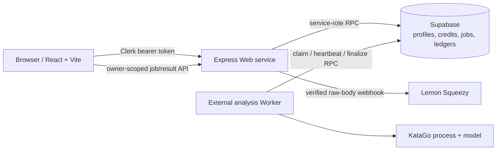

# KataTalk current architecture

> Current implementation record: 2026-08-10. This document describes the code
> now in the repository, not a production deployment claim. The detailed
> commercialization review is in [docs/codebase-commercialization-review-2026-08-10.md](docs/codebase-commercialization-review-2026-08-10.md).

## System boundary

The Web service receives browser traffic and payments; the Worker only claims
and finalizes queued analysis jobs. They must be deployed as distinct processes
when `ANALYSIS_WORKER_MODE=external`.

## Components and sources of truth

| Area             | Current implementation                                                                             | Boundary                                                                                                                            |
| ---------------- | -------------------------------------------------------------------------------------------------- | ----------------------------------------------------------------------------------------------------------------------------------- |
| Client           | React, Vite, React Query, Tailwind/Radix                                                           | Calls Express API; no Supabase service-role access.                                                                                 |
| Identity         | Clerk in production                                                                                | Browser token is verified server-side. Local/legacy modes are non-production paths.                                                 |
| Application data | Supabase PostgreSQL and SECURITY DEFINER RPCs                                                      | `profiles`, credit ledger, analysis jobs, worker status, and finalization/reconciliation state are the operational source of truth. |
| Legacy identity  | Optional MySQL/Drizzle identity sync                                                               | Compatibility path only; reads stay read-only and first-use mutations are explicit.                                                 |
| Billing          | Lemon Squeezy one-time credit packs                                                                | Raw-body webhook verification and idempotency grant credits. Toss is scaffolded, not an enabled checkout path.                      |
| Analysis         | External Worker plus KataGo                                                                        | The Web service enqueues; the Worker owns KataGo execution, lease heartbeat, result/finalization, and worker health.                |
| Release gates    | Vitest, Playwright, build/provenance, secret scan, dependency audit, PostgreSQL migration/ACL gate | CI proves repository contracts, not third-party staging integration.                                                                |

## Main flows

### Analysis lifecycle

1. An authenticated owner uploads an SGF to `POST /api/analyze`.
2. The Web service validates the payload, spends credits and enqueues the job
   through the atomic Supabase contract.
3. An external Worker claims a leased job, sends heartbeat updates, and runs
   the selected engine. Production KataGo uses `ANALYSIS_ENGINE=katago`.
4. The Worker writes a normalized result, completes/refunds through RPCs, and
   reports health. A bounded reconciliation command handles only quarantined
   finalization anomalies.
5. The owner polls the owner-scoped result endpoint; the client renders a
   normalized view model, board playback, timeline, and deterministic learning
   signals.

### Payment lifecycle

1. The authenticated user requests a configured Lemon Squeezy credit pack.
2. A verified, raw-body webhook identifies the order/event and calls the
   idempotent credit-grant RPC.
3. The immutable credit ledger is the audit trail. Checkout redirects never
   grant credit by themselves.

## Production deployment contracts

| Process | Required responsibility                                                                         | Must not receive                                                    |
| ------- | ----------------------------------------------------------------------------------------------- | ------------------------------------------------------------------- |
| Web     | Clerk, public URL, Lemon Squeezy, Supabase queue/ledger access                                  | KataGo binary, model, or config paths.                              |
| Worker  | Supabase URL/service-role key, external Worker mode, atomic enqueue guard, KataGo configuration | Clerk secret, JWT secret, Lemon Squeezy secrets, or `APP_BASE_URL`. |

`validateProductionDeploymentEnv()` validates the Web contract.
`validateProductionAnalysisWorkerEnv()` validates the Worker contract. Both
fail closed when atomic enqueue is explicitly disabled. Local combined
development continues to use the broader validation path.

See [docs/env-guide.md](docs/env-guide.md) for exact deployment variables and
[docs/database-migration-gate.md](docs/database-migration-gate.md) for the
migration/ACL evidence procedure.

## Deliberate limits

- A GitHub Actions pass is not a Supabase, Clerk, Lemon Squeezy, or GPU Worker
  staging proof.
- Rate limiting is in-process and must become a shared store before horizontal
  Web scaling.
- SGF playback is deliberately partial; it is not a complete Go-rules engine.
- Raw SGF/result storage and retention need a reviewed object-storage, TTL,
  deletion, and legal policy before general availability.
- No LLM explanatory path is released as verified game advice.
