# KataTalk 전체 코드 production 리뷰 — 2026-08-12

> 판정: **글로벌 공개 유료 서비스 NO-GO**
>
> 현재 제품 수준: **root/timeline 수치·PV 기반 폐쇄형 베타 조건부 GO — per-turn BSI/ADI 손실 UI containment 필수**
>
> 목표 명세: [글로벌 production 자연어 해설 서비스 명세 v1](production-global-commentary-spec-v1.md)
>
> 검토 기준: `agent/finalization-reconciliation`, 시작 HEAD `8ed0035`, 저장소 정적 분석과 기존 CI/테스트 증거

> **2026-08-19 구현 addendum:** 이 문서의 원래 finding은 기준일 snapshot으로
> 유지한다. 이후 per-turn loss 관점 정규화와 교차축 회귀가 추가됐고,
> migration `015` 기반 owner-scoped 분석 request 멱등성, owner-qualified 경량
> status/timeline, 별도 versioned result endpoint, 운영 error stack/브라우저 PII
> cache 제거가 로컬 구현됐다. 실제 Supabase 적용·안전한 rollout 증거는 없고
> commentary runtime·payment reversal·capacity·최소권한·보존·글로벌 품질 gate는
> 여전히 열려 있으므로 전체 **NO-GO 판정은 변하지 않는다**. 최신 누적 상태는
> [`review.md`](../review.md), 목표 계약은
> [`production-global-commentary-spec-v1.md`](production-global-commentary-spec-v1.md),
> 과금 전환 절차는
> [`analysis-idempotency-rollout-v1.md`](analysis-idempotency-rollout-v1.md)를 따른다.

## 1. 결론

KataTalk는 단순 시제품이 아니다. 인증된 SGF admission, 원자적 크레딧 차감·enqueue, 외부 KataGo Worker, lease fencing, 실패·환불, 격리된 reconciliation, SECURITY DEFINER ACL/RLS, 수치 결과와 PV UI, 상당한 단위·DB·브라우저 테스트가 존재한다.

그러나 목표인 “글로벌 사용자를 위한 KataGo 기반 자연어 바둑 해설”은 현재 runtime에 없다. LLM provider·orchestrator·guard는 단위 모듈일 뿐 Worker/DB/API/UI 호출 경로가 없고, provider prompt도 한국어로 고정되어 있다. 더 중요하게는 per-turn 후보 수치의 착수자 관점 정규화가 보장되지 않아 BSI·결정적 장면 선별이 반대로 해석될 수 있다. **정확하지 않은 evidence를 유창하게 설명하는 LLM을 연결해서는 안 된다.**

출시 전 가장 중요한 순서는 다음과 같다.

1. per-turn 승률·집차 관점 정규화와 교차축 테스트
2. 분석 요청 idempotency와 owner-qualified 경량 조회
3. 결제 reversal/webhook inbox와 queue admission/backpressure
4. Analysis Worker 최소권한, 유한 보존·home region, provider DPA·법적 근거·동의 승인
5. timeline-first 적응형 분석과 versioned evidence bundle
6. 위 pre-provider gate 뒤 별도 Commentary Worker, 다국어 guard·fallback·품질 corpus
7. telemetry·실제 staging/soak·복구·최종 rollout 법무 증거

외부 LLM provider 호출과 사용자에게 보이지 않는 shadow 호출도 4번 gate 전에는 금지한다.

## 2. 검토 범위와 증거 한계

| 영역   | 검토 대상                                                               |
| ------ | ----------------------------------------------------------------------- |
| 저장소 | 추적 파일 410개, TS/TSX 298개, 서버 테스트 파일 91개                    |
| 데이터 | Supabase migration 14개(`001`~`014`), RPC/ACL/원장/lease/reconciliation |
| 제품   | React UI, 업로드·polling·결과·삭제·결제 UX, 4개 UI 언어                 |
| 엔진   | KataGo root/multi-turn/timeline/Deep Search, BSI/ADI, quality gate      |
| 자연어 | planner V1/V2, provider, orchestrator, guard, claim verifier            |
| 운영   | GitHub Actions 4개, health/readiness, retention, staging runbooks       |

이 보고서는 저장소 증거와 기존 자동화 결과를 평가한다. 실제 Clerk tenant, Supabase 프로젝트, Lemon Squeezy live/store 설정, GPU/KataGo image, LLM provider, DNS/CDN/WAF, backup restore는 이번 환경에서 실행하지 않았다. 따라서 로컬·CI 통과를 hosted production 증거로 간주하지 않는다.

검토 시작 시 PR #4 GitHub Actions `31367782357`은 production dependency audit만 `nanoid 5.1.6` advisory로 실패했다. direct dependency와 lockfile을 `>=5.1.16`으로 올린 뒤 로컬 frozen install, production audit(known vulnerability 0), TypeScript, Vitest 91 files/988 tests, Playwright 9/9와 clean-HEAD production build가 통과했다. 리뷰·명세 커밋 `09e513b`의 원격 run [`31607218074`](https://github.com/xjvmwodnjs/katatalk-web/actions/runs/31607218074)도 Type/unit/build/secret, PostgreSQL, production audit, Playwright 네 job을 모두 통과했다.

## 3. 현재 구현에서 강한 부분

### 돈과 작업 상태

- `server/analyzeRoute.ts`는 인증·rate limit을 multipart 메모리 parsing보다 먼저 적용하고 1MiB, strict UTF-8, strict SGF/KataGo admission을 차감 전에 수행한다.
- migration `011`은 크레딧 차감과 job enqueue를 한 트랜잭션으로 묶는다.
- migration `012`와 `server/creditService.ts`는 exact lease 조건의 실패·환불을 원자화한다.
- migration `014`와 reconciliation 명령은 일반 실패 경로와 분리된 quarantine만 제한적으로 복구한다.
- Worker의 heartbeat와 fenced finalize는 stale Worker가 새 Worker의 결과를 덮어쓰는 것을 막는다.

### 권한과 입력 경계

- migration `013`은 SECURITY DEFINER owner/search path/execute ACL을 고정하고 anon/authenticated 직접 실행을 거절한다.
- production Web은 Clerk/external Worker/atomic enqueue를 fail-closed로 요구한다.
- Web/Analysis Worker 환경 검증이 분리되어 Worker에 Clerk·Lemon·JWT·`APP_BASE_URL`을 요구하지 않는다.
- Lemon webhook raw body가 JSON parser보다 먼저 등록되고 HMAC 비교와 지급 idempotency가 있다.
- HSTS·frame·referrer·MIME 등 수동 baseline header와 `/api` body 상한이 존재한다.

### 분석·제품 기반

- root/multi-turn, 선택형 timeline/Deep Search, BSI/ADI, product event와 deterministic explanation plan이 계층화돼 있다.
- 결과 ViewModel은 legacy/verified axis를 구분하고 검증되지 않은 값을 추측하지 않는다.
- 결과 UI는 승률, 후보 수, PV overlay, 수순 이동, 로컬 try-play, owner 삭제를 제공한다.
- route lazy loading, Clerk/Supabase/legacy auth abstraction, ko/en/ja/zh UI 문구 기반이 있다.

### 검증 기반

- 91개 서버 Vitest 파일과 PostgreSQL fresh/upgrade/ACL/concurrency/fault/reconciliation gate가 있다.
- Playwright는 390/430/1440에서 결과·PV·try-play·삭제를 검증한다.
- build provenance, secret scan, production dependency audit가 release workflow에 있다.

이 강점은 버리지 않고 다음 production 구조의 불변식으로 승격해야 한다.

## 4. P0 — 출시를 직접 차단하는 문제

### P0-1. per-turn 수치 관점이 정규화되지 않는다

`server/worker/analysisEngines/katagoWinratePerspectiveConfig.ts`는 `BLACK`, `WHITE`, `SIDETOMOVE`를 허용한다. 하지만 `server/worker/analysisEngines/katagoMultiTurnRun.ts`는 후보별 raw `moveInfos.winrate`와 `scoreLead`를 복사하고, `server/bsiV1.ts`는 이를 `max(0, best - played)`로 계산한다.

예를 들어 BLACK 축에서 백에게 좋은 후보는 black winrate가 낮다. 현재 식은 백의 손실을 0으로 만들거나 반대로 해석할 수 있고, 그 값이 `shared/decisiveMoveSelectorV1.ts`의 중요 장면 선택에 전파된다.

완료 조건:

- candidate마다 black/white/player-to-move 값을 함께 저장한다.
- loss는 항상 해당 착수자의 관점으로 계산한다.
- 세 config가 같은 player loss를 내는 교차축 테스트를 흑·백 착수와 score/winrate 모두에 적용한다.
- **즉시 containment:** 완료 전 현재 UI의 BSI 값, BSI/ADI 기반 decisive/review 선택, deterministic “AI memo”의 `score_loss`/`winrate_loss` bullet을 숨기고 root/timeline 수치·PV만 표시한다.
- 완료 전 BSI/ADI/decisive selector를 UI 또는 LLM의 손실·패착 claim 근거로 사용하지 않는다.

### P0-2. 자연어 해설이 제품 경로에 없다

`server/worker/analysisEngines/katagoEngine.ts`는 `explanation_planner`, `claim_verification`, `llm_commentary`를 미구현으로 기록한다. `createLlmCommentaryProviderV1`와 orchestrator에는 비테스트 production 호출자가 없다. `server/llm/commentaryProviderV1.ts`의 prompt는 한국어 전용이며, UI도 `shared/analysisResultI18n.ts`에서 LLM이 실행되지 않았음을 표시한다.

필요한 경계는 `EvidenceBundleV2 → Commentary job → locale/audience planner → provider → strict schema/claim/policy guard → immutable artifact/fallback`이다. KataGo 성공과 commentary 성공은 별도 상태여야 하며 자연어 실패가 분석 환불이나 재차감을 만들면 안 된다.

### P0-3. 분석 접수에 client idempotency가 없다

`server/analyzeRoute.ts`는 매 요청마다 새 job ID를 만든다. migration `011`은 같은 job ID만 중복 방지하므로, 202 응답 유실 뒤 브라우저가 다시 업로드하면 새 job과 새 차감이 생길 수 있다.

완료 조건:

- `(owner, request_id)` unique와 SGF/옵션 digest를 원자 RPC에 포함한다.
- 정확한 replay는 기존 job·잔액을 반환하고 같은 key의 다른 payload는 409다.
- 응답 유실·100회 동시 replay에서 job 1개, usage row 1개, 차감 1회를 증명한다.

### P0-4. 결제가 지급 전용이고 reversal 수명주기가 없다

Lemon provider는 `order_created`만 처리한다. store/variant/currency/amount/test mode/final state의 서버 검증, refund/chargeback/cancel/debt 정책, durable webhook inbox·DLQ·operator replay가 없다. Toss는 scaffold일 뿐이다.

완료 조건:

- 서명 검증 뒤 원문 hash/event를 durable inbox에 기록한 후 2xx한다.
- provider event state machine과 상품·금액·통화·mode 검증을 둔다.
- refund/chargeback을 idempotent ledger event로 처리하고 nightly reconciliation을 운영한다.
- 실제 sandbox purchase/replay/refund/chargeback을 staging gate로 만든다.

### P0-5. 용량 admission 없이 먼저 차감한다

분석 접수는 Worker 생존, global active-job cap, queue age, 사용자 fairness를 확인하지 않고 차감·enqueue한다. limiter는 process-local이고 Worker 한 프로세스는 최대 4 lane이다. Worker가 없거나 queue가 포화돼도 유료 job은 계속 쌓일 수 있다.

완료 조건:

- shared rate limit과 atomic capacity admission을 차감 전에 적용한다.
- per-user active cap, fair scheduling, oldest queue age, ETA/Retry-After를 정의한다.
- overload에서 거절된 job이 절대 차감되지 않음을 증명한다.

### P0-6. 유료 글로벌 UX와 법무 동의가 완성되지 않았다

앱에 Privacy/Terms/refund/support/security link가 없고 pricing 동의는 실제 문서·버전 증거와 연결되지 않는다. 운영 error boundary는 full stack을 사용자에게 표시한다. 이 상태에서 공개 결제를 열 수 없다.

또한 `package.json`은 `MIT`를 선언하지만 저장소에 루트 `LICENSE`가 없다. 공개 소스인지 proprietary 서비스인지 운영자가 결정하고 package metadata, 실제 license text, third-party notices를 일치시켜야 한다.

완료 조건:

- 법무 승인된 버전형 Terms/Privacy/refund/AI disclosure와 consent record
- footer와 checkout 전 실제 link, 세금·통화·지역 안내, support/security contact
- 고정 locale error + incident ID만 노출하고 stack은 redacted telemetry로 전송
- 제품/저장소 license 결정, root license text와 third-party notice/SBOM 정합성

## 5. P1 — 글로벌 규모와 신뢰성을 막는 문제

| 영역                 | 현재 문제                                                                                      | 필요한 상태                                                                                        |
| -------------------- | ---------------------------------------------------------------------------------------------- | -------------------------------------------------------------------------------------------------- |
| Status API           | `select('*')`로 최대 1MiB SGF/result를 매 polling마다 읽고 owner를 application에서 확인        | owner-qualified 2KB metadata query, foreign/not-found 404, 별도 artifact/ETag                      |
| Progress             | timeline progress가 node-local `.tmp/katatalk-progress` JSONL                                  | DB/Redis/stream 등 Web A가 Worker B를 관찰하는 durable transport                                   |
| Worker 권한          | Analysis Worker도 전체 Supabase service-role 사용                                              | claim/heartbeat/finalize/자기 artifact만 가능한 전용 role 또는 내부 queue API                      |
| Rate limit           | in-memory/per-instance, fixed `trust proxy=1`                                                  | verified ingress CIDR, edge byte cap/WAF, Redis limiter, IPv6/multi-instance test                  |
| Retention            | production 기본 무기한, cleanup manual dispatch                                                | 데이터 등급별 필수 유한 TTL, scheduled monitored purge, DSAR/account deletion, backup 전파         |
| Destructive workflow | retention dispatch에 branch/ref guard와 target-project fingerprint가 없고 action tag가 mutable | protected ref/environment, project fingerprint, dry-run diff, immutable action SHA와 dual approval |
| 외부 호출            | Supabase/Lemon에 deadline 없음, LLM timeout은 `Promise.race`뿐                                 | AbortSignal/deadline/size cap, jitter retry, circuit breaker/bulkhead                              |
| Health               | public `/readyz`가 env/config만 검사하고 상세 topology 노출                                    | minimal liveness, 내부 dependency readiness, token-protected diagnostics                           |
| Observability        | console log 중심, central metrics/tracing/on-call 없음                                         | upload→job→KataGo→LLM→result/payment correlation과 dashboard/alert/runbook                         |
| Deploy               | production container/IaC/canary/rollback 없음                                                  | immutable Web/Worker/KataGo/model digest, SBOM, signed image, rollback drill                       |
| CI supply chain      | dependency audit schedule가 없고 Actions가 mutable major tag를 사용                            | scheduled audit, pinned action SHA, provenance/attestation과 update policy                         |
| Backup               | restore 자동화·증거 없음                                                                       | encrypted backup, 정기 restore test와 RPO/RTO                                                      |
| Identity             | optional MySQL path, Clerk-only user numeric id `0`                                            | Supabase subject 기준으로 profile/history 통합 또는 MySQL을 명시적 필수 서비스화                   |

## 6. KataGo·근거 계층 리뷰

현재 실행은 root → 고정 20수 간격/final 후보 → 최대 6개 multi-turn → BSI/ADI → Deep Search → 마지막 timeline 순서다. timeline이 늦어 고정 간격 사이의 실제 변곡점을 targeted 분석하지 못한다.

목표 순서는 다음으로 바꾼다.

```text
저비용 전체 timeline
  → 변곡점·불확실성 후보
  → 중간 visits targeted 분석
  → 상위 후보 bounded Deep Search
  → canonical EvidenceBundleV2
  → commentary eligibility
```

추가 결손:

- BSI/ADI는 `provisional`이며 quality gate가 여러 부재를 warning으로만 처리한다.
- ADI ownership volatility는 항상 null이고 invasion/reduction 개념 근거가 사실상 없다.
- ladder evidence는 항상 false이고 concept tag는 사활·축 판정기가 아니다.
- Deep Search와 최종 result에 binary/model/config/policy digest와 stable evidence ID가 없다.
- Worker result type은 느슨한 `Record<string, unknown>`이다.
- 현재 SGF contract는 일본식 rules만 허용한다. 다른 ruleset은 명시적으로 후속 출시해야 한다.

자연어 모델은 이 결손을 추론으로 메우지 않는다. evidence profile이 지원하지 않는 사활·패·축·선수/후수·연결/절단 단정은 금지한다.

## 7. LLM·해설 계층 리뷰

현재 모듈은 좋은 실험 기반이지만 production gateway가 아니다.

- prompt가 한국어 전용이며 exact output version·locale/audience 계약이 불완전하다.
- timeout 뒤 fetch를 취소하지 않아 socket과 비용이 계속될 수 있다.
- provider token cap, cost 기록, bounded retry, circuit breaker, concurrency budget이 없다.
- 금칙 표현과 claim regex가 ko/en 중심이라 ja/zh 우회 표현을 검증하지 못한다.
- 좌표·`points`·percent 일부만 검증하며 원인·결과, player/perspective, PV 순서·합법성, 사활·패·축을 검증하지 못한다.
- 호출 성공, guard reject, fallback 표시, 비용 발생을 구분하는 trace가 없다.
- fake provider 단위 테스트는 있지만 실제 model regression·locale 평가가 없다.

출시 원칙:

- raw SGF·PII는 provider에 보내지 않고 allowlisted evidence만 전달한다.
- 모든 좌표·숫자·player·판정 문장은 stable evidence reference가 필요하다.
- strict JSON schema와 unknown-property rejection을 적용한다.
- provider/guard 실패는 기존 결정론적 memo로 100% fallback한다.
- `ko-KR`/`en`부터 locale별 독립 gate를 통과시키고 `ja-JP`/`zh-CN`은 그 전까지 LLM OFF다.
- post-game review만 허용하고 진행 중 대국의 실시간 조력은 product policy로 금지한다.

## 8. 클라이언트·글로벌 제품 리뷰

강점은 upload→비동기 job→deep link 복구→결과/삭제 흐름과 수치/PV 중심 UI다. 다만 production 제품 상태 machine과 접근성이 부족하다.

주요 결손:

- 신규 업로드와 deep-link polling이 `Home.tsx`에 중복되어 취소·timeout·visibility·429/Retry-After가 일관되지 않는다.
- 20분 뒤 polling은 멈추지만 화면은 계속 running처럼 보일 수 있다.
- auth provider가 이름·email 포함 user 객체를 사용처 없이 localStorage에 저장한다.
- HTML `lang`/title은 한국어 고정이고 `maximum-scale=1`로 확대를 막는다.
- try-play board는 pointer-only이며 screen reader/keyboard로 착수할 수 없다.
- SVG chart의 접근 가능한 값·selected 상태와 대체 data table이 없다.
- custom language selector는 listbox/menu keyboard/focus 계약이 없다.
- browser locale negotiation, `Intl` 숫자·날짜·통화, zh-CN/zh-TW 정책이 없다.
- analysis history, cancel/retry, export/account deletion, 로그인 뒤 원래 job 복귀가 없다.
- Playwright는 mock API·Chromium 한 종류여서 실제 auth/payment/locale/offline 장애 증거가 아니다.

출시 gate는 WCAG 2.2 AA, 200~400% zoom, keyboard-only 전 흐름, 44px target, reduced motion, axe serious/critical 0, NVDA/VoiceOver smoke, Chromium/Firefox/WebKit과 360~1440 viewport를 포함해야 한다.

## 9. 목표 production 구조

```mermaid
flowchart LR
  U["Global user"] --> EDGE["CDN / WAF"]
  EDGE --> API["Stateless regional Web API"]
  API --> DB[("Authoritative ledger/control DB")]
  DB --> AQ["Durable fair analysis queue"]
  AQ --> KW["Least-privilege GPU KataGo pool"]
  KW --> OBJ["Encrypted lifecycle object storage"]
  KW --> EV["Versioned EvidenceBundleV2"]
  EV --> CQ["Commentary queue"]
  CQ --> CW["Least-privilege Commentary Worker"]
  CW --> LLM["Locale-aware LLM gateway"]
  LLM --> GUARD["Schema + claim + policy guard"]
  GUARD --> OBJ
  DB --> API
  PAY["Payment webhook"] --> INBOX["Durable inbox / DLQ"]
  INBOX --> LEDGER["Entitlement + reversal state machine"]
  LEDGER --> DB
```



초기 글로벌 서비스는 CDN과 stateless Web을 여러 지역에 둘 수 있어도 원장 쓰기는 한 primary region으로 유지한다. active-active credit ledger는 충돌·일관성 semantics가 설계되기 전 도입하지 않는다.

## 10. 실행 순서와 Definition of Done

### 단계 0 — 현재 CI와 문서 기준선

- `nanoid >=5.1.16`, production high/critical 0, 모든 required check green
- README/review/architecture/TODO/env/security/privacy가 현재 vs 목표를 동일하게 설명

### 단계 1 — 정확성·금전 P0

- per-turn axis 정규화와 교차축 동일성
- analyze request idempotency와 경량 owner query/result 분리
- queue capacity admission 전 차감 금지
- durable webhook inbox/reversal/reconciliation
- production stack·browser PII 제거와 versioned 약관/개인정보/환불 동의
- Analysis Worker 최소권한 DB role, finite retention, home region과 LLM provider DPA·법적 근거 승인

### 단계 2 — 근거 pipeline

- timeline-first adaptive planner
- engine/model/config/policy provenance
- strict `AnalysisEvidenceBundleV2`, stable evidence ID, eligibility
- lifecycle-managed object storage와 deletion/backup propagation

### 단계 3 — 안전한 commentary beta

- 별도 Commentary Worker/DB role/queue
- locale/audience-aware planner와 `CommentaryArtifactV1`
- AbortSignal, schema, claim verifier, circuit breaker, token/cost trace
- provider 없이도 deterministic fallback E2E

### 단계 4 — 글로벌 제품·운영

- history/cancel/retry/export/delete, WCAG/i18n/Intl
- shared limiter/WAF, metrics/tracing/alerts/on-call
- reproducible images/SBOM/model digest, backup restore/rollback drill
- 국가별 세금·소비자 권리·지원 범위와 최종 rollout 법무 승인

### 단계 5 — 실제 출시 증거

- real protected staging: login → one charge → GPU KataGo → guarded commentary → reload/delete → failure/refund → purchase/replay/reversal
- duplicate submission/webhook/finalizer와 Worker stale/kill에서 exactly-once ledger 결과
- DB/provider outage, lost 202, lost webhook response를 포함한 fault injection
- 최소 30~60분 GPU soak와 queue/engine/E2E/VRAM/RSS gate
- 동의·라이선스 corpus 200국 이상, 기사 2인·언어별 원어민 검수, critical factual error 0
- 1% canary 뒤 locale별 점진 확대와 kill switch

## 11. 현재 출시 판정표

| 단계                     | 판정          | 조건                                                                                            |
| ------------------------ | ------------- | ----------------------------------------------------------------------------------------------- |
| 로컬 mock 개발           | **GO**        | production 데이터·결제와 완전 분리                                                              |
| 로컬 실제 KataGo         | **조건부 GO** | 고정 binary/model/config, 테스트 corpus, provisional per-turn loss UI 숨김                      |
| 폐쇄형 staging           | **조건부 GO** | 전용 tenant/DB/Worker, 무료 또는 수동 크레딧, provisional per-turn loss UI 숨김, 관찰·삭제 가능 |
| 초대형 유료 beta         | **NO-GO**     | P0 정확성·idempotency·reversal·admission·법무 미완료                                            |
| 글로벌 공개 유료 beta/GA | **NO-GO**     | 자연어 runtime·다국어 품질·운영/보안/법무/실환경 증거 미완료                                    |

## 12. 문서 source of truth

- 현재 코드·위험·출시 판정: 이 문서
- 목표 계약·SLO·로드맵: [production-global-commentary-spec-v1.md](production-global-commentary-spec-v1.md)
- 현재 배포 경계: [../ARCHITECTURE.md](../ARCHITECTURE.md)
- 실행 backlog: [TODO.md](TODO.md)
- 환경 profile: [env-guide.md](env-guide.md)
- 법무 초안: [../PRIVACY.md](../PRIVACY.md), [../TERMS.md](../TERMS.md), [../SECURITY.md](../SECURITY.md)

날짜가 붙은 이전 benchmark·상용화 문서는 당시 증거 snapshot으로 보존하며 현재 출시 판정으로 사용하지 않는다.
