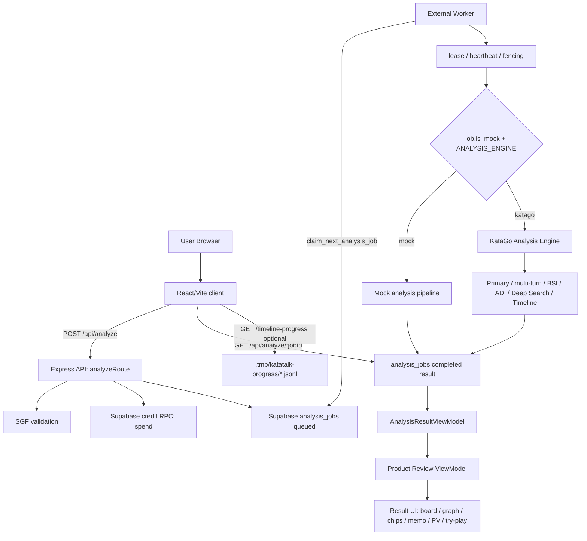

# KataTalk Current Code Workflow & Cursor Persona System

> **SUPERSEDED SNAPSHOT — DO NOT USE AS CURRENT IMPLEMENTATION GUIDANCE.** This document predates migrations 008–014, the current GPU backend smoke/TensorRT support, finalization reconciliation, request-boundary hardening, and the 2026-08-12 global commentary review. Use [codebase-production-review-2026-08-12.md](codebase-production-review-2026-08-12.md), [production-global-commentary-spec-v1.md](production-global-commentary-spec-v1.md), [../ARCHITECTURE.md](../ARCHITECTURE.md), and [env-guide.md](env-guide.md). The body remains only as historical persona/workflow evidence.

## 1. Executive Summary

KataTalk은 현재 SGF 파일을 업로드하면 서버가 SGF를 검증하고 크레딧을 차감한 뒤 `analysis_jobs`에 작업을 enqueue하며, 별도 Worker가 Supabase queue에서 작업을 claim해 KataGo 또는 mock 분석 파이프라인을 실행하고, 완료된 결과를 React/Vite 결과 화면에서 승률 그래프, 후보 chip, deterministic memo, SVG 바둑판, PV overlay, try-play로 보여주는 구조다.

- 현재 구현 완료된 핵심 기능:
  - SGF 업로드, validation, 크레딧 차감, job enqueue.
  - Supabase `analysis_jobs` queue, Worker claim, lease, stale retry, heartbeat, lease fencing.
  - Worker 전용 KataGo 실행 경로와 mock/KataGo 결정성 guard.
  - KataGo primary analysis, multi-turn analysis, BSI v1, ADI v1, Deep Search plan/execution 옵션, realtime winrate timeline 옵션.
  - `ProductReviewV1` 생성: `gameResultV1`, `decisiveMoveV1`, `reviewMovesV1`, `conceptTagsV1`, `candidateComparisonV1`, `explanationPlanV2`.
  - `AnalysisResultView` 기반 board-first 결과 UI, PV overlay, local try-play, ko/en/ja/zh i18n, evidence label mapping.
  - Lemon Squeezy checkout/webhook idempotency와 Supabase credit 충전/환불 RPC.
  - Playwright synthetic Product Review 결과 화면 E2E smoke.
- 아직 구현되지 않은 것:
  - 흑/백 기준 승률 확정 변환 및 enabled toggle.
  - 실제 LLM commentary를 결과 UI나 Worker 본 분석 흐름에 연결하는 기능.
  - `top_mistakes` 사용자-facing 결과.
  - 실제 착수 저장, 서버 재분석 기반 try-play, 변화도 탐색.
  - DB schema 기반 realtime progress 저장.
  - 현재 브랜치 기준 `KATAGO_BACKEND_CHECK_MODE`, `analysis_smoke`, `version_then_smoke`, TensorRT backend 감지, `katagoSmokeOk` startup log.
- 현재 개발 우선순위상 중요한 위험 요소:
  - realtime timeline progress polling이 450ms 주기로 `/api/analyze/:jobId`와 `/timeline-progress`를 함께 호출해 local에서도 rate limit 429를 만들 수 있다.
  - 현재 GPU backend validation은 `katago version` 출력 기반이라 실제 긴 분석 중 GPU 사용 여부를 완전히 증명하지는 않는다.
  - Product Review 알고리즘은 deterministic signal layer까지 구현됐지만 품질 평가는 synthetic/unit 중심이다.
  - `result.algorithmStage.notYetImplemented`에 concept/explanation 관련 오래된 metadata가 남아 있어 ViewModel product layer와 표현이 어긋날 수 있다.
  - SGF parser는 v1 범위이며 suicide/ko/after-move setup/handicap auto placement는 제한적이다.

## 2. Repository Architecture

| 영역 | 역할 | 주요 파일 | 현재 메모 |
|---|---|---|---|
| `client` | React/Vite UI, auth provider bridge, upload/result 화면 | `client/src/pages/Home.tsx`, `client/src/components/AnalysisResultView.tsx`, `client/src/components/BadukBoardView.tsx`, `client/src/components/AnalysisWinratePanel.tsx`, `client/src/_core/auth/*` | board-first 결과 UI와 polling/deep link 처리의 중심이다. |
| `server` | Express API, auth, billing, credits, queue access, Worker helpers | `server/analyzeRoute.ts`, `server/creditsRoute.ts`, `server/billingRoute.ts`, `server/creditService.ts`, `server/_core/env.ts` | Web/API와 Worker 공용 server code가 같이 있다. |
| `server/worker` | external Worker, KataGo runtime, claim loop | `server/worker/analysisWorkerLoop.ts`, `server/worker/processClaimedAnalysisJob.ts`, `server/worker/katagoAnalysisDbPipeline.ts` | KataGo는 이 영역에서만 실제 실행된다. |
| `server/worker/analysisEngines` | KataGo query, raw parser, smoke, timeline, config | `katagoEngine.ts`, `katagoSgfQuery.ts`, `katagoRawParser.ts`, `katagoSmokeRun.ts`, `katagoWinrateTimelineRun.ts`, `winrateTimelineConfig.ts` | primary/multi-turn/timeline analysis의 runtime 구현이다. |
| `shared` | client/server 공용 schema, parser, ViewModel, product algorithm | `shared/analysisResultViewModel.ts`, `shared/sgfPlaybackV1.ts`, `shared/analysisProductEventsV1.ts`, `shared/decisiveMoveSelectorV1.ts`, `shared/reviewMovesSelectorV1.ts`, `shared/conceptTaggerV1.ts`, `shared/candidateComparisonV1.ts`, `shared/explanationPlannerV2.ts` | 현재 Product Review algorithm 대부분이 여기에 있다. |
| `e2e` | Playwright result UI smoke | `e2e/product-review-result.spec.ts`, `e2e/fixtures/product-review-completed-result.ts` | synthetic completed `katago-worker-v1` response를 intercept한다. 실제 DB/KataGo 호출은 없다. |
| `docs` | env, smoke, algorithm, LLM guard/provider 문서 | `docs/env-guide.md`, `docs/master-staging-smoke-v1.md`, `docs/realtime-winrate-timeline-v1.md`, `docs/algorithm/KataTalk_Algorithm_V2.5.md` | 일부 문서는 현재 코드보다 앞선/뒤선 브랜치 개념을 포함할 수 있어 코드 기준 확인이 필요하다. |
| `supabase/migrations` | credit/job queue schema와 RPC | `001_create_katatalk_credit_system.sql` ... `007_analysis_job_lease_retry.sql` | `006` RPC 권한 제한, `007` lease/retry/fencing 필드 추가가 핵심이다. |
| `scripts` | local smoke/workbench/run helper | `scripts/katago-smoke.ts`, `scripts/localAlgorithmWorkbenchV1.ts`, `scripts/run-server.mjs` | `katago:smoke`, local algorithm workbench, dev server runner를 제공한다. |

## 3. Current Runtime Architecture



| 실행 구성 | 현재 코드 기준 |
|---|---|
| Web app | `corepack pnpm dev`가 `server/_core/index.ts`를 Vite middleware와 Express API로 실행한다. |
| API server | `/api/analyze`, `/api/analyze/:jobId`, `/api/analyze/:jobId/timeline-progress`, `/api/credits/*`, `/api/billing/*`를 제공한다. |
| external Worker | `corepack pnpm dev:worker` 또는 `corepack pnpm worker:analysis`가 `server/worker/analysisWorker.ts`를 실행한다. |
| KataGo Analysis Engine | `ANALYSIS_ENGINE=katago`인 Worker에서만 `KATAGO_BINARY_PATH`, `KATAGO_CONFIG_PATH`, `KATAGO_MODEL_PATH`를 사용해 실행된다. |
| Supabase/job queue | `analysis_jobs`에 queued/running/completed/failed 상태를 저장하고, `claim_next_analysis_job(p_worker_id, p_stale_seconds)` RPC로 claim한다. |
| local progress file/API | `KATAGO_WINRATE_TIMELINE_LOCAL_PROGRESS=true`이고 production이 아닐 때 `.tmp/katatalk-progress/<jobId>.jsonl`을 append/read한다. |
| Product Review ViewModel | completed result를 `buildAnalysisResultViewModel(data)`가 `katago-worker-v1`, `mock-legacy`, `unknown`으로 분류하고 product layer를 계산한다. |
| E2E synthetic fixture | Playwright가 `/api/analyze/:jobId` 응답을 synthetic completed fixture로 intercept한다. 실제 KataGo/DB/결제/LLM 호출은 없다. |

## 4. Current Analysis Pipeline

| 단계 | 입력 | 출력 | 주요 파일 | 주요 env | 실패 시 동작 | 테스트 파일 |
|---|---|---|---|---|---|---|
| 1. SGF upload | multipart `.sgf`, language | authenticated request body | `client/src/pages/Home.tsx`, `server/analyzeRoute.ts`, `server/_core/clerkAuth.ts` | `VITE_AUTH_PROVIDER`, `AUTH_PROVIDER` | POST auth는 identity만 동기화하고 missing file/invalid auth는 400/401 | Clerk auth·route tests |
| 2. validation | SGF text | normalized metadata or fixed 400 | `server/sgfValidation.ts`, `shared/sgfKatagoParseV1.ts`, `shared/sgfPlaybackV1.ts` | 없음 | malformed/duplicate/non-root/unsupported `SZ`/`KM`도 wallet 전에 reject; missing만 19/6.5 | parser·validation·playback·route tests |
| 3. wallet/credit spend/refund | admitted user, jobId, cost=1 | wallet 준비 + debit ledger | `server/creditService.ts`, `server/analyzeRoute.ts` | `SUPABASE_URL`, `SUPABASE_SERVICE_ROLE_KEY` | admission 뒤 wallet 1회; insufficient credit 402, insert 실패 시 refund | route·credit RPC·refund tests |
| 4. job enqueue | SGF, sha256, fileName, language | `analysis_jobs` queued row | `server/analyzeRoute.ts`, `server/middleware/analyzeEnqueueGuard.ts` | `ANALYSIS_ENGINE`, `ANALYSIS_WORKER_MODE`, `KATATALK_ALLOW_MOCK_ANALYSIS` | Supabase 실패 시 refund 후 500 | `server/analyzeRoute.mockGuard.test.ts` |
| 5. Worker claim/lease/retry | queued/stale job | running lease row | `server/worker/analysisWorkerLoop.ts`, `server/creditService.ts`, `supabase/migrations/007_analysis_job_lease_retry.sql` | `ANALYSIS_WORKER_ID`, `ANALYSIS_CLAIM_STALE_SECONDS` | claim RPC 실패는 log 후 idle retry | `server/analysisClaim.test.ts`, `server/analysisWorkerLoop.test.ts` |
| 6. engine route | claimed row | mock/katago/mismatch path | `server/worker/processClaimedAnalysisJob.ts`, `server/analysisEngineDeterminism.ts` | `ANALYSIS_ENGINE` | mismatch는 failed + paid job refund | `server/analysisEngineDeterminism.test.ts` |
| 7. KataGo analysis | SGF text, parsed minimal SGF | `katago-worker-v1` result | `server/worker/analysisEngines/katagoEngine.ts`, `katagoSmokeRun.ts`, `katagoSgfQuery.ts` | `KATAGO_BINARY_PATH`, `KATAGO_CONFIG_PATH`, `KATAGO_MODEL_PATH`, `KATAGO_MAX_VISITS`, `KATAGO_ANALYSIS_TIMEOUT_MS` | primary fail은 job failed/refund | `server/analysisEngines.test.ts`, `server/katagoSmoke.test.ts` |
| 8. realtime winrate timeline quick scan | parsed SGF, jobId | `winrateTimelineV1` and optional progress JSONL | `katagoWinrateTimelineRun.ts`, `katagoAnalyzeTurnsCollector.ts`, `winrateTimelineConfig.ts`, `server/winrateTimelineProgressV1.ts` | `KATAGO_WINRATE_TIMELINE_*` | timeline 실패는 result metadata; job failed/refund로 전파하지 않음 | `server/winrateTimelineV1.test.ts` |
| 9. BSI/ADI/deep search | `turnAnalyses`, plan | BSI, ADI, deepSearchPlan/results | `shared/bsiV1.ts`, `shared/adiV1.ts`, `server/deepSearchPlanV1.ts`, `server/deepSearchResultsV1.ts` | `DEEP_SEARCH_PLAN_*`, `KATAGO_DEEP_SEARCH_*` | deep search 후보 실패는 job 전체 실패 아님 | `server/bsiV1.test.ts`, `server/adiV1.test.ts`, `server/deepSearchResultsV1.test.ts` |
| 10. completed/failure write | normalized result or error | completed/failed row | `server/worker/katagoAnalysisDbPipeline.ts`, `server/creditService.ts` | `ANALYSIS_WORKER_HEARTBEAT_SECONDS` | `LEASE_LOST`면 terminal write/refund 생략 | `server/katagoAnalysisDbPipeline.test.ts` |
| 11. GET result | jobId, auth user | job status/result | `server/analyzeRoute.ts`, `shared/analysisJob.ts` | `KATAGO_WINRATE_TIMELINE_LOCAL_PROGRESS` for progress endpoint | owner mismatch 403, missing progress 404 | `server/analysisJobContract.test.ts`, `server/inMemoryJobOwnership.test.ts` |
| 12. Product Review generation | completed `katago-worker-v1` result | `productReviewV1`, key candidates | `shared/analysisResultViewModel.ts`, `shared/analysisProductEventsV1.ts`, selectors | 없음 | malformed embedded data는 fallback/rebuild | `server/analysisResultViewModel.test.ts`, selector tests |
| 13. conceptTagsV1 | candidate, board snapshot | conservative concept tags and forbidden claims | `shared/conceptTaggerV1.ts` | 없음 | unsafe strings/malformed tags rejected | `server/conceptTaggerV1.test.ts` |
| 14. candidateComparisonV1 | product move + tags | comparison material | `shared/candidateComparisonV1.ts` | 없음 | no loss data means no loss delta | `server/candidateComparisonV1.test.ts` |
| 15. explanationPlanV2 | product move + comparison | deterministic memo plan | `shared/explanationPlannerV2.ts` | 없음 | invalid bullet invariant rejected by guard | `server/explanationPlannerV2.test.ts` |
| 16. evidence label mapping | internal evidence strings | i18n labels | `shared/explanationEvidenceLabelsV1.ts`, `shared/analysisResultI18n.ts` | 없음 | unknown evidence becomes fallback label | `server/explanationEvidenceLabelsV1.test.ts` |
| 17. UI rendering | ViewModel | result screen | `client/src/components/AnalysisResultView.tsx`, `BadukBoardView.tsx`, `AnalysisWinratePanel.tsx` | browser `localStorage` lang | mock/unknown/placeholder guarded UI | `e2e/product-review-result.spec.ts` |
| 18. PV overlay | selected candidate/reference | numbered overlay | `AnalysisResultView.tsx`, `BadukBoardView.tsx` | 없음 | invalid/pass/occupied-only PV does not enter variation mode | `server/analysisReviewUiV2.test.ts`, E2E |
| 19. try-play | local board click | local virtual stones only | `AnalysisResultView.tsx`, `BadukBoardView.tsx` | 없음 | no server/KataGo/LLM call | E2E |

SGF game metadata는 `sgf-game-info-v1` marker 아래 root `PB/PW/DT/RE`를 안전한 작성값 또는 `null`로 전달한다. SimpleText에는 NFC·공백·길이 제한을 적용하고, FF4 부분/쉼표 `DT`와 최대 1000의 exact decimal round-trip `RE`만 허용한다. 잘못된 선택 필드는 해당 필드만 숨기지만 malformed UTF-8은 wallet/debit/enqueue 전에 거절한다. marker 결과는 UI 직전에 재검증하고, legacy `katago-worker-v1`는 `sgf_content`/`sgfContent`를 재파싱하거나 구 placeholder를 숨긴다. UI는 `DT`를 직접 표시하고 `RE`는 공통 `ProductGameResult` parser로 해석한다. 이 root-only 출시 계약은 FF4 일반 `game-info` 배치보다 좁으며 corpus 개인정보 규칙은 그대로 유지한다.

## 5. Current Feature Inventory

### 5.1 SGF Upload / Validation

- 현재 상태: implemented.
- 사용자에게 보이는 기능 여부: 보임.
- production 연결 여부: API 경로 존재.
- 테스트 상태: `server/sgfValidation.test.ts`, `server/sgfPlaybackV1.test.ts`, `server/sgfKatagoParseV1.test.ts`.
- 주요 위험:
  - v1 parser는 mainline 중심이다.
  - suicide/ko/handicap auto placement/after-move setup은 완전 지원이 아니다.
- 다음 개선 포인트:
  - SGF edge case fixture를 실제 공개 sample 기준으로 늘리는 것이 필요하다.

### 5.2 Job Queue / Worker

- 현재 상태: implemented.
- 사용자에게 보이는 기능 여부: 간접적으로 보임.
- production 연결 여부: Supabase RPC 기반.
- 테스트 상태: `server/analysisClaim.test.ts`, `server/katagoAnalysisDbPipeline.test.ts`, `server/analysisWorkerLoop.test.ts`.
- 주요 위험:
  - migration 007 적용 전 old Worker가 돌면 RPC signature mismatch가 날 수 있다.
  - heartbeat가 `locked_at` 갱신 방식이므로 운영 관측에서 별도 `heartbeat_at` 컬럼을 기대하면 안 된다.
- 다음 개선 포인트:
  - stale retry/lease lost/partial failure 관측용 운영 log dashboard는 현재 코드 밖 작업이다.

### 5.3 KataGo Runtime

- 현재 상태: implemented.
- 사용자에게 보이는 기능 여부: 결과로 보임.
- production 연결 여부: Worker에서만 가능.
- 테스트 상태: smoke/unit 중심. 실제 binary는 `katago:smoke` 또는 local manual smoke 필요.
- 주요 위험:
  - Web/API는 KataGo를 실행하지 않으므로 Web env만 바꿔서는 실제 분석이 되지 않는다.
  - `analysis_example.cfg`처럼 analysis용 config가 필요하다.
- 다음 개선 포인트:
  - 실제 GPU 환경 smoke 기록을 계속 축적해야 한다.

### 5.4 GPU Backend Validation

- 현재 상태: partial.
- 사용자에게 보이는 기능 여부: 없음, Worker startup log.
- production 연결 여부: `KATAGO_REQUIRE_GPU_BACKEND=true`일 때 startup guard.
- 테스트 상태: `server/worker/katagoBackendDetectionV1.test.ts`.
- 주요 위험:
  - 현재 코드 기준 backend detection은 `katago version` 출력 기반이며 `cuda/opencl/eigen/unknown`만 감지한다.
  - 현재 코드에는 `KATAGO_BACKEND_CHECK_MODE`, `analysis_smoke`, `version_then_smoke`, TensorRT 감지, `katagoSmokeOk`가 없다.
- 다음 개선 포인트:
  - 실제 분석 smoke 기반 GPU runtime 검증은 현재 코드 기준 미구현이다.

### 5.5 Realtime Winrate Timeline

- 현재 상태: implemented, disabled by default.
- 사용자에게 보이는 기능 여부: `KATAGO_WINRATE_TIMELINE_ENABLED=true`와 local progress opt-in 시 running 중 그래프 pending/partial/final 표시.
- production 연결 여부: local progress는 production에서 비활성.
- 테스트 상태: `server/winrateTimelineV1.test.ts`.
- 주요 위험:
  - local progress는 파일 기반이며 DB realtime이 아니다.
  - progress endpoint와 status polling이 모두 `analyzeGetUserLimit`를 쓰므로 429 위험이 있다.
- 다음 개선 포인트:
  - polling rate와 rate limit 조정 또는 DB-backed progress는 별도 작업이다.

### 5.6 Product Review Algorithm v2.5

- 현재 상태: implemented in ViewModel/shared.
- 사용자에게 보이는 기능 여부: 후보 chip, memo, reference panel로 보임.
- production 연결 여부: completed result client/shared 변환 경로.
- 테스트 상태: `server/decisiveMoveSelectorV1.test.ts`, `server/reviewMovesSelectorV1.test.ts`, `server/productReviewWorkbenchV1.test.ts`.
- 주요 위험:
  - 품질 검증은 아직 synthetic/unit 중심이다.
  - decisive는 “패착 확정”이 아니라 후보 signal로 표현되어야 한다.
- 다음 개선 포인트:
  - 실제 기보 sample별 selector trace 평가가 필요하다.

### 5.7 Concept Tagger v1

- 현재 상태: implemented.
- 사용자에게 보이는 기능 여부: memo evidence/context로 간접 노출.
- production 연결 여부: ViewModel product layer.
- 테스트 상태: `server/conceptTaggerV1.test.ts`.
- 주요 위험:
  - ownership, ladder, life-and-death high confidence는 conservative guard로 제한된다.
- 다음 개선 포인트:
  - ownership 기반 concept은 현재 KataGo query에서 ownership을 저장하지 않으므로 미구현이다.

### 5.8 Candidate Comparison v1

- 현재 상태: implemented.
- 사용자에게 보이는 기능 여부: memo bullet/evidence label로 간접 노출.
- production 연결 여부: ViewModel product layer.
- 테스트 상태: `server/candidateComparisonV1.test.ts`.
- 주요 위험:
  - comparison은 정답/오답 판정이 아니며 UI 문구가 계속 중립적이어야 한다.
- 다음 개선 포인트:
  - 더 풍부한 비교는 현재 PV/score/winrate/concept 범위 내에서만 해야 한다.

### 5.9 Explanation Planner v2

- 현재 상태: implemented deterministic planner.
- 사용자에게 보이는 기능 여부: deterministic AI memo로 보임.
- production 연결 여부: ViewModel product layer.
- 테스트 상태: `server/explanationPlannerV2.test.ts`.
- 주요 위험:
  - LLM처럼 오해되는 표현을 피해야 한다.
- 다음 개선 포인트:
  - 실제 LLM 연결 전 guard/orchestrator와 plan compatibility smoke가 필요하다.

### 5.10 Evidence Label Mapper

- 현재 상태: implemented.
- 사용자에게 보이는 기능 여부: 보임.
- production 연결 여부: UI rendering.
- 테스트 상태: `server/explanationEvidenceLabelsV1.test.ts`, E2E.
- 주요 위험:
  - raw evidence string이 새 경로에서 직접 렌더링되지 않아야 한다.
- 다음 개선 포인트:
  - 새 evidence type을 추가할 때 i18n mapping과 unsafe fallback을 함께 추가해야 한다.

### 5.11 Result UI / UX v4

- 현재 상태: implemented.
- 사용자에게 보이는 기능 여부: 보임.
- production 연결 여부: client result view.
- 테스트 상태: E2E synthetic fixture.
- 주요 위험:
  - 모바일 390/430 기준은 E2E가 보지만 실제 다양한 SGF 길이/후보 조합은 추가 수동 smoke가 필요하다.
- 다음 개선 포인트:
  - 실제 completed job deep link smoke와 viewport capture가 필요하다.

### 5.12 PV Overlay / Variation Review

- 현재 상태: implemented.
- 사용자에게 보이는 기능 여부: 보임.
- production 연결 여부: client-only ViewModel/UI.
- 테스트 상태: E2E.
- 주요 위험:
  - pass/invalid/occupied-only PV는 variation mode에 들어가지 않아야 한다.
- 다음 개선 포인트:
  - 실제 board renderer와 PV coordinate edge case를 더 늘린다.

### 5.13 Try-play

- 현재 상태: implemented as local state only.
- 사용자에게 보이는 기능 여부: 보임.
- production 연결 여부: client-only.
- 테스트 상태: E2E.
- 주요 위험:
  - 서버 저장/재분석이 없는 기능이므로 사용자에게 “가상 착수”로만 보여야 한다.
- 다음 개선 포인트:
  - 실제 분석 요청과 섞이지 않도록 UI copy를 유지한다.

### 5.14 LLM Guard / Provider / Orchestrator

- 현재 상태: guarded/disabled by default.
- 사용자에게 보이는 기능 여부: 실제 LLM output은 미노출.
- production 연결 여부: provider code는 있으나 Worker/UI 본 흐름에는 연결되지 않음.
- 테스트 상태: `server/llmCommentaryGuardV1.test.ts`, `server/llmCommentaryClaimVerifierV1.test.ts`, `server/llmCommentaryOrchestratorV1.test.ts`, `server/llm/commentaryProviderV1.test.ts`.
- 주요 위험:
  - `KATATALK_LLM_COMMENTARY_ENABLED=true`와 API key가 있어도 현재 main path에는 자동 연결되지 않는다.
  - env prefix는 `KATATALK_LLM_COMMENTARY_*`이며 `KATALK_*`는 현재 provider code에서 읽지 않는다.
- 다음 개선 포인트:
  - 실제 연결 전 fallback, claim verifier, safe prompt smoke가 필요하다.

### 5.15 E2E Smoke

- 현재 상태: implemented.
- 사용자에게 보이는 기능 여부: 개발 검증용.
- production 연결 여부: 없음.
- 테스트 상태: `corepack pnpm e2e`.
- 주요 위험:
  - synthetic fixture라 실제 KataGo/DB/결제/LLM을 대체하지 않는다.
- 다음 개선 포인트:
  - local real KataGo completed deep link smoke와 병행해야 한다.

### 5.16 Payment/Credit, 현재 구현 범위만

- 현재 상태: Lemon Squeezy checkout/webhook implemented, Toss checkout disabled.
- 사용자에게 보이는 기능 여부: credit pack checkout UI/API.
- production 연결 여부: Lemon env 필요.
- 테스트 상태: `server/paymentWebhook.test.ts`, `server/httpCreditsAnalyzeBilling.test.ts`, credit tests.
- 주요 위험:
  - Toss provider skeleton은 있으나 `/api/billing/create-checkout`에서 Toss는 disabled response다.
  - success URL은 credit grant를 하지 않고 webhook만 credit grant를 한다.
- 다음 개선 포인트:
  - local smoke에서는 live payment를 켜지 않는 것이 안전하다.

### 5.17 Auth/Supabase, 현재 구현 범위만

- 현재 상태: local-dev, legacy-manus, supabase, clerk provider 지원.
- 사용자에게 보이는 기능 여부: login/signup/logout/upload protection.
- production 연결 여부: production은 `AUTH_PROVIDER=clerk`, `VITE_AUTH_PROVIDER=clerk` 강제.
- 테스트 상태: auth/env/ownership tests.
- 주요 위험:
  - local-dev auth는 development 전용이며 production에서 금지된다.
  - server-only `SUPABASE_SERVICE_ROLE_KEY`를 client `VITE_*`로 넣으면 안 된다.
- 다음 개선 포인트:
  - local/dev와 production env profile 분리를 계속 유지한다.

## 6. Environment Variable Map

### 6.1 Auth

| env name | Web 필요 | Worker 필요 | 기본값 | local smoke 권장값 | production 주의사항 | 관련 파일 | secret 여부 |
|---|---:|---:|---|---|---|---|---:|
| `NODE_ENV` | 예 | 예 | dev command는 development | `development` | `production`이면 auth/payment/env guard 강화 | `server/_core/env.ts`, `server/_core/index.ts` | 아니오 |
| `PORT` | 예 | 아니오 | `3000` | Web: `3000` 또는 E2E `3200` | deploy platform port 사용 | `server/_core/index.ts`, `server/index.ts` | 아니오 |
| `APP_BASE_URL` | 예 | 아니오 | `http://localhost:3000` | Web URL | production은 HTTPS와 non-localhost 필수 | `server/_core/env.ts`, `server/billingRoute.ts` | 아니오 |
| `AUTH_PROVIDER` | 예 | 예 | non-production `local-dev` | `local-dev` | production은 `clerk`만 허용 | `server/_core/env.ts` | 아니오 |
| `VITE_AUTH_PROVIDER` | 예 | 아니오 | client fallback `local-dev` | `local-dev` | production은 `clerk` 필수 | `client/src/_core/auth/KataTalkAuthRoot.tsx`, `client/src/main.tsx` | 아니오 |
| `JWT_SECRET` | 예 | Worker도 server env validation 때문에 필요 가능 | local-dev fallback 있음 | placeholder long secret | production 필수 | `server/_core/env.ts` | 예 |
| `CLERK_SECRET_KEY` | Clerk server | Worker도 validation 대상일 수 있음 | 없음 | local-dev에서는 불필요 | production Clerk 필수, client 노출 금지 | `server/_core/env.ts`, `server/_core/clerkAuth.ts` | 예 |
| `VITE_CLERK_PUBLISHABLE_KEY` | Clerk client | 아니오 | 없음 | local-dev에서는 불필요 | client public key만 | `client/src/main.tsx` | 아니오 |
| `LOCAL_DEV_USER_EMAIL` | 예 | Worker 불필요 | `dev@katatalk.local` | test email | production 사용 금지 | `server/_core/env.ts` | 아니오 |
| `LOCAL_DEV_USER_NAME` | 예 | Worker 불필요 | `Local Developer` | test name | production 사용 금지 | `server/_core/env.ts` | 아니오 |
| `VITE_OAUTH_PORTAL_URL` | legacy client | 아니오 | 없음 | local-dev 불필요 | legacy provider 전용 | `client/src/const.ts` | 아니오 |
| `VITE_APP_ID` | legacy client/server | Worker 불필요 | 없음 | local-dev 불필요 | legacy-manus 전용 | `client/src/const.ts`, `server/_core/env.ts` | 아니오 |
| `OAUTH_SERVER_URL` | legacy server | Worker 불필요 | 없음 | local-dev 불필요 | legacy-manus 전용 | `server/_core/env.ts` | 아니오 |
| `OWNER_OPEN_ID` | legacy/server | 확인 필요 | 없음 | 불필요 | legacy/open id 관련 | `server/_core/env.ts` | 확인 필요 |

### 6.2 Supabase

| env name | Web 필요 | Worker 필요 | 기본값 | local smoke 권장값 | production 주의사항 | 관련 파일 | secret 여부 |
|---|---:|---:|---|---|---|---|---:|
| `SUPABASE_URL` | 예 | 예 | 없음 | placeholder URL | server env에 필요 | `server/_core/env.ts`, `server/_core/supabaseAdmin.ts` | 아니오 |
| `SUPABASE_SERVICE_ROLE_KEY` | 예, server-side only | 예 | 없음 | placeholder secret | client/VITE 금지, production 필수 | `server/_core/env.ts`, `server/_core/supabaseAdmin.ts` | 예 |
| `SUPABASE_ANON_KEY` | supabase auth server | 보통 불필요 | 없음 | supabase auth 사용 시 | service role과 혼동 금지 | `server/_core/env.ts` | 예 또는 public 성격 확인 필요 |
| `VITE_SUPABASE_URL` | supabase client auth | 아니오 | 없음 | supabase auth 사용 시 | public URL | `client/src/lib/supabase.ts` | 아니오 |
| `VITE_SUPABASE_ANON_KEY` | supabase client auth | 아니오 | 없음 | supabase auth 사용 시 | anon key만 | `client/src/lib/supabase.ts` | 아니오 |
| `DATABASE_URL` | legacy DB sync | Worker 확인 필요 | 없음 | 보통 불필요 | production supabase legacy auth guard 관련 | `server/db.ts`, `server/_core/env.ts` | 예 |

### 6.3 Analysis Engine / Worker

| env name | Web 필요 | Worker 필요 | 기본값 | local smoke 권장값 | production 주의사항 | 관련 파일 | secret 여부 |
|---|---:|---:|---|---|---|---|---:|
| `ANALYSIS_ENGINE` | 예, enqueue 결정 | 예, pipeline 결정 | `mock` | real smoke: `katago` | Web/Worker 값 불일치 시 mismatch failed/refund | `server/worker/analysisEngines/config.ts`, `server/middleware/analyzeEnqueueGuard.ts` | 아니오 |
| `ANALYSIS_WORKER_MODE` | 예 | 예 | non-production `inline`, production `external` | real smoke: `external` | production `katago+inline` 금지 | `server/analysisWorkerMode.ts` | 아니오 |
| `KATATALK_ALLOW_MOCK_ANALYSIS` | 예 | 예 | production false unless true | real smoke: `false` | production mock public guard | `server/_core/env.ts` | 아니오 |
| `ANALYSIS_WORKER_ID` | 아니오 | 예 | hostname/pid/random | stable local id | log/lease 식별 | `server/worker/analysisWorkerId.ts` | 아니오 |
| `ANALYSIS_CLAIM_STALE_SECONDS` | 아니오 | 예 | `900` | `900` | too low면 long job duplicate risk | `server/worker/analysisWorkerLoop.ts`, `server/creditService.ts` | 아니오 |
| `ANALYSIS_WORKER_HEARTBEAT_SECONDS` | 아니오 | 예 | `60`, clamp 5..600 | `30` 또는 `60` | stale seconds보다 충분히 낮아야 함 | `server/creditService.ts` | 아니오 |

### 6.4 KataGo Path / Model / Config

| env name | Web 필요 | Worker 필요 | 기본값 | local smoke 권장값 | production 주의사항 | 관련 파일 | secret 여부 |
|---|---:|---:|---|---|---|---|---:|
| `KATAGO_BINARY_PATH` | 아니오 | 예, katago engine | 없음 | `<local-katago-binary-path>` | 실제 path 로그 노출 최소화 | `katagoEngine.ts`, `config.ts`, `katagoBackendDetectionV1.ts` | path 민감 |
| `KATAGO_CONFIG_PATH` | 아니오 | 예 | 없음 | `<analysis-config-path>` | GTP config와 analysis config 혼동 주의 | `katagoEngine.ts`, `config.ts` | path 민감 |
| `KATAGO_MODEL_PATH` | 아니오 | 예 | 없음 | `<model.bin.gz-path>` | 모델 파일 커밋 금지 | `katagoEngine.ts`, `config.ts` | path 민감 |
| `KATAGO_MAX_VISITS` | 아니오 | 예 | `200`, clamp 1..5000 | smoke `50~200` | 비용/시간 직접 영향 | `server/worker/analysisEngines/config.ts` | 아니오 |
| `KATAGO_ANALYSIS_TIMEOUT_MS` | 아니오 | 예 | `120000`, clamp 30000..900000 | `120000` | long job timeout 조정 | `config.ts` | 아니오 |
| `KATAGO_MULTI_TURN_MAX` | 아니오 | 예 | `6`, clamp 0..100 | smoke `6`, off `0` | 너무 크면 비용 증가 | `config.ts` | 아니오 |
| `KATAGO_MULTI_TURN_MAX_VISITS` | 아니오 | 예 | fallback `KATAGO_MAX_VISITS`, clamp 1..5000 | `50~200` | 비용/시간 영향 | `config.ts` | 아니오 |
| `KATAGO_MULTI_TURN_QUERY_TIMEOUT_MS` | 아니오 | 예 | primary timeout | `120000` | per-query timeout | `config.ts` | 아니오 |
| `KATAGO_MULTI_TURN_BATCH_TIMEOUT_MS` | 아니오 | 예 | scaled, max 900000 | `300000~900000` | batch 전체 timeout | `config.ts` | 아니오 |
| `KATAGO_MULTI_TURN_BATCH` | 아니오 | 예 | 코드에서 raw parser path가 사용 | 확인 필요 | JSONL batching behavior 관련 | `server/katagoMultiTurn.test.ts`, runtime path 확인 필요 | 아니오 |
| `KATAGO_MULTI_TURN_ALLOW_IDLESS_SEQUENTIAL_FALLBACK` | 아니오 | 예 | false | 기본 unset | id 없는 response fallback 위험 | `server/katagoMultiTurn.test.ts`, runtime path 확인 필요 | 아니오 |

### 6.5 GPU Backend Validation

| env name | Web 필요 | Worker 필요 | 기본값 | local smoke 권장값 | production 주의사항 | 관련 파일 | secret 여부 |
|---|---:|---:|---|---|---|---|---:|
| `KATAGO_REQUIRE_GPU_BACKEND` | 아니오 | 예 | false | GPU 강제 시 `true` | 현재는 `cuda/opencl`만 GPU로 인정 | `server/worker/katagoBackendDetectionV1.ts` | 아니오 |
| `KATAGO_BACKEND_CHECK_TIMEOUT_MS` | 아니오 | 예 | `10000`, clamp 100..60000 | `10000` | timeout이면 require mode fail | `katagoBackendDetectionV1.ts` | 아니오 |
| `KATAGO_BACKEND_CHECK_MODE` | 아니오 | 아니오 | 현재 코드에 없음 | 사용하지 말 것 | 현재 브랜치 미구현 | 없음 | 아니오 |

### 6.6 Realtime Timeline / Local Progress

| env name | Web 필요 | Worker 필요 | 기본값 | local smoke 권장값 | production 주의사항 | 관련 파일 | secret 여부 |
|---|---:|---:|---|---|---|---|---:|
| `KATAGO_WINRATE_TIMELINE_ENABLED` | 아니오 | 예 | false | realtime smoke `true` | 비용/시간 영향 | `winrateTimelineConfig.ts`, `katagoWinrateTimelineRun.ts` | 아니오 |
| `KATAGO_WINRATE_TIMELINE_LOCAL_PROGRESS` | 예, endpoint open | 예, progress append | false, production forced false | Web/Worker 모두 `true` | production에서 비활성 | `winrateTimelineConfig.ts`, `server/analyzeRoute.ts` | 아니오 |
| `KATAGO_WINRATE_TIMELINE_MAX_VISITS` | 아니오 | 예 | `50`, clamp 1..2000 | quick `20~50` | quick scan 비용 | `winrateTimelineConfig.ts` | 아니오 |
| `KATAGO_WINRATE_TIMELINE_VISITS` | 아니오 | 예 | legacy alias/fallback | 가능하면 `MAX_VISITS` 사용 | 혼동 주의 | `winrateTimelineConfig.ts` | 아니오 |
| `KATAGO_WINRATE_TIMELINE_MAX_TURNS` | 아니오 | 예 | `300`, clamp 1..500 | smoke sample 길이에 맞춤 | long game cap | `winrateTimelineConfig.ts` | 아니오 |
| `KATAGO_WINRATE_TIMELINE_TIMEOUT_MS` | 아니오 | 예 | `600000`, clamp 30000..1800000 | `600000` | long game timeout | `winrateTimelineConfig.ts` | 아니오 |
| `KATAGO_WINRATE_TIMELINE_ANALYSIS_PV_LEN` | 아니오 | 예 | `1`, clamp 0..16 | `1` | output size 영향 | `winrateTimelineConfig.ts` | 아니오 |
| `KATAGO_WINRATE_TIMELINE_INCLUDE_FINAL` | 아니오 | 예 | true | true | capped일 때 final 포함 | `winrateTimelineConfig.ts` | 아니오 |
| `KATAGO_WINRATE_TIMELINE_REPORT_EVERY_SECONDS` | 아니오 | 예 | `0.5`, clamp 0.1..10 | `0.5` | 너무 낮으면 progress write 증가 | `winrateTimelineConfig.ts` | 아니오 |

### 6.7 LLM Commentary

| env name | Web 필요 | Worker 필요 | 기본값 | local smoke 권장값 | production 주의사항 | 관련 파일 | secret 여부 |
|---|---:|---:|---|---|---|---|---:|
| `KATATALK_LLM_COMMENTARY_ENABLED` | 아니오 | 현재 main path에는 불필요 | false/unset | unset 또는 `false` | true만으로 UI 연결되지 않음 | `server/llm/commentaryProviderV1.ts` | 아니오 |
| `KATATALK_LLM_COMMENTARY_API_KEY` | 아니오 | provider 생성 시 필요 | 없음 | unset | secret, 로그/prompt 노출 금지 | `commentaryProviderV1.ts` | 예 |
| `KATATALK_LLM_COMMENTARY_ENDPOINT` | 아니오 | provider 생성 시 optional | OpenAI chat completions default | unset | 외부 endpoint 주의 | `commentaryProviderV1.ts` | 확인 필요 |
| `KATATALK_LLM_COMMENTARY_MODEL` | 아니오 | provider 생성 시 optional | `gpt-4o-mini` | unset | 모델명 운영 계약 | `commentaryProviderV1.ts` | 아니오 |
| `KATALK_LLM_COMMENTARY_*` | 아니오 | 아니오 | 현재 코드에서 읽지 않음 | 사용하지 말 것 | legacy prefix 미지원 | 없음 | 해당 없음 |

### 6.8 Payment / Credit

| env name | Web 필요 | Worker 필요 | 기본값 | local smoke 권장값 | production 주의사항 | 관련 파일 | secret 여부 |
|---|---:|---:|---|---|---|---|---:|
| `LEMONSQUEEZY_API_KEY` | billing checkout server | 아니오 | 없음 | live payment 끄려면 unset | production checkout 필수 | `server/_core/env.ts`, `lemonsqueezyProvider.ts` | 예 |
| `LEMONSQUEEZY_STORE_ID` | billing checkout server | 아니오 | 없음 | unset | production 필수 | `lemonsqueezyProvider.ts` | 확인 필요 |
| `LEMONSQUEEZY_WEBHOOK_SECRET` | webhook server | 아니오 | 없음 | unset or placeholder test only | production 필수 | `lemonsqueezyProvider.ts` | 예 |
| `LEMONSQUEEZY_CREDIT_PACK_STARTER_VARIANT_ID` | checkout | 아니오 | 없음 | unset | production 필수 | `lemonsqueezyProvider.ts` | 확인 필요 |
| `LEMONSQUEEZY_CREDIT_PACK_STANDARD_VARIANT_ID` | checkout | 아니오 | 없음 | unset | production 필수 | `lemonsqueezyProvider.ts` | 확인 필요 |
| `LEMONSQUEEZY_CREDIT_PACK_PRO_VARIANT_ID` | checkout | 아니오 | 없음 | unset | production 필수 | `lemonsqueezyProvider.ts` | 확인 필요 |
| `TOSS_CLIENT_KEY` | server env only | 아니오 | 없음 | unset | Toss checkout currently disabled in route | `server/_core/env.ts` | 확인 필요 |
| `TOSS_SECRET_KEY` | server env only | 아니오 | 없음 | unset | server secret | `server/_core/env.ts` | 예 |
| `TOSS_WEBHOOK_SECRET` | server env only | 아니오 | 없음 | unset | currently not full flow | `server/_core/env.ts` | 예 |
| `TOSS_SUCCESS_URL` | server env only | 아니오 | 없음 | unset | Toss disabled | `server/_core/env.ts` | 아니오 |
| `TOSS_FAIL_URL` | server env only | 아니오 | 없음 | unset | Toss disabled | `server/_core/env.ts` | 아니오 |

### 6.9 Rate Limit / Test / Misc

| env name | Web 필요 | Worker 필요 | 기본값 | local smoke 권장값 | production 주의사항 | 관련 파일 | secret 여부 |
|---|---:|---:|---|---|---|---|---:|
| `VITEST_RATE_LIMIT_OFF` | test only | test only | `server/vitestSetup.ts` sets true if unset | normal dev unset | production ignored unless NODE_ENV=test | `server/middleware/apiRateLimit.ts`, `server/vitestSetup.ts` | 아니오 |
| `CI` | E2E/test | 아니오 | unset | unset local | Playwright reporter/reuse behavior | `playwright.config.ts` | 아니오 |
| `BUILT_IN_FORGE_API_URL` | server misc | 아니오 | 없음 | unset | legacy feature 확인 필요 | `server/_core/env.ts` | 확인 필요 |
| `BUILT_IN_FORGE_API_KEY` | server misc | 아니오 | 없음 | unset | secret | `server/_core/env.ts` | 예 |
| `ENABLE_LEGACY_MANUS_STORAGE` | server misc | 아니오 | false | false/unset | legacy feature | `server/_core/env.ts` | 아니오 |
| `VITE_FRONTEND_FORGE_API_URL` | client map | 아니오 | fallback 없음 | unset unless Map needed | public endpoint | `client/src/components/Map.tsx` | 아니오 |
| `VITE_FRONTEND_FORGE_API_KEY` | client map | 아니오 | 없음 | unset unless Map needed | public key only | `client/src/components/Map.tsx` | 확인 필요 |

## 7. Local Test Profiles

### Profile A. UI Mock Smoke

- 목적: 실제 KataGo 없이 UI, upload, mock result, auth/credit path를 빠르게 확인한다.
- Web env:

```powershell
[Web Terminal]
$env:NODE_ENV="development"
$env:AUTH_PROVIDER="local-dev"
$env:VITE_AUTH_PROVIDER="local-dev"
$env:JWT_SECRET="<local-dev-jwt-secret>"
$env:SUPABASE_URL="<supabase-url>"
$env:SUPABASE_SERVICE_ROLE_KEY="<supabase-service-role-key>"
$env:ANALYSIS_ENGINE="mock"
$env:ANALYSIS_WORKER_MODE="inline"
$env:KATATALK_ALLOW_MOCK_ANALYSIS="true"
corepack pnpm dev
```

- Worker env: 필요 없음.
- 실행 명령: `corepack pnpm dev`.
- 기대 로그: `engine=mock`, `workerMode=inline`.
- 확인할 UI: upload, loading, mock-legacy 안내, credit 표시.
- 실패 시 원인:
  - Supabase env 없음: credit/profile API 503.
  - credit 0: upload 402.

### Profile B. Real KataGo Basic Smoke

- 목적: mock 없이 Worker가 실제 KataGo primary/multi-turn analysis를 수행하는지 확인한다.
- Web env:

```powershell
[Web Terminal]
$env:NODE_ENV="development"
$env:AUTH_PROVIDER="local-dev"
$env:VITE_AUTH_PROVIDER="local-dev"
$env:JWT_SECRET="<local-dev-jwt-secret>"
$env:SUPABASE_URL="<supabase-url>"
$env:SUPABASE_SERVICE_ROLE_KEY="<supabase-service-role-key>"
$env:ANALYSIS_ENGINE="katago"
$env:ANALYSIS_WORKER_MODE="external"
$env:KATATALK_ALLOW_MOCK_ANALYSIS="false"
$env:KATAGO_WINRATE_TIMELINE_LOCAL_PROGRESS="false"
corepack pnpm dev
```

```powershell
[Worker Terminal]
$env:NODE_ENV="development"
$env:AUTH_PROVIDER="local-dev"
$env:JWT_SECRET="<local-dev-jwt-secret>"
$env:SUPABASE_URL="<supabase-url>"
$env:SUPABASE_SERVICE_ROLE_KEY="<supabase-service-role-key>"
$env:ANALYSIS_ENGINE="katago"
$env:ANALYSIS_WORKER_MODE="external"
$env:KATATALK_ALLOW_MOCK_ANALYSIS="false"
$env:ANALYSIS_WORKER_ID="local-katago-worker-1"
$env:KATAGO_BINARY_PATH="<katago-binary-path>"
$env:KATAGO_CONFIG_PATH="<analysis-config-path>"
$env:KATAGO_MODEL_PATH="<model-path>"
$env:KATAGO_MAX_VISITS="200"
$env:KATAGO_ANALYSIS_TIMEOUT_MS="120000"
$env:KATAGO_MULTI_TURN_MAX="6"
$env:KATAGO_WINRATE_TIMELINE_ENABLED="false"
$env:KATAGO_DEEP_SEARCH_ENABLED="false"
$env:KATATALK_LLM_COMMENTARY_ENABLED="false"
corepack pnpm dev:worker
```

- 기대 로그: `engine=katago`, `workerMode=external`, `katagoBackend=<cuda|opencl|eigen|unknown>`.
- 확인할 UI: completed result에서 `source=katago-worker-v1` 기반 Product Review 화면.
- 실패 시 원인:
  - Web만 `ANALYSIS_ENGINE=katago`이고 Worker가 mock이면 `ENGINE_MISMATCH_WORKER_MOCK`.
  - Worker path/config/model 누락이면 startup failure.

### Profile C. GPU Backend Required Smoke

- 목적: 현재 코드 기준 `katago version` backend 감지가 GPU로 잡히는지 확인한다.
- Web env: Profile B와 동일.
- Worker env: Profile B에 추가.

```powershell
[Worker Terminal]
$env:KATAGO_REQUIRE_GPU_BACKEND="true"
$env:KATAGO_BACKEND_CHECK_TIMEOUT_MS="10000"
corepack pnpm dev:worker
```

- 기대 로그:
  - `katagoBackend=cuda` 또는 `katagoBackend=opencl`
  - `katagoGpuBackend=true`
  - `katagoBackendCheckOk=true`
- 실패 시 원인:
  - `katagoBackend=eigen`: CPU backend build/config.
  - `katagoBackend=unknown`: `katago version` output에서 backend 문자열 감지 실패.
  - 현재 코드에는 `version_then_smoke`나 `katagoSmokeOk` log가 없다.

### Profile D. Realtime Winrate Timeline Smoke

- 목적: KaTrain식 pending/partial/final 그래프를 local progress file/API로 확인한다.
- Web env: Profile B에 추가.

```powershell
[Web Terminal]
$env:KATAGO_WINRATE_TIMELINE_LOCAL_PROGRESS="true"
corepack pnpm dev
```

- Worker env: Profile B에 추가.

```powershell
[Worker Terminal]
$env:KATAGO_WINRATE_TIMELINE_ENABLED="true"
$env:KATAGO_WINRATE_TIMELINE_LOCAL_PROGRESS="true"
$env:KATAGO_WINRATE_TIMELINE_MAX_VISITS="50"
$env:KATAGO_WINRATE_TIMELINE_REPORT_EVERY_SECONDS="0.5"
$env:KATAGO_WINRATE_TIMELINE_MAX_TURNS="300"
$env:KATAGO_WINRATE_TIMELINE_TIMEOUT_MS="600000"
corepack pnpm dev:worker
```

- 기대 로그: `[katago-timeline] start ... localProgress=true`.
- 확인할 UI: running 중 sparse fallback 대신 progress graph가 pending/partial/final로 채워지는지.
- 실패 시 원인:
  - Worker만 `LOCAL_PROGRESS=true`이고 Web이 false/unset이면 `/timeline-progress`가 404.
  - Web만 true이고 Worker가 false면 progress file이 없어서 404.
  - 450ms polling과 rate limit 때문에 429가 날 수 있다.

### Profile E. Product Review UX Smoke

- 목적: 실제 DB/KataGo 없이 결과 화면 layout과 interaction만 빠르게 검증한다.
- Web env: Playwright config가 자동 설정.
- Worker env: 없음.
- 실행 명령:

```powershell
[Validation Commands]
corepack pnpm e2e:install
corepack pnpm e2e
```

- 기대 로그: 390x844, 430x932, 1440x900 테스트 통과.
- 확인할 UI: board, graph, Product Review chip, deterministic memo, reference overlay, back to mainline, try-play.
- 실패 시 원인:
  - Chromium 미설치.
  - 3200 stale server 재사용.

### Profile F. LLM Guard-only Smoke

- 목적: 실제 LLM 호출 없이 guard/orchestrator/provider unit tests만 검증한다.
- Web env: 필요 없음.
- Worker env: 필요 없음.
- 실행 명령:

```powershell
[Validation Commands]
$env:KATATALK_LLM_COMMENTARY_ENABLED="false"
corepack pnpm test -- --runInBand
```

- 기대 로그: LLM guard/provider/orchestrator tests 통과.
- 확인할 UI: 없음.
- 실패 시 원인:
  - 실제 API key를 넣어도 현재 E2E/UI path에는 연결되지 않는다.

## 8. Current Tests and What They Cover

| 테스트 범주 | 대표 파일 | 커버하는 것 |
|---|---|---|
| SGF/parser/board | `server/sgfPlaybackV1.test.ts`, `server/sgfValidation.test.ts`, `server/sgfKatagoParseV1.test.ts`, `server/badukBoardViewV1.test.ts` | SGF escape, comments, variation skip, setup stones, coordinate, board snapshot, capture 일부 |
| Queue/Worker/lease | `server/analysisClaim.test.ts`, `server/katagoAnalysisDbPipeline.test.ts`, `server/analysisWorkerLoop.test.ts` | claim, lease fencing, heartbeat, late update 방지 |
| Engine determinism | `server/analysisEngineDeterminism.test.ts`, `server/analyzeRoute.mockGuard.test.ts` | mock/KataGo mismatch 방지, production mock guard |
| KataGo runtime | `server/analysisEngines.test.ts`, `server/katagoMultiTurn.test.ts`, `server/katagoSmoke.test.ts`, `server/worker/katagoBackendDetectionV1.test.ts` | query/path/env parser, raw parser, multi-turn, backend detection |
| Timeline | `server/winrateTimelineV1.test.ts` | analyzeTurns, final/partial merge, progress events, timeline fallback |
| Product algorithm | `server/analysisProductEventsV1.test.ts`, `server/decisiveMoveSelectorV1.test.ts`, `server/reviewMovesSelectorV1.test.ts`, `server/conceptTaggerV1.test.ts`, `server/candidateComparisonV1.test.ts` | game result, decisive/review selector, concept tags, comparison guard |
| Explanation/LLM guard | `server/explanationPlannerV1.test.ts`, `server/explanationPlannerV2.test.ts`, `server/explanationEvidenceLabelsV1.test.ts`, `server/llmCommentary*.test.ts`, `server/llm/commentaryProviderV1.test.ts` | plan invariant, safe labels, forbidden claims, provider disabled behavior |
| UI/ViewModel | `server/analysisResultViewModel.test.ts`, `server/analysisReviewUiV2.test.ts`, `server/analysisResultI18n.test.ts`, `server/analysisResultUiHelpers.test.ts` | ViewModel, i18n, forbidden labels, board navigation helper |
| Credit/payment/auth | `server/creditRpc.test.ts`, `server/httpCreditsAnalyzeBilling.test.ts`, `server/paymentWebhook.test.ts`, `server/env.production.test.ts`, `server/auth.logout.test.ts` | credit spend/refund, Lemon webhook, env production guard, logout |
| E2E | `e2e/product-review-result.spec.ts` | synthetic Product Review UI smoke across 3 viewports |

Coverage gap:
- 실제 KataGo binary/model/config와 GPU runtime 검증은 unit tests로 대체 불가.
- realtime timeline 실제 partial stream은 local manual smoke 필요.
- Product Review 품질은 synthetic tests 중심이라 실제 기보 평가가 필요하다.
- 결제 live checkout/webhook은 fixture 중심이며 실제 Lemon dashboard 설정은 별도 확인 필요.
- Playwright는 synthetic completed result만 보므로 upload/Worker/Supabase end-to-end는 포함하지 않는다.

## 9. Known Gaps / Risks

| 리스크 | 현재 코드 기준 근거 | 짧은 개선 방향 |
|---|---|---|
| GPU 실제 사용 검증 | 현재 `katagoBackendDetectionV1.ts`는 `katago version` 기반 | local smoke에서 Worker log와 `nvidia-smi`를 함께 확인 |
| local progress production safety | `readWinrateTimelineLocalProgressEnabledFrom`이 production에서 false | production에서 file progress를 켜려 하지 말 것 |
| rate limit / polling | `Home.tsx` 450ms polling, `apiRateLimit.ts` GET 120/min | realtime smoke에서 429 관찰 시 interval/limit 조정 작업 분리 |
| large SGF performance | SGF 원문 DB 저장, completed GET에 owner용 `sgf_content` 병합 | 큰 SGF payload smoke 및 TTL/storage 정책은 별도 작업 |
| LLM 연결 전 guard | guard/provider/orchestrator는 있으나 main path 미연결 | 연결 전 guard-only smoke 유지 |
| Product Review 품질 검증 | selectors는 구현됐지만 sample evaluation 부족 | local workbench report로 실제 기보별 trace 비교 |
| UI mobile density | E2E는 390/430/1440 synthetic fixture | 실제 긴 후보/긴 번역으로 수동 viewport smoke |
| Vite chunk size warning | build 시 client chunk 경고 가능 | code splitting은 별도 UX/build 작업 |
| Railway GPU runtime 미완성 | 현재 코드는 Worker runtime만; GPU 서버 운영은 문서/외부 설정 의존 | 현재 문서 범위 내 smoke checklist만 사용 |
| DB schema 기반 realtime progress 미구현 | progress는 `.tmp/katatalk-progress` JSONL | production realtime은 DB/SSE/WebSocket 등 별도 설계 필요 |

## 10. Cursor Persona System

### Product Architect

- 목적: product layer 책임과 기능 범위를 정리한다.
- 담당 범위: Product Review flow, current/implemented vs missing 구분, roadmap slice.
- 주요 파일: `shared/analysisResultViewModel.ts`, `shared/analysisProductEventsV1.ts`, `docs/algorithm/KataTalk_Algorithm_V2.5.md`.
- 절대 건드리면 안 되는 영역: KataGo runtime, payment secrets, DB migrations without explicit task.
- 필요한 skill: architecture reading, product scope lock, schema contract review.
- 작업 전 checklist: current branch, diff scope, current result schema 확인.
- 구현 checklist: user-facing 표현이 구현 상태와 일치하는지 확인.
- 테스트 checklist: `corepack pnpm check`, 관련 selector/viewmodel tests.
- 완료 보고 형식: 변경 파일, 현재 기능 범위, 미구현 표시, risk.
- Codex 리뷰 요청 포인트: 구현된 기능처럼 과장된 문구가 없는지.

### KataGo Runtime Engineer

- 목적: KataGo binary/config/model/backend/runtime/smoke를 담당한다.
- 담당 범위: `katagoEngine`, raw parser, smoke, multi-turn, timeline runtime, backend detection.
- 주요 파일: `server/worker/analysisEngines/*`, `server/worker/katagoBackendDetectionV1.ts`.
- 절대 건드리면 안 되는 영역: UI product copy, billing/credit RPC.
- 필요한 skill: process management, stdin JSON query, timeout, redaction.
- 작업 전 checklist: `KATAGO_*` env, config type, model path, raw output policy.
- 구현 checklist: raw stdout/stderr full DB 저장 금지, path/secret log 금지.
- 테스트 checklist: `server/analysisEngines.test.ts`, `server/katagoMultiTurn.test.ts`, `server/winrateTimelineV1.test.ts`, real `katago:smoke`.
- 완료 보고 형식: env, command, observed source, mock=false, latency.
- Codex 리뷰 요청 포인트: Web/API에서 KataGo 직접 실행이 생겼는지.

### Analysis Algorithm Engineer

- 목적: decisive/review selector, ranking/evidence를 담당한다.
- 담당 범위: Product Review Algorithm v2.5.
- 주요 파일: `shared/decisiveMoveSelectorV1.ts`, `shared/reviewMovesSelectorV1.ts`, `shared/analysisProductEventsV1.ts`, `shared/productReviewWorkbenchV1.ts`.
- 절대 건드리면 안 되는 영역: Worker process spawn, payment, DB schema.
- 필요한 skill: deterministic ranking, schema guard, no-overclaim policy.
- 작업 전 checklist: decisive positive loss invariant, review context/loss separation.
- 구현 checklist: final/pass/duplicate turn exclusion, max 5, no forbidden labels.
- 테스트 checklist: decisive/review/workbench tests.
- 완료 보고 형식: scoring diff, rejected candidate reason, tests.
- Codex 리뷰 요청 포인트: ADI-only/timeline-only가 loss로 승격되지 않았는지.

### Baduk Concept Engineer

- 목적: 바둑 개념 태그와 후보 비교 근거를 보수적으로 만든다.
- 담당 범위: Concept Tagger, Candidate Comparison.
- 주요 파일: `shared/conceptTaggerV1.ts`, `shared/candidateComparisonV1.ts`.
- 절대 건드리면 안 되는 영역: LLM provider, billing, Worker runtime.
- 필요한 skill: board adjacency/liberty heuristics, conservative labeling.
- 작업 전 checklist: available evidence와 unavailable evidence 구분.
- 구현 checklist: ownership/liberty/ladder 근거 없으면 high confidence 금지.
- 테스트 checklist: concept/candidate comparison tests.
- 완료 보고 형식: tag rule, forbiddenConceptClaims, guard result.
- Codex 리뷰 요청 포인트: v25 taxonomy가 concept tag로 직접 승격됐는지.

### Explanation Safety Engineer

- 목적: deterministic explanation, evidence labels, LLM guard를 안전하게 유지한다.
- 담당 범위: ExplanationPlan, evidence label mapper, LLM guard/verifier/orchestrator/provider.
- 주요 파일: `shared/explanationPlannerV2.ts`, `shared/explanationEvidenceLabelsV1.ts`, `shared/llmCommentary*.ts`, `server/llm/commentaryProviderV1.ts`.
- 절대 건드리면 안 되는 영역: KataGo process, Supabase migrations, payment.
- 필요한 skill: prompt safety, claim verification, unsafe string guard.
- 작업 전 checklist: raw SGF/secret/path/env 문자열이 plan/prompt/output으로 흐르는지 확인.
- 구현 checklist: loss/context bullet invariant, forbidden label guard, fallback.
- 테스트 checklist: explanation/LLM/evidence tests.
- 완료 보고 형식: accepted/rejected payload examples, no real LLM call 여부.
- Codex 리뷰 요청 포인트: plan에 없는 좌표/수치 claim이 통과하는지.

### UI/UX Engineer

- 목적: Analysis Result 화면, board-first mobile UX, PV overlay, try-play를 담당한다.
- 담당 범위: client result UI.
- 주요 파일: `client/src/components/AnalysisResultView.tsx`, `BadukBoardView.tsx`, `AnalysisWinratePanel.tsx`, `AnalysisCandidateList.tsx`, `shared/analysisResultI18n.ts`.
- 절대 건드리면 안 되는 영역: Worker/KataGo runtime, DB schema, payment.
- 필요한 skill: responsive UI, accessibility, i18n, no-overclaim copy.
- 작업 전 checklist: mock/unknown/placeholder guard, lang keys.
- 구현 checklist: mobile 390/430, no horizontal overflow, mode state separation.
- 테스트 checklist: `corepack pnpm e2e`, UI helper tests.
- 완료 보고 형식: screenshots/checklist, touched components, i18n keys.
- Codex 리뷰 요청 포인트: forbidden label or raw evidence leak.

### QA/E2E Engineer

- 목적: regression과 viewport smoke를 검증한다.
- 담당 범위: Vitest, Playwright, smoke fixtures.
- 주요 파일: `e2e/product-review-result.spec.ts`, `e2e/fixtures/*`, relevant server tests.
- 절대 건드리면 안 되는 영역: production logic beyond test hooks.
- 필요한 skill: test isolation, fixture design, artifact hygiene.
- 작업 전 checklist: synthetic vs real smoke 구분.
- 구현 checklist: no real KataGo/LLM/payment/DB in E2E unless explicitly requested.
- 테스트 checklist: `check`, `test`, `build`, `e2e`.
- 완료 보고 형식: command results, artifact status, fixture path.
- Codex 리뷰 요청 포인트: E2E가 실제 runtime을 대체한다고 오해될 문구.

### DevOps/Smoke Engineer

- 목적: local/Railway smoke, env profile, report 문서를 담당한다.
- 담당 범위: `docs/env-guide.md`, smoke checklist/report, package scripts.
- 주요 파일: `docs/master-staging-smoke-v1.md`, `docs/env-guide.md`, `.env.example`, `package.json`.
- 절대 건드리면 안 되는 영역: algorithm scoring, UI copy, payment live settings.
- 필요한 skill: env separation, PowerShell examples, secret redaction.
- 작업 전 checklist: Web/Worker env 분리, current code env names.
- 구현 checklist: no actual secret/path, no live payment instruction.
- 테스트 checklist: docs diff check, commands where relevant.
- 완료 보고 형식: profile list, command list, safety notes.
- Codex 리뷰 요청 포인트: env name typo, `KATATALK_*` vs `KATALK_*`.

### Security/Privacy Guard

- 목적: secret/path/SGF 원문/unsafe payload/redaction을 지킨다.
- 담당 범위: logs, DB error messages, prompt/input/output guards, fixtures.
- 주요 파일: `server/analysisEngineDeterminism.ts`, `shared/*Guard*`, `shared/analysisProductEventsV1.ts`, `.gitignore`.
- 절대 건드리면 안 되는 영역: unrelated UI layout, selector scoring.
- 필요한 skill: secret scanning, redaction, attack strings.
- 작업 전 checklist: raw SGF, env, path, API key, model path exposure points.
- 구현 checklist: safe string guard and tests.
- 테스트 checklist: relevant guard tests, `git diff --check`.
- 완료 보고 형식: blocked payloads, allowed fixed phrases, no secret evidence.
- Codex 리뷰 요청 포인트: SGF fragment leak or path-like string leak.

### Release Manager

- 목적: branch/diff/test/build/e2e 상태와 untracked file을 관리한다.
- 담당 범위: release checklist, merge readiness report.
- 주요 파일: `package.json`, docs, test reports.
- 절대 건드리면 안 되는 영역: code changes unless explicitly requested.
- 필요한 skill: git hygiene, command execution, status interpretation.
- 작업 전 checklist: `git status --short --branch`, target branch, existing dirty files.
- 구현 checklist: unrelated changes 보존.
- 테스트 checklist: `git diff --check`, `check`, `test`, `build`, `e2e`.
- 완료 보고 형식: branch, dirty status, command results, merge blockers.
- Codex 리뷰 요청 포인트: generated artifacts or codex reports accidentally tracked.

## 11. Persona별 Cursor Skill Templates

```text
[Persona: Product Architect]
역할: 현재 구현된 product layer와 미구현 범위를 분리해 기능 요구를 작은 작업으로 자른다.
범위: shared/analysisResultViewModel.ts, shared/analysisProductEventsV1.ts, docs/algorithm/*
입력: 현재 branch diff, result JSON sample, 사용자 목표
금지: KataGo runtime, payment, DB schema를 임의 수정하지 말 것
작업 순서: 기존 코드 분석 → product contract 정리 → 최소 변경 제안/구현 → 미구현 표시 확인
검증: corepack pnpm check; corepack pnpm test
완료 보고: 변경 파일, product contract, 미구현 유지 항목, 테스트 결과
```

```text
[Persona: KataGo Runtime Engineer]
역할: KataGo 실행, query, timeout, raw parser, GPU backend detection을 담당한다.
범위: server/worker/analysisEngines/*, server/worker/katagoBackendDetectionV1.ts
입력: SGF sample, KATAGO_* placeholder env, smoke 목표
금지: Web/API에서 KataGo 직접 실행 경로 추가 금지, raw stdout/stderr 전체 저장 금지
작업 순서: env parser 확인 → query 생성 확인 → process timeout 확인 → redaction 확인 → smoke/test
검증: corepack pnpm check; corepack pnpm test; corepack pnpm katago:smoke -- <sample>
완료 보고: env, command, source, mock=false, latency, failure summary
```

```text
[Persona: Analysis Algorithm Engineer]
역할: decisiveMove/reviewMoves ranking과 evidence를 안전하게 개선한다.
범위: shared/decisiveMoveSelectorV1.ts, shared/reviewMovesSelectorV1.ts, shared/productReviewWorkbenchV1.ts
입력: completed result fixture, workbench trace
금지: ADI-only/timeline-only를 loss로 승격 금지, forbidden label 금지
작업 순서: selector input 분석 → invariant 확인 → scoring 최소 변경 → trace/test 보강
검증: corepack pnpm check; corepack pnpm test -- decisive/review/workbench 관련
완료 보고: ranking 변화, rejected reason, tests, residual risk
```

```text
[Persona: Baduk Concept Engineer]
역할: 보수적 바둑 개념 태그와 후보 비교 근거를 만든다.
범위: shared/conceptTaggerV1.ts, shared/candidateComparisonV1.ts
입력: board snapshot, candidate, PV, existing concept tags
금지: ownership/ladder/life-and-death를 근거 없이 확정 표현하지 말 것
작업 순서: available evidence 식별 → caveat/forbidden claim 생성 → guard/test
검증: corepack pnpm check; corepack pnpm test -- concept/candidate comparison 관련
완료 보고: tag rules, forbidden claims, unsafe string guard 결과
```

```text
[Persona: Explanation Safety Engineer]
역할: ExplanationPlan, evidence labels, LLM guard/provider/orchestrator 안전성을 유지한다.
범위: shared/explanationPlannerV2.ts, shared/explanationEvidenceLabelsV1.ts, shared/llmCommentary*.ts, server/llm/*
입력: product move, comparison, concept tags, plan/output payload
금지: 실제 LLM 호출 연결 금지, raw SGF/secret/path/env prompt 포함 금지
작업 순서: plan invariant 확인 → safe string guard → forbidden label guard → fallback 확인
검증: corepack pnpm check; corepack pnpm test -- explanation/llm/evidence 관련
완료 보고: accepted/rejected cases, usedLlm 여부, fallback reason
```

```text
[Persona: UI/UX Engineer]
역할: AnalysisResultView, board-first mobile UX, PV overlay, try-play를 개선한다.
범위: client/src/components/AnalysisResultView.tsx, BadukBoardView.tsx, AnalysisWinratePanel.tsx, shared/analysisResultI18n.ts
입력: ViewModel shape, viewport goals, i18n language list
금지: Worker/KataGo/DB/payment 변경 금지, mock/unknown을 실제 분석처럼 표시 금지
작업 순서: 기존 state/mode 분석 → minimal UI 변경 → i18n key 보강 → E2E 업데이트
검증: corepack pnpm check; corepack pnpm test; corepack pnpm build; corepack pnpm e2e
완료 보고: viewport 결과, changed components, i18n keys, known UX risk
```

```text
[Persona: QA/E2E Engineer]
역할: Playwright와 Vitest로 regression을 잡는다.
범위: e2e/*, server/*.test.ts, fixtures
입력: user scenario, expected UI state, fixture contract
금지: real KataGo/LLM/payment/DB 호출을 E2E에 섞지 말 것
작업 순서: fixture 분석 → route intercept → viewport/assertion → artifact hygiene
검증: corepack pnpm check; corepack pnpm test; corepack pnpm build; corepack pnpm e2e
완료 보고: command results, fixture scope, artifacts ignored 여부
```

```text
[Persona: DevOps/Smoke Engineer]
역할: local/Railway smoke 절차와 env profile 문서를 관리한다.
범위: docs/env-guide.md, docs/master-staging-smoke-v1.md, .env.example, package.json scripts
입력: current env map, target smoke profile
금지: 실제 secret/path/API key 기록 금지, live payment 유도 금지
작업 순서: 코드에서 env 재확인 → Web/Worker 분리 → PowerShell 예시 → safety note
검증: git diff --check; corepack pnpm check; 필요한 smoke command
완료 보고: profile, command, expected log, failure troubleshooting
```

```text
[Persona: Security/Privacy Guard]
역할: secret/path/SGF 원문/unsafe payload 노출을 막는다.
범위: server/analysisEngineDeterminism.ts, shared guards, .gitignore, fixtures
입력: payload samples, logs, DB result/error fields
금지: 실제 secret/path/private SGF 출력 금지
작업 순서: exposure points 조사 → guard/redaction 확인 → malicious fixture 추가 → tests
검증: git diff --check; corepack pnpm test -- guard/security 관련
완료 보고: blocked payloads, allowed payloads, remaining 확인 필요
```

```text
[Persona: Release Manager]
역할: branch, dirty status, check/test/build/e2e, merge readiness를 정리한다.
범위: repository status, command results, release docs
입력: target branch, expected changed files, validation commands
금지: 사용자 변경 revert 금지, codex-*.md/secret/.env commit 금지
작업 순서: git status → diff scope → commands → artifact check → release note
검증: git diff --check; corepack pnpm check; corepack pnpm test; corepack pnpm build; corepack pnpm e2e
완료 보고: branch, changed files, command summary, blocker/non-blocker
```

## 12. Standard Workflow for Future Tasks

| 단계 | 담당 | 산출물 | 검증 명령 | 다음 단계 조건 |
|---|---|---|---|---|
| 1. Task Definition | Product Architect | 구현/리뷰 목표, 금지 범위 | 없음 | 범위가 한 문장으로 명확함 |
| 2. Scope Lock | Release Manager + 담당 persona | 수정 대상 파일 목록, non-target 목록 | `git status --short --branch` | 기존 dirty change 파악 |
| 3. Persona Assignment | Product Architect | 담당 persona와 리뷰 persona | 없음 | 책임 영역 충돌 없음 |
| 4. Implementation | 담당 Cursor persona | 최소 변경 diff | 관련 unit test | 금지 영역 변경 없음 |
| 5. Self-check | 담당 Cursor persona | 자체 체크리스트 | `corepack pnpm check`, 관련 tests | type/test 통과 또는 원인 기록 |
| 6. Codex Review | Codex | 한국어 리뷰 보고서 | 필요 시 `git diff --check`, `check/test/build/e2e` | blocker 목록 확정 |
| 7. Blocker Fix | 담당 Cursor persona | blocker-only patch | blocker regression tests | 기존 동작 보존 |
| 8. Smoke Test | QA/E2E + DevOps/Smoke | smoke report | `build`, `e2e`, local smoke | 환경 실패와 코드 실패 구분 |
| 9. Merge | Release Manager | merge readiness note | `git status`, full validation | blocker 없음 |
| 10. Post-merge Report | Release Manager + Product Architect | master 상태/다음 작업 | 필요 명령 재실행 | 다음 task definition 생성 |

## 13. Standard Prompt Templates

### 13.1 Cursor 구현 요청 템플릿

```text
리뷰/구현 대상은 <branch>입니다. 전체 프로젝트 수정 금지.
목표: <구체적 목표>
담당 persona: <Persona Name>
수정 허용 파일: <paths>
절대 수정 금지: <paths/features>
현재 코드 먼저 분석하고, 최소 변경만 하세요.
기존 동작을 보존하고, 확실하지 않은 것은 "확인 필요"로 남기세요.
검증: corepack pnpm check, corepack pnpm test, corepack pnpm build, 필요한 경우 corepack pnpm e2e.
완료 보고: 변경 파일, 구현 요약, 테스트 결과, 남은 리스크.
```

### 13.2 Cursor blocker 수정 템플릿

```text
이전 Codex 리뷰 blocker만 수정하세요. 새 기능 추가 금지.
blocker:
1. <문제>
수정 범위: <paths>
기존 코드 분석 후 최소 변경만 하세요.
관련 없는 파일을 수정하지 말고, 기존 동작을 보존하세요.
테스트는 blocker regression 중심으로 추가/수정하세요.
완료 보고에는 blocker별 수정 근거와 실행한 command를 적으세요.
```

### 13.3 Codex 코드 리뷰 템플릿

```text
리뷰 대상은 <branch>입니다. 전체 프로젝트 리뷰 금지.
범위: <feature area>
코드 수정 금지. 한국어 리뷰 보고서만 작성하세요.
중점 확인:
1. <point>
검증 명령:
- git diff --check origin/master...HEAD
- corepack pnpm check
- corepack pnpm test
- corepack pnpm build
- corepack pnpm e2e
보고 형식:
A. 총평
B. 반드시 고칠 이슈
C. 나중에 고칠 이슈
D. master 병합 가능 여부
E. 다음 단계 전 확인할 점
```

### 13.4 Codex 전체 아키텍처 재리뷰 템플릿

```text
한국어로 답변하세요. 코드 수정 금지.
현재 master 전체 코드 기준으로 아키텍처, runtime, env, security, tests, operations를 리뷰하세요.
추측하지 말고 현재 코드에 있는 기능만 정리하세요.
보고서 파일: docs/<name>.md
검증: git status --short, git diff --check, corepack pnpm check, corepack pnpm test, corepack pnpm build, corepack pnpm e2e.
```

### 13.5 병합 요청 템플릿

```text
대상 branch <branch>의 master 병합 전 최종 확인을 해주세요.
코드 수정 금지.
확인: git status, git diff --check origin/master...HEAD, check/test/build/e2e, changed file scope, generated artifacts, secrets.
결론은 blocker / non-blocker / merge 가능으로 나눠 주세요.
```

### 13.6 smoke report 작성 템플릿

```text
실행한 smoke 결과를 docs/<report>.md에 기록하세요.
실제 secret, API key, KataGo path, SGF 원문 전문은 쓰지 마세요.
포함: env profile, command, sample id, result.source, meta.mock, latency, failed/timeout 여부, UI 확인 항목, 남은 이슈.
코드 수정 금지, report 파일만 작성.
```

### 13.7 local GPU smoke 템플릿

```text
현재 코드 기준 local GPU KataGo smoke 절차를 실행/문서화하세요.
Web/Worker 터미널 env를 분리하세요.
KATAGO_REQUIRE_GPU_BACKEND=true에서는 katagoBackend, katagoGpuBackend, katagoBackendCheckOk를 확인하세요.
현재 코드에 없는 KATAGO_BACKEND_CHECK_MODE, katagoSmokeOk를 있다고 쓰지 마세요.
실제 path/secret은 placeholder로만 기록하세요.
```

### 13.8 UI mobile smoke 템플릿

```text
Product Review 결과 UI를 390x844, 430x932, 1440x900에서 smoke하세요.
확인: board-first layout, no horizontal overflow, candidate chip, deterministic memo, evidence labels, PV overlay, back to mainline, try-play undo/reset, forbidden labels 없음.
실제 KataGo/LLM/결제/DB 호출이 있는지 여부를 명확히 구분하세요.
```

## 14. Immediate Next Recommended Steps

1. local GPU realtime timeline smoke:
   - Profile D로 Web/Worker env를 분리해 실행한다.
   - 현재 코드 기준 `katagoBackend`, `katagoGpuBackend`, `katagoBackendCheckOk`만 확인 가능하다.
   - `katagoSmokeOk`, `version_then_smoke`, TensorRT는 현재 코드에 없으므로 체크 항목에서 제외한다.
2. env profile 확인:
   - `.env` 하나로 Web과 Worker를 같이 실행할 수는 있지만, PowerShell 명시 env가 `.env`보다 우선하도록 터미널별로 분리 설정하는 것이 안전하다.
   - Web에는 `KATAGO_*` path를 넣지 않는 것을 원칙으로 한다.
3. Product Review quality sample evaluation:
   - `scripts/localAlgorithmWorkbenchV1.ts`로 실제 completed result의 decisive/review/concept/comparison/explanation trace를 비교한다.
   - “패착 확정”이 아니라 candidate signal로 유지한다.
4. LLM 연결 전 guard integration check:
   - `KATATALK_LLM_COMMENTARY_ENABLED=false`를 유지하고 guard/orchestrator/provider tests만 검증한다.
   - legacy `KATALK_*` env를 쓰지 않는다.
5. UI mobile smoke:
   - Playwright synthetic E2E와 실제 completed deep link smoke를 둘 다 수행한다.
   - synthetic E2E가 실제 KataGo/Supabase path를 대체하지 않는다는 점을 report에 남긴다.
