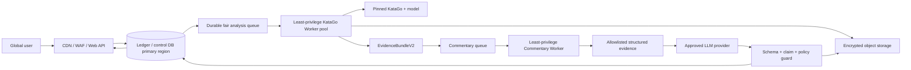

# KataTalk 글로벌 production 자연어 해설 서비스 명세 v1

> 상태: 구현 전 기준 명세
> 기준일: 2026-08-12
> 목표: KataGo의 검증 가능한 수치·수순 근거를 바탕으로 글로벌 사용자가 이해할 수 있는 자연어 바둑 해설을 안전하고 안정적으로 제공한다.

## 1. 제품 정의

KataTalk는 사용자가 업로드한 SGF를 KataGo로 분석하고, 중요한 장면을 선별해 사용자의 수준과 언어에 맞는 자연어 해설을 제공한다. 자연어 모델은 새로운 바둑 사실을 만드는 분석기가 아니라, **검증된 구조화 근거를 설명하는 표현 계층**이다.

서비스의 핵심 약속은 다음과 같다.

1. 좌표·승률·집 차이·추천 수순은 KataGo 결과와 버전이 고정된 변환 로직에서만 가져온다.
2. LLM에는 raw SGF, 계정 정보, 결제 정보, secret, 파일 경로, 로그를 보내지 않는다.
3. LLM 출력이 계약 또는 claim 검증을 통과하지 못하면 저장·노출하지 않고 결정론적 해설로 대체한다.
4. 숫자 분석 성공과 자연어 생성 상태를 분리해, LLM 장애가 크레딧 원장이나 KataGo 결과를 훼손하지 않게 한다.
5. 사용자는 해설 언어, 기력 수준, 보존·삭제 상태와 AI 생성 사실을 알 수 있어야 한다.

## 2. 출시 범위

### v1 공개 베타 목표 범위

- 보드 크기: 9×9, 13×13, 19×19
- 입력: UTF-8 FF4 SGF, 현재 admission 규칙을 통과한 메인라인
- 규칙: v1은 현재 parser와 KataGo 계약이 검증하는 일본식 규칙만 지원하며 다른 룰셋은 admission에서 거절
- 목표 언어: `ko-KR`, `en`, `ja-JP`, `zh-CN`
- 출시 순서: `ko-KR`/`en`을 먼저 독립 승인하고, `ja-JP`/`zh-CN`은 각 언어의 기사·원어민 검수 gate를 통과하기 전까지 LLM 출력을 비활성화하고 결정론적 fallback만 제공
- 대상 수준: 입문, 중급, 단, 고단
- 결과:
  - 전체 승률 흐름 또는 사용할 수 없다는 명시적 상태
  - 최대 1개의 결정적 장면 후보와 최대 5개의 복습 장면 후보
  - 실전 수, 추천 후보, 제한된 PV, 집/승률 근거
  - 장면별 짧은 자연어 해설, 근거 bullet, 불확실성 안내
- 결제: Lemon Squeezy 일회성 크레딧 팩
- 유료 공개 전 분석 재시도 idempotency, capacity-before-debit와 결제 refund/chargeback 불변식을 `NLC-005`~`NLC-007`로 완성

### v1 제외 범위

- 실시간 대국 코칭, 부정행위 탐지, 프로 기사 수준의 정답 보증
- 자유형 바둑 Q&A, SGF 전문을 LLM에 보내는 대화
- 모든 룰셋과 변형 SGF의 완전한 합법성 판정
- 음성·영상 해설, 사용자 간 공유·공개 링크
- 다중 리전 active-active 데이터베이스
- Toss 실결제와 구독 상품

## 3. 현재 코드 기준선

이미 구현된 기반:

- `server/analyzeRoute.ts`: 인증·SGF admission·원자적 크레딧 차감/작업 enqueue
- `server/worker/*`: 외부 Worker, lease/heartbeat, KataGo root·multi-turn·deep search·timeline
- `shared/analysisProductEventsV1.ts`: 장면·근거·confidence 계약
- `shared/explanationPlannerV1.ts`, `shared/explanationPlannerV2.ts`: 결정론적 해설 재료와 사용자 수준별 계획
- `shared/llmCommentaryGuardV1.ts`: prompt/output 입력값·길이·금지 표현·민감 payload 검사
- `shared/llmCommentaryClaimVerifierV1.ts`: 좌표·집·승률 claim을 plan 근거와 대조
- `shared/llmCommentaryOrchestratorV1.ts`: 검증 실패 시 결정론적 fallback
- `server/llm/commentaryProviderV1.ts`: 기본 OFF인 provider adapter
- `shared/analysisResultViewModel.ts`, `client/src/components/AnalysisResultView.tsx`: 숫자·PV·복습 장면 UI 기반

아직 제품 경로가 아닌 것:

- provider/orchestrator는 Worker, DB, API, UI에 연결되지 않았다.
- provider prompt는 한국어로 고정되어 있고 모델·prompt provenance, token/cost 기록, 재시도·회로 차단·실제 취소가 없다.
- commentary 전용 상태, 저장 계약, owner API, 삭제/retention, 다국어 품질 평가가 없다.
- 실제 provider와 바둑 전문가 corpus를 이용한 end-to-end 해설 품질 증거가 없다.

### LLM 연결보다 먼저 닫아야 할 정확성 결손

- `turnAnalyses`의 후보별 `winrate`/`scoreLead`를 KataGo 설정 축에서 해당 착수자의 관점으로 정규화하지 않은 채 BSI가 `best - played`를 계산한다. `BLACK` 설정에서 백 착수 손실이 0 또는 반대 부호가 될 수 있으므로 **P0**다.
- 현재 실행 순서는 고정 간격 후보 정밀 분석 뒤에 전체 timeline을 계산한다. 20수 간격 사이의 실제 변곡점이 정밀 분석·Deep Search 후보에서 빠질 수 있다.
- BSI와 ADI는 코드상 `provisional`이고 ownership volatility는 항상 `null`, ladder 근거는 항상 false이며 concept tag는 국소 휴리스틱이다. 이 근거로 사활·축·패·연결/절단을 단정하면 안 된다.
- ViewModel의 Explanation Plan V2 audience는 현재 `dan`으로 고정되어 있다. 사용자 수준을 입력·저장·artifact 계약에 포함하기 전 개인화 출시를 주장하지 않는다.

따라서 production 순서는 **착수자 관점 정규화 → 저비용 전체 timeline → 적응형 장면 선택 → 정밀/Deep Search → versioned evidence → 자연어 표현**으로 고정한다.

정규화가 완료되기 전에는 현재 UI에서 BSI 값, BSI/ADI 기반 decisive/review 선택과 deterministic memo의 `score_loss`/`winrate_loss` bullet을 숨긴다. root/timeline의 검증된 표시 축과 PV만 제공하며 이 containment 없이는 폐쇄형 사용자 beta도 GO로 보지 않는다.

## 4. 목표 아키텍처



### 서비스 분리

| 구성요소          | 책임                                                        | 금지 사항                                                  |
| ----------------- | ----------------------------------------------------------- | ---------------------------------------------------------- |
| Web API           | 인증, admission, owner API, 상태/결과 제공                  | KataGo·LLM 직접 장기 실행                                  |
| KataGo Worker     | timeline-first 수치 분석, plan 재료 생성, result provenance | 결제/Clerk secret, 자연어를 사실로 확정, 전체 service-role |
| Commentary Worker | 안전 plan 조회, provider 호출, 검증·저장                    | raw SGF·사용자 PII, KataGo/결제 secret, 전체 service-role  |
| LLM provider      | 구조화 plan의 표현 변환                                     | 원본 SGF 분석, 임의 좌표·수치 생성                         |
| Database          | 상태, 원장, versioned result/commentary source of truth     | 브라우저 service-role 접근                                 |

초기 글로벌 출시는 단일 primary write region과 CDN/edge 보호를 사용한다. 다중 리전 쓰기는 실제 지연·규제·장애 데이터가 요구하기 전까지 도입하지 않는다.

## 5. 데이터 계약

### `AnalysisEvidenceBundleV2`

자연어 계층은 느슨한 `analysis_jobs.result`나 raw SGF를 직접 읽지 않는다. KataGo Worker가 strict runtime schema로 다음 allowlist artifact를 만든다.

- `analysisId`, `sgfSha256`, `evidenceHash`, board size, rules, komi, initial player
- KataGo binary version·SHA, model SHA, config SHA, backend와 visits/timeout/policy version
- 모든 장면의 stable `evidenceId`, 착수자, 실전 수, 후보 수, 제한된 PV
- 각 후보의 `black`, `white`, `playerToMove` 축 winrate/score와 정규화 delta
- timeline·targeted·deep-search 단계별 `complete | partial | failed`
- `commentaryEligibility`와 reason code

파일명, `PB`/`PW`, 계정 식별자, SGF comment와 raw SGF는 이 artifact에 포함하지 않는다. `BLACK`/`WHITE`/`SIDETOMOVE` 설정이 같은 player loss를 내는 교차축 테스트가 통과하지 않으면 `commentaryEligibility=false`다.

### `CommentaryProviderInputV1`

Provider에는 `AnalysisEvidenceBundleV2` 전체를 직렬화하지 않고 다음 projection만 최대 32KiB로 전달한다.

```ts
type GtpColumnV1 =
  | "A"
  | "B"
  | "C"
  | "D"
  | "E"
  | "F"
  | "G"
  | "H"
  | "J"
  | "K"
  | "L"
  | "M"
  | "N"
  | "O"
  | "P"
  | "Q"
  | "R"
  | "S"
  | "T";
type GtpRowV1 =
  | "1"
  | "2"
  | "3"
  | "4"
  | "5"
  | "6"
  | "7"
  | "8"
  | "9"
  | "10"
  | "11"
  | "12"
  | "13"
  | "14"
  | "15"
  | "16"
  | "17"
  | "18"
  | "19";
type GtpCoordinateV1 = `${GtpColumnV1}${GtpRowV1}`;
type ProviderMoveV1 = GtpCoordinateV1 | "pass";
type ProviderConceptKeyV1 =
  | "reduction"
  | "invasion"
  | "territory_defense"
  | "connection"
  | "cut"
  | "atari"
  | "capture"
  | "life_and_death_context"
  | "ladder_risk"
  | "sente_context"
  | "gote_context"
  | "tenuki_context"
  | "shape"
  | "thickness"
  | "endgame"
  | "weak_group_attack"
  | "weak_group_save";
type ProviderCaveatKeyV1 =
  | "candidate_not_final_judgement"
  | "timeline_context_not_loss"
  | "limited_search"
  | "pv_reference_only"
  | "concept_hint_only"
  | "local_reading_only"
  | "ownership_unavailable";

type CommentaryProviderInputV1 = {
  version: "commentary-provider-input-v1";
  locale: "ko-KR" | "en" | "ja-JP" | "zh-CN";
  audience: "beginner" | "intermediate" | "dan" | "high_dan";
  board: {
    size: 9 | 13 | 19;
    rules: "japanese";
    komi: number;
    initialPlayer: "B" | "W";
  };
  scenes: Array<{
    evidenceAlias: `E${number}`;
    sceneType: "decisive_move" | "review_move";
    turnIndex: number;
    player: "B" | "W";
    playedMove: ProviderMoveV1;
    candidates: Array<{
      move: ProviderMoveV1;
      playerWinrateDelta: number | null;
      playerScoreDeltaPoints: number | null;
      pv: ProviderMoveV1[];
    }>;
    allowedConceptKeys: ProviderConceptKeyV1[];
    caveatKeys: ProviderCaveatKeyV1[];
  }>;
};

type CommentaryProviderOutputV1 = {
  version: "commentary-provider-output-v1";
  summary: Array<{
    text: string;
    evidenceAliases: Array<`E${number}`>;
  }>;
  sections: Array<{
    evidenceAlias: `E${number}`;
    turnIndex: number;
    titleKey: "decisive_move" | "review_move";
    claims: Array<{
      text: string;
      evidenceAliases: Array<`E${number}`>;
    }>;
    caveatKeys: ProviderCaveatKeyV1[];
  }>;
};
```

입력과 출력은 구현 시 JSON Schema 또는 동등한 runtime schema로 고정하고 **모든 중첩 object에 `additionalProperties: false`**를 적용한다. Provider 호출 전 입력을, 응답 수신 직후 출력을 각각 strict parse하며 unknown field는 버린 뒤 진행하지 않고 전체 요청을 reject한다. 추가 계약은 다음과 같다.

- input UTF-8 JSON은 최대 32KiB, output은 최대 32KiB다. 문자열은 NFC이고 C0/C1 control, bidi override, NUL을 거절한다.
- `scenes`는 1~6개, `candidates`는 장면당 1~5개, `pv`는 후보당 0~10수다. concept key는 중복 없이 최대 4개, caveat key는 중복 없이 최대 7개다.
- `evidenceAlias`는 한 요청 안에서 유일한 `E1`~`E6`이고, `turnIndex`는 유일한 1~10,000 정수다. output section은 input scene과 alias·turn·type이 정확히 일치해야 한다.
- 좌표는 대문자 GTP 형식이며 `I` 열을 쓰지 않는다. 열과 행은 해당 `board.size` 안이어야 하고 보드 밖 좌표를 거절한다. `pass`만 유일한 비좌표 move다.
- `komi`는 -150~150의 유한한 0.5 단위 점수다. `playerWinrateDelta`는 착수자 관점의 유한한 0~1 **ratio**, `playerScoreDeltaPoints`는 유한한 0~`2 × board.size²` **points**이며 둘 중 하나 이상 있어야 한다. 음수·NaN·Infinity·문자열 숫자를 거절한다.
- provider output의 `summary`는 1~3개, `sections`는 1~6개, section별 `claims`는 1~4개다. summary/claim 본문은 각각 320/500 Unicode scalar 이하이고 각 항목은 input에 존재하는 alias를 1~4개 참조한다. 알 수 없는 alias·key, 중복 section, input에 없던 turn은 거절한다.
- `ProviderConceptKeyV1`와 `ProviderCaveatKeyV1`가 유일한 registry다. 새 key는 schema/version을 올리고 locale corpus·guard를 재승인한 뒤에만 추가한다.

`evidenceAlias`는 요청마다 새로 만드는 비식별 alias다. Gateway만 alias와 내부 stable `evidenceId`의 매핑을 요청 메모리 안에서 보유하고, strict output과 모든 좌표·수치 claim을 검증한 뒤 저장 artifact의 `evidenceRefs`로 변환한다. provider는 stable ID, digest 또는 provenance를 반환할 수 없다. Gateway만 검증된 `evidenceHash`, engine/model/config/policy digest와 provider/model/prompt/guard version을 최종 artifact에 추가한다.

Provider input에는 `analysisId`, job/commentary/owner ID, `sgfSha256`, `evidenceHash`, engine/model/config digest, 파일명, `PB`/`PW`/`DT`/`RE`, SGF comment/raw SGF, 계정·결제 식별자, 내부 error/log를 절대 포함하지 않는다.

### Commentary job과 artifact

`analysis_commentary_jobs`와 versioned `analysis_commentary_artifacts` 또는 동등한 분리 테이블을 사용한다. `analysis_jobs.status`나 숫자 결과 blob을 재사용하지 않는다. Artifact version은 생성 후 덮어쓰지 않는다. 본문/object는 artifact별 암호화 key로 보호한다.

Job 필수 필드:

- `id`, `analysis_job_id`, `owner_profile_id`
- `request_id`, `evidence_hash`
- `locale`: `ko-KR | en | ja-JP | zh-CN`
- `audience`: `beginner | intermediate | dan | high_dan`
- `status`: `queued | running | completed | fallback | failed`
- `attempt_count`, `locked_at`, `locked_by`, `last_error_code`
- `created_at`, `updated_at`, `completed_at`, `expires_at`

Artifact 필수 필드:

- `id`, `commentary_job_id`, `evidence_hash`
- `commentary_schema_version`, `planner_version`, `guard_version`, `claim_verifier_version`
- `prompt_template_version`, `provider`, `model`, `model_revision`
- `input_token_count`, `output_token_count`, `estimated_cost_usd`
- `commentary_json`, `fallback_reason_code`
- `created_at`, `expires_at`

유일성 키는 최소한 `(analysis_job_id, evidence_hash, locale, audience, prompt_template_version)`를 포함한다. 동일 결과의 재시도나 브라우저 새로고침은 중복 과금·중복 생성하지 않는다.

live job/artifact의 owner·analysis·evidence 연결은 terminal 후 최대 30일만 보존한다. owner 삭제나 retention 만료 시 하나의 fenced transaction/outbox 절차가 artifact DB row, object 본문, encryption key, linked commentary job row와 provider request/response·cache를 삭제하거나 crypto-erase한다. 따라서 삭제 뒤 `owner_profile_id`, `analysis_job_id`, `evidence_hash`가 남은 linked job row는 허용하지 않는다. 사용자 조회는 즉시 404가 되고 primary 삭제는 24시간, backup 만료는 30일 이내여야 한다. Provider는 학습 사용 OFF와 zero-retention을 우선하며, 불가피한 보안 로그의 최대 보존·삭제 SLA가 30일 이하임을 DPA로 승인해야 한다.

별도 tombstone에는 무작위 deletion operation ID, 삭제 시각, reason code와 policy version만 최대 1년 보존할 수 있다. artifact/job/owner/analysis ID, digest/hash, locale, 본문, evidence, provider payload처럼 사용자나 콘텐츠에 다시 연결 가능한 값은 남기지 않는다. 감사 지표는 비식별 집계만 사용한다.

### Commentary output

```ts
type CommentaryArtifactV1 = {
  version: "commentary-v1";
  locale: "ko-KR" | "en" | "ja-JP" | "zh-CN";
  audience: "beginner" | "intermediate" | "dan" | "high_dan";
  status: "completed" | "fallback";
  summary: Array<{ text: string; evidenceRefs: string[] }>;
  sections: Array<{
    turnIndex: number;
    titleKey: "decisive_move" | "review_move";
    claims: Array<{ text: string; evidenceRefs: string[] }>;
    caveatKeys: ProviderCaveatKeyV1[];
  }>;
  provenance: {
    evidenceHash: string;
    engineVersion: string;
    modelDigest: string;
    plannerVersion: string;
    promptTemplateVersion: string;
    provider: string;
    model: string;
  };
};
```

`CommentaryArtifactV1`은 provider output schema와 다른 내부 저장 schema다. `evidenceRefs`는 Gateway가 alias를 치환한 DB 내부 stable evidence ID만 참조하며 raw SGF나 provider prompt 전문을 포함하지 않는다. Gateway가 붙이는 provenance는 provider가 덮어쓸 수 없다. 좌표·수치·player·관점·바둑 판정을 포함하는 문장은 `evidenceRefs`가 비어 있으면 schema 단계에서 거절한다. strict parser는 모든 중첩 object의 알 수 없는 추가 필드도 거절한다.

## 6. 처리 상태와 실패 정책

아래 provider 단계는 Phase A, 특히 `NLC-009`의 최소권한·finite retention·home region·DPA·법적 근거·동의 gate가 모두 닫힌 뒤에만 활성화한다. 그전에는 production과 shadow 모두 provider 호출을 하지 않는다.

1. KataGo 결과가 quality gate와 commentary eligibility를 통과하면 commentary job을 idempotent하게 생성한다. 불충분한 evidence는 provider를 호출하지 않고 deterministic fallback으로 끝낸다.
2. Commentary Worker가 lease를 획득하고 locale/audience별 안전 plan을 만든다.
3. input guard 통과 후 provider를 호출한다.
4. JSON schema, output guard, claim verifier, locale 검사 순서로 검증한다.
5. 모두 통과하면 `completed`; 검증 실패나 provider 장애면 결정론적 plan으로 `fallback`을 저장한다.
6. LLM 출력 원문은 검증 통과 전 사용자 결과에 포함하지 않는다.
7. commentary 재시도는 분석 크레딧을 다시 차감하지 않는다.

재시도 정책:

- timeout 10초, 전체 budget 20초
- 네트워크/429/5xx만 최대 2회 exponential backoff + jitter
- 4xx schema/auth 오류는 즉시 실패
- provider별 circuit breaker와 동시성·비용 budget
- Commentary job deadline, Worker shutdown, lease 상실이 provider 요청을 중단하도록 실제 `AbortSignal` 전달. 비동기 job은 단순한 브라우저 연결 종료만으로 취소하지 않음

사용자 계약:

- 숫자 분석이 성공하고 자연어만 실패하면 검증된 결정론적 설명과 “자동 해설을 간단히 표시했다”는 상태를 제공한다.
- 숫자 분석 자체가 실패하면 기존 원자적 실패/환불 정책을 따른다.
- 자연어 실패만으로 추가 차감하거나 동일 분석을 자동 재구매하지 않는다.

## 7. API 명세

### `POST /api/analyze`

기존 multipart 계약을 유지하며 선택 필드를 추가한다.

- `Idempotency-Key` 또는 동등한 client request ID를 필수로 받는다.
- `commentaryLocale`: 기본 사용자 locale
- `commentaryAudience`: 기본 `intermediate`
- 잘못된 값은 크레딧 차감 전에 400

`(owner, request_id)`는 unique여야 한다. 같은 key·같은 SGF hash/옵션 재요청은 기존 job과 잔액을 반환하고, 같은 key에 다른 SGF hash·언어·audience가 오면 409를 반환한다. 응답 유실 뒤 100회 동시 재시도에서도 job·차감 ledger가 정확히 1개여야 한다. Queue가 한도 또는 SLO를 넘은 경우 **차감 전에** 429/503과 `Retry-After`를 반환한다.

### `GET /api/analyze/:jobId`

상태 polling 응답은 2KB 이하를 목표로 하고, 큰 SGF·결과·commentary 전문을 분리한다.

- `analysisStatus`
- `commentaryStatus`
- `progress`
- `resultVersion`
- `updatedAt`
- 민감 owner 응답은 `Cache-Control: private, no-store`
- owner 조건이 SQL/RPC 조회 자체에 포함되며, 타인의 ID와 없는 ID를 모두 404로 정규화

### `GET /api/analyze/:jobId/result`

- owner-only
- versioned numeric/KataGo result
- `ETag` 또는 digest 제공
- SGF 원문은 별도 권한 경로로 분리

### `GET /api/analyze/:jobId/commentary?locale=&audience=`

- owner-only
- `completed` 또는 `fallback` commentary만 반환
- provider 원문 응답, prompt, token, 내부 error는 반환하지 않음
- 아직 준비되지 않았으면 202와 제한된 상태만 반환

### 삭제

기존 분석 payload 삭제는 5장의 동일 fenced transaction/outbox 규칙으로 commentary artifact row·object·key·provider cache와 linked commentary job row를 함께 제거한다. 삭제 뒤 owner/analysis/evidence 연결이 남아서는 안 된다. 신용 ledger는 승인된 법적 보존 기간 동안 유지할 수 있지만 commentary job/artifact ID, evidence hash나 본문을 보유하지 않는다. 별도 tombstone은 비연결 deletion operation ID·시각·reason·policy version만 보존한다.

상태 polling은 전체 SGF/result 행을 읽지 않는다. 완료 artifact는 별도 endpoint/object storage에서 digest·ETag로 제공하며, 진행률은 Web/Worker 로컬 파일이 아닌 공용 durable transport를 사용한다.

## 8. 안전·개인정보·보안 요구사항

- raw SGF, 파일명, 플레이어명, 이메일, Clerk ID, 결제 ID를 provider에 전송하지 않는다.
- provider 입력은 allowlist 기반 scalar/enum/좌표/수치 구조로 재생성한다.
- prompt injection으로 해석될 SGF comment나 사용자 문자열을 plan에 포함하지 않는다.
- provider와 DPA, 학습 사용 금지, 보존 기간, 처리 리전, subprocessors를 계약·공개한다.
- 사용자는 AI 생성 해설임을 확인하고 삭제할 수 있어야 한다.
- 운영 로그는 prompt/output 전문 대신 request ID, version, latency, token, outcome code만 기록한다.
- API key는 Commentary Worker 전용 secret이며 Web/KataGo Worker에 배포하지 않는다.
- 콘텐츠 안전 필터는 바둑 해설의 사실 검증과 별개 단계로 적용한다.
- CSP는 Clerk·결제·font·provider 관찰 결과로 allowlist를 만든 뒤 report-only부터 적용한다.
- Clerk token의 audience/authorized party와 ingress proxy CIDR을 production topology에 고정한다.
- 분석 Worker DB 자격 증명은 claim·heartbeat·finalize·자신의 artifact만 허용하고 결제·profile·credit RPC 실행을 거절한다.
- 보존 기간은 production에서 데이터 등급별 유한값을 필수로 하고, purge·account deletion·backup propagation을 예약·감시한다.
- 모든 외부 호출은 전파된 deadline과 실제 `AbortSignal`, 응답 크기 상한, idempotent 요청에만 제한된 retry를 적용한다.
- Web은 SIGTERM에서 readiness를 먼저 내리고 새 admission을 중단한 뒤 진행 중 HTTP/webhook을 bounded drain한다. Worker도 새 claim을 멈추고 lease 상태를 안전하게 넘긴다.
- public liveness는 최소 정보만 반환하고, 내부 readiness는 bounded DB·queue·예상 engine/Worker 상태를 검사하며 상세 diagnostics는 token으로 보호한다.

## 9. 글로벌 UX·접근성·현지화

- 모든 사용자 문구는 locale key 기반이며 provider가 UI 버튼·법률 문구를 생성하지 않는다.
- 숫자 표기, 소수점, 날짜, 시간대는 locale-aware formatter를 사용한다.
- 중국어는 제품 출시 전에 간체/번체 범위를 명시한다. v1 기본은 간체 `zh-CN`으로 고정하고 UI 코드 `zh`와 매핑한다.
- 해설은 좌표만 나열하지 않고 현재 수, 추천 후보, 이유, 참고 수순, 불확실성 순서로 읽힌다.
- board와 해설 장면 선택은 키보드·screen reader에서 연결되고 현재 수가 음성으로 전달된다.
- WCAG 2.2 AA, 200~400% zoom, 320 CSS px, keyboard-only 전체 흐름, reduced-motion을 출시 gate로 둔다.
- 긴 해설은 progressive disclosure를 사용하고 모바일에서 board와 근거가 서로 가려지지 않아야 한다.
- 바둑판에는 키보드 가능한 grid 또는 동등한 수순 표, 승률 chart에는 동일 정보의 data table, 상태 변화에는 live region을 제공한다. 터치 target은 최소 44 CSS px다.
- 운영 화면은 stack·내부 error를 노출하지 않고 locale 메시지와 incident ID만 표시한다. 이름·이메일을 브라우저 `localStorage`에 저장하지 않는다.
- 분석 history/status/cancel/retry, 로그인 뒤 원래 deep link 복귀, 데이터 export/account deletion, 버전형 약관·개인정보·환불 동의를 핵심 흐름에 포함한다.

## 10. SLO와 운영 지표

공개 베타 초기 목표:

| 지표                             | 목표                        |
| -------------------------------- | --------------------------- |
| Web API 월 가용성                | 99.9%                       |
| 분석 접수 API p95                | 800ms 이하                  |
| 상태 조회 API p95                | 300ms 이하, 응답 2KB 이하   |
| 표준 19×19 분석 전체 p95         | 120초 이하                  |
| commentary plan 준비 후 p95      | 8초 이하, hard timeout 10초 |
| commentary 검증 fallback 비율    | 정상 provider 구간 1% 이하  |
| 미근거 좌표·수치 노출            | 0건                         |
| 결제 중복 지급·이중 차감         | 0건                         |
| terminal 실패 후 미환불 유료 job | 0건                         |

필수 metric:

- queue depth/age, claim latency, Worker heartbeat, engine duration, GPU memory/error
- commentary latency/attempt/fallback/reason/provider/model/locale/audience
- token·비용, 사용자당/분석당 원가, cache hit
- 401/403/413/429/5xx, shared rate-limit store 상태
- payment webhook lag/replay/duplicate/reversal, ledger mismatch
- deletion backlog와 retention purge 결과

알림에는 runbook, 담당자, correlation ID가 연결되어야 하며 원문 SGF나 자연어 출력 전문을 넣지 않는다.

## 11. 품질 평가와 출시 게이트

### 자동 평가

- schema/guard/claim verifier: unsafe fixture에서 누출 0, 허위 좌표·수치 통과 0
- `BLACK`/`WHITE`/`SIDETOMOVE` config와 흑·백 착수 모두에서 player loss·score 부호 교차축 동일성 100%
- deterministic replay: 동일 engine/result digest에서 selector와 plan 동일
- locale: 요청 언어 일치율 99% 이상, 다른 언어 혼입 critical 0
- malformed/provider timeout/429/5xx에서 fallback 및 상태 불변식 100%
- 구/신 result/commentary schema 호환 테스트
- Chromium/Firefox/WebKit, 360/390/430/768/1440, 네 locale, zoom/keyboard/axe serious·critical 0
- 실제 staging upload → charge → queue → GPU KataGo → commentary/fallback → reload/delete와 payment reversal 종단 검사

### 바둑 전문가 평가

- 동의·익명화·라이선스가 확인된 실제 exporter corpus 최소 200국
- 9/13/19, 접바둑, pass, setup stone, 장기 대국, 각 지원 언어 coverage
- 주요 장면은 독립 검수자 2명이 확인
- critical factual error 0
- “근거와 모순 없음” 99.5% 이상
- 교육적 유용성 평균 4.0/5 이상
- 언어별 결과를 원어민 바둑 검수자가 별도 승인

### 운영 출시 gate

- 최신 production dependency high/critical 0
- Supabase 001–014 및 commentary migration의 실제 catalog/ACL 증거
- Clerk 로그인/JWKS 장애, Lemon 결제/중복/환불/차지백, Worker kill/reclaim, provider 장애 drill 통과
- 30–60분 이상 실제 staging soak와 queue/비용/SLO 보고서
- 개인정보·약관·환불·AI 고지 법무 승인
- penetration test와 공개 security contact
- destructive retention/reconciliation workflow의 protected ref·target-project fingerprint·dual approval와 immutable action SHA
- repository/product license 결정, root license·third-party notice·SBOM 정합성

## 12. 구현 로드맵과 완료 조건

### Phase A — 현재 기준선 복구

- `NLC-000` **완료**: `nanoid >=5.1.16`, local/PR production audit known vulnerability 0 (`31607218074`)
- `NLC-001`: current review·CI·문서의 단일 source of truth 정리
- `NLC-002`: 먼저 provisional BSI/ADI loss UI를 숨기고, per-turn winrate/score를 black·white·player-to-move 축으로 정규화한 뒤 교차축 동일성 통과 시에만 다시 활성화
- `NLC-003`: timeline-first 적응형 후보 선택 뒤 targeted/deep 분석
- `NLC-004`: strict `AnalysisEvidenceBundleV2`와 engine/model/config/policy digest
- `NLC-005`: 분석 request idempotency와 owner-qualified 경량 status/result 분리
- `NLC-006`: durable payment webhook inbox와 refund/chargeback/debt state machine
- `NLC-007`: shared capacity admission·per-user fairness를 차감 전에 원자 적용
- `NLC-008`: production stack 노출·browser PII storage 제거와 versioned legal links/consent
- `NLC-009`: Analysis Worker 최소권한 DB role, finite retention/home region, provider DPA·법적 근거·동의 계약 승인
- 완료: UI containment 배포, PR 필수 check 전부 green, 축 오류 0, 100회 재시도 1 job/1 차감, overload 차감 0, payment replay/reversal 불변식과 문서 정합성 통과. NLC-009 전에는 외부 provider·shadow 호출 금지

### Phase B — versioned commentary core

- `NLC-010`: `CommentaryArtifactV1`, job 상태, provenance, digest 계약
- `NLC-011`: migration/RPC/ACL과 owner-only API
- `NLC-012`: Commentary Worker lease·retry·circuit breaker
- `NLC-013`: provider adapter의 AbortSignal, structured schema, token/cost 계측
- 완료: Phase A 전체가 닫힌 뒤에만 provider를 연결하며, provider가 없어도 deterministic fallback으로 end-to-end 성공

### Phase C — 다국어 제품 연결

- `NLC-020`: locale/audience-aware planner와 prompt template
- `NLC-021`: result UI, 장면 동기화, fallback/AI 표시, 삭제
- `NLC-022`: `ko-KR`/`en`/`ja-JP`/`zh-CN` UI·fallback 번역, screen reader·mobile/zoom gate
- 완료: 네 언어 UI/fallback staging E2E, `ko-KR`/`en` LLM gate와 WCAG 2.2 AA 자동/수동 검사 통과. `ja-JP`/`zh-CN` LLM은 Phase D의 언어별 승인 전 OFF

### Phase D — 품질·안전 증거

- `NLC-030`: consented corpus와 golden commentary/evidence manifest
- `NLC-031`: 자동 claim·locale·regression eval 및 전문가 review tool
- `NLC-032`: shadow mode로 생성하되 사용자 미노출, fallback·비용 측정
- 완료: 11장 기준 충족, 모델/prompt 변경마다 회귀 gate 실행

### Phase E — 글로벌 운영

- `NLC-040`: CDN/WAF, shared rate limit, ingress byte cap, no-store 정책
- `NLC-041`: GPU/Commentary Worker autoscaling, queue age 기반 capacity
- `NLC-042`: dashboards, alerts, on-call, backup/restore, disaster drill
- `NLC-043`: 판매 국가·세금·지원 시간대와 regional availability의 GA 승인
- `NLC-044`: webhook DLQ/operator replay, nightly provider-ledger reconciliation과 runbook
- `NLC-045`: 객체 저장소 crypto-erasure, account deletion·backup restore·최소권한 contract의 운영 증거
- `NLC-046`: immutable CI action/image provenance, scheduled dependency scan, destructive workflow target guard와 license/third-party notice
- 완료: staging 종단·soak·장애 drill·법무 승인 후 제한 공개 베타

## 13. 출시 판정

현재 판정은 **NO-GO**다. 구현된 안전 plan과 LLM guard는 좋은 기반이지만, 실제 제품 연결·다국어 품질·provider 운영·실환경 데이터베이스/결제/Worker 증거가 없다. Phase A–E gate가 증거로 닫힐 때만 공개 유료 출시를 재판정한다.
