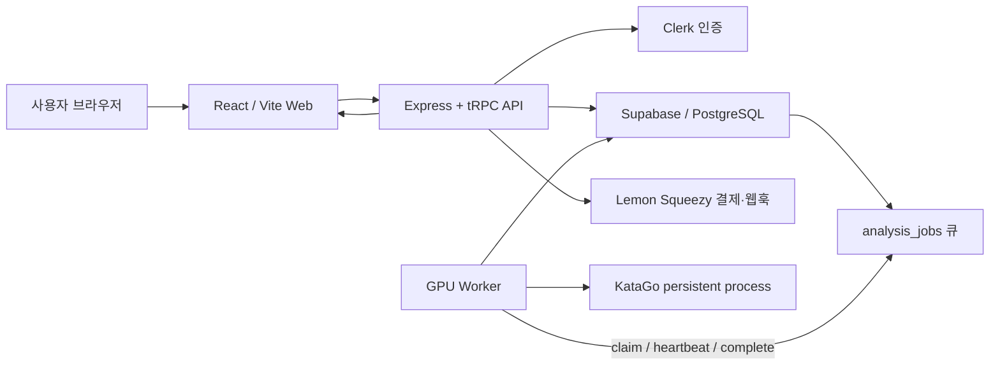
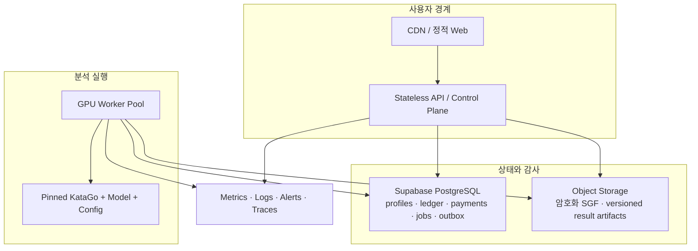

# KataTalk 상용화 코드베이스 리뷰

> 기준일: 2026-08-04
> 대상 저장소: `xjvmwodnjs/katatalk-web`
> 기준 브랜치/구현 상태: `agent/clerk-client-artifact-gate` / 이번 리뷰 작업 트리
> 문서 목적: 현재 구현을 사실에 근거해 진단하고, 공개 유료 서비스로 전환하기 위한 작업 순서와 합격 기준을 단일 기준점으로 만든다.

---

## 1. 결론부터

KataTalk는 단순한 화면 시제품을 넘어섰다. SGF 업로드, 비동기 분석 작업, 크레딧 차감, 결제 웹훅, KataGo 장기 실행 프로세스, 결과 정규화, 진행 상태와 결과 UI, CI까지 상용 서비스의 주요 부품이 이미 존재한다. 타입 검사, 단위 테스트, 빌드, 브라우저 E2E도 현재 체크아웃에서 모두 통과했다.

그러나 **지금 바로 불특정 다수에게 공개 유료 판매를 시작하는 것은 NO-GO**다. 이유는 기능 부족보다 돈·권한·분석 정확성·운영 복구의 핵심 불변식이 아직 실제 환경에서 증명되지 않았기 때문이다.

| 출시 단계                           |             판정 | 근거                                                                                        |
| ----------------------------------- | ---------------: | ------------------------------------------------------------------------------------------- |
| 로컬 개발 및 내부 데모              |           **GO** | 핵심 흐름과 자동화 테스트가 동작한다.                                                       |
| 모의 엔진을 이용한 내부/지인 테스트 |           **GO** | 운영 데이터와 실제 결제를 분리한다는 조건이다.                                              |
| 실제 KataGo를 이용한 폐쇄형 테스트  |    **조건부 GO** | 고정된 엔진/모델, 별도 스테이징 DB, 관찰 가능성, 데이터 동의가 먼저 필요하다.               |
| 초대형 유료 베타                    | **조건부 NO-GO** | 아래 P0 중 과금·환불, 권한, 결제 수명주기, 규칙 정확성, 실제 E2E를 모두 닫은 뒤 재판정한다. |
| 공개 유료 베타/GA                   |        **NO-GO** | 보안·법무·운영 복구·장기 SLO·실사용 품질 증거가 부족하다.                                   |

### 공개 유료 출시 판단에 남은 P0 요약

1. 실패 확정·환불 원자 명령과 PostgreSQL CI 게이트는 구현됐고 GitHub Actions에서 통과했다. 실제 Supabase 스테이징 증거는 아직 남아 있다.
2. Supabase `SECURITY DEFINER` 권한 manifest와 SQL 거절 검사는 구현됐지만 실제 Supabase/PostgREST 스냅샷은 남아 있다.
3. Lemon Squeezy 결제 성공만 처리하고 환불·차지백·취소 및 상품 실체 검증은 완성되지 않았다.
4. SGF root `RU`의 일본식-only admission, strict root `SZ`/`KM`, pre-mainline `PL`·`HA`/setup 기반 `initialPlayer`, and `sgf-game-info-v1` metadata contracts are implemented. Malformed UTF-8 is a fixed 400 before wallet/debit/enqueue; safe authored-or-null `PB/PW/DT/RE` is field-local, with valid FF4 partial/comma `DT` forms accepted and invalid shortcut state rejected, bounded lexical numeric `RE`, generic `B+`/`W+` as `win`, and marked-result revalidation. Legacy `katago-worker-v1` reparses `sgf_content` or `sgfContent` or hides placeholders. Remaining: post-move setup transition, real-exporter compatibility, and staging evidence.
5. 마이그레이션 실행 경로는 단일화했지만 기존 운영 DB의 승인된 history baseline과 스테이징 리허설이 남아 있다.
6. Clerk → 결제 → DB → 실제 Worker/KataGo → 결과/원장의 실환경 종단 증거가 없다.
7. Worker가 죽어 있어도 사용자의 크레딧은 즉시 차감되며, 오래 묵은 작업의 자동 취소·환불 정책이 없다.

`COM-003`의 프로덕션 의존성 high/critical 게이트는 계속 fail-closed한다. 2026-08-04 새 `ip-address` advisory가 PR CI를 차단했고, 허용된 `express-rate-limit@8.5.1 → ip-address@^10.2.0` 범위 안에서 lockfile만 `10.4.0`으로 갱신했다. 로컬 frozen install과 production audit는 다시 알려진 취약점 0을 확인했고, PR #2 GitHub Actions [`30923411845`](https://github.com/xjvmwodnjs/katatalk-web/actions/runs/30923411845)의 4개 job도 모두 통과했다.

**첫 구현 작업은 `COM-001: 실패 확정 + 환불 원자화`로 잡는 것이 맞다.** 이 작업이 결제 서비스의 가장 중요한 불변식인 “돈을 냈는데 결과도 환불도 없는 상태”와 “환불받았는데 작업이 다시 성공하는 상태”를 동시에 막는다.

---

## 2. 검토 범위와 실제 검증 결과

이번 리뷰는 문서만 읽은 평가가 아니다. 저장소 전체 구조, 런타임 경로, DB 마이그레이션, 결제, 인증, Worker, 결과 UI, 테스트, CI, 운영 스크립트를 확인하고 로컬에서 실행 가능한 검증을 수행했다.

### 저장소 규모

| 항목                      |                  현재 값 |
| ------------------------- | -----------------------: |
| Git 추적 파일             |   399개 (이번 변경 포함) |
| TypeScript/TSX            | 289개 파일 / 약 61,134줄 |
| Vitest 테스트 파일        |                     90개 |
| Vitest 테스트 수          |                    981개 |
| Playwright 시나리오       |                      9개 |
| Supabase SQL 마이그레이션 |       14개 (`001`~`014`) |
| GitHub Actions 워크플로   |                      4개 |

### 실행 검증

| 검증                                       |                           결과 | 비고                                                                                                                                                      |
| ------------------------------------------ | -----------------------------: | --------------------------------------------------------------------------------------------------------------------------------------------------------- |
| TypeScript `tsc --noEmit`                  | **로컬 PASS / master CI PASS** | 현재 브랜치 타입 오류 없음, master 실행 `30448737391`                                                                                                     |
| Vitest                                     | **로컬 PASS / master CI PASS** | 현재 87 files / 955 tests, master 실행 `30448737391`은 86 / 927                                                                                           |
| 프로덕션 빌드                              | **로컬 PASS / master CI PASS** | 현재 Clerk manifest·verifier + API + Worker 번들 통과, master 실행 `30448737391`                                                                          |
| Playwright Chromium                        | **로컬 PASS / master CI PASS** | 현재와 master 모두 9/9, 테스트/모의 분석 모드, master 실행 `30448737391`                                                                                  |
| 프로덕션 의존성 감사                       | **로컬 PASS / master CI PASS** | 현재 `ip-address@10.4.0`, 알려진 취약점 0; master 실행 `30448737391`                                                                                       |
| 실제 외부 KataGo 종단 테스트               |                     **미검증** | 바이너리·모델·GPU·실데이터가 필요한 별도 게이트                                                                                                           |
| 실제 Clerk/Lemon/Supabase 결제 종단 테스트 |                     **미검증** | 스테이징 공급자 계정과 웹훅 필요                                                                                                                          |
| 신규 DB/기존 DB 마이그레이션 리허설        |             **GitHub CI PASS** | PostgreSQL 16 fresh/upgrade·ACL·rollback·동시성·history-absent와 함수 본문·table persistence·독립 composite drift fixture 통과, master 실행 `30448737391` |

현재 `agent/clerk-client-artifact-gate` 작업 트리는 2026-08-04 로컬에서 secret scan, CI 대상 Prettier, `tsc --noEmit`, Vitest 87 files / 955 tests, dirty source build 차단을 통과했다. clean commit 상태에서는 process env를 비우고 `.env.production.local`의 padded Clerk test key만 사용한 production client/API/Worker build와 artifact verifier가 통과했으며, manifest source SHA도 해당 Git HEAD와 일치했다. Playwright Chromium은 변경 전후 UI 경로 9/9를 통과했다. 같은 구현과 advisory lock fix는 PR #2 GitHub Actions [`30923411845`](https://github.com/xjvmwodnjs/katatalk-web/actions/runs/30923411845)에서 type/unit/Clerk build/secret/format, PostgreSQL, production audit, Playwright 4개 job을 모두 통과했다.

COM-005 일본식 규칙 admission 커밋 `9392d77`의 GitHub 근거는 실행 [`30372767399`](https://github.com/xjvmwodnjs/katatalk-web/actions/runs/30372767399)이다. 타입·84 files / 843 tests·프로덕션 Web/API/Worker 빌드·format/secret scan, Playwright, PostgreSQL gate, 프로덕션 의존성 감사가 모두 통과했다. `PASS`는 회귀 방어가 상당히 잘 되어 있다는 뜻이지, 실제 결제와 실제 GPU 분석까지 안전하다는 뜻은 아니다. 특히 Playwright 테스트는 테스트 인증과 모의/외부 대체 경로를 사용하므로 상용 종단 증거와 구분해야 한다.

COM-005 초기 착수 계약 커밋 `e02f3d1`의 GitHub 근거는 실행 [`30426033948`](https://github.com/xjvmwodnjs/katatalk-web/actions/runs/30426033948)이다. 타입·84 files / 857 tests·프로덕션 Web/API/Worker 빌드·format/secret scan, Playwright, PostgreSQL gate, 프로덕션 의존성 감사가 모두 통과했다. 이 근거는 `PL`·`HA`/setup `initialPlayer`와 과금 전 admission 회귀를 닫지만 실제 KataGo/실제 exporter/staging 증거를 대신하지 않는다.

COM-005 strict `SZ`/`KM` 계약 커밋 `4a75b70`은 GitHub CI [`30433097938`](https://github.com/xjvmwodnjs/katatalk-web/actions/runs/30433097938)에서 85 files / 871 tests, format/type/secret scan, 프로덕션 Web/API/Worker 빌드, Playwright, PostgreSQL migration/ACL/atomicity, 프로덕션 의존성 감사 등 4개 job 전체를 통과했다. 이 근거는 root metadata 구조·지원 범위·query/UI 전파와 validation 전 wallet 0회/통과 후 1회 회귀를 닫지만 실제 exporter/real-engine/staging 증거를 대신하지 않는다.

COM-005 실제값 보존 game metadata 커밋 `e2c220f`은 GitHub CI [`30440871859`](https://github.com/xjvmwodnjs/katatalk-web/actions/runs/30440871859)에서 86 files / 927 tests, Playwright 9/9, format/type/secret scan, 프로덕션 Web/API/Worker 빌드, PostgreSQL migration/ACL/atomicity, 프로덕션 의존성 감사 등 4개 job 전체를 통과했다. 이 근거는 root `PB/PW/DT/RE` 작성값 또는 `null`, malformed UTF-8 과금 전 거절, marker 재검증, legacy SGF 복구와 placeholder 제거를 닫지만 root 외 game-info, legacy charset/`CA` transcoding, 실제 exporter/real-engine/staging 증거를 대신하지 않는다.

최신 `master` merge commit `5ac090e`는 GitHub CI [`30448737391`](https://github.com/xjvmwodnjs/katatalk-web/actions/runs/30448737391)의 4개 job을 모두 통과했으며, 현재 브랜치의 기준 커밋이다.

### 문서 신뢰도

- 루트 [ARCHITECTURE.md](ARCHITECTURE.md)는 Manus OAuth, MySQL, Stripe, LLM 중심의 과거 구조를 설명해 현재 Clerk, Supabase, Lemon Squeezy, KataGo Worker 구조와 맞지 않는다.
- [docs/commercialization-review.md](docs/commercialization-review.md)의 상단 수치와 본문은 현재 저장소와 다르며, 같은 문서의 후반 변경 이력과도 모순된다.
- [docs/TODO.md](docs/TODO.md)와 [README.md](README.md)의 과거 `007 → 006` 순서는 `001 → 014` 숫자 순서와 단일 runner 안내로 교정했다.

앞으로는 이 `review.md`의 출시 게이트와 백로그를 기준점으로 삼고, 구조 설명은 별도의 최신 `ARCHITECTURE.md`로 다시 작성하는 편이 안전하다.

---

## 3. 현재 시스템 지도

### 실행 구성



### 핵심 흐름

1. **인증**: Clerk 토큰을 API에서 검증하고 사용자 프로필/크레딧 지갑을 Supabase에 보장한다.
2. **업로드**: 사용자가 SGF를 업로드하면 크기와 최소 구조를 검사한다.
3. **과금 및 enqueue**: DB RPC가 크레딧을 차감하고 원장 항목과 `analysis_jobs`를 함께 만든다.
4. **분석**: 외부 Worker가 lease를 획득하고 heartbeat를 보내며 지속 실행 중인 KataGo 프로세스에 질의한다.
5. **완료**: Worker가 결과를 정규화해 작업에 저장하고 클라이언트가 상태를 polling해 결과를 표시한다.
6. **결제**: Lemon Squeezy 웹훅의 HMAC을 확인한 뒤 주문 ID로 중복을 방지하고 크레딧을 지급한다.
7. **삭제/보존**: 사용자 소유권을 확인해 결과를 삭제하고, opt-in 보존 정리 스크립트가 별도로 존재한다.

### 잘 잡힌 부분

- 프로덕션 환경에서 인증·핵심 환경변수가 누락되면 fail-closed 한다.
- 상태 조회, 진행 조회, 삭제에서 사용자 소유권을 검사한다.
- SGF 업로드는 1MB로 제한하고 기본 SGF 형태를 검사한다.
- 결제 웹훅은 raw body 기반 HMAC과 timing-safe 비교를 사용한다.
- 마이그레이션 `011`은 크레딧 차감, 원장 기록, 작업 enqueue를 원자화했다.
- Worker에는 lease, heartbeat, stale worker fencing, 재시도 횟수 제한이 있다.
- C1~C4 단계와 persistent KataGo 세션이 있고 프로덕션 mock 사용 방지 장치가 있다.
- 결과의 핵심 생성 경로가 자유형 LLM 출력이 아니라 결정론적 계약과 ViewModel을 중심으로 구성되어 있다.
- secret scan, 타입 검사, 단위 테스트, 빌드, E2E, 의존성 감사 CI가 이미 있다.
- 결과 삭제와 보존 처리의 기반이 있고, UI는 deep link 복원, 진행 표시, 429 backoff를 제공한다.
- 바둑판, 변화도(PV), 직접 두어보기, 결과 보고서 UI의 제품 형태가 비교적 잘 만들어져 있다.

---

## 4. P0 — 유료 출시 전 반드시 해결

### COM-001. 실패 상태와 환불을 한 트랜잭션으로 묶기

**상태: 검증 중 — 원자 실패/환불, 격리 상태 endpoint, 단일 작업 reconciliation RPC/CLI를 구현했다. GitHub Actions [31093729191](https://github.com/xjvmwodnjs/katatalk-web/actions/runs/31093729191)의 type/unit/build/secret, PostgreSQL migration/ACL/atomicity, Playwright, dependency audit가 모두 통과했다. 실제 Supabase 스테이징 출시 증거 및 monitor drill이 남아 있다 (2026-08-06).**

- migration `012`가 job row, 원래 usage, profile, refund ledger를 잠그고 실패 전환과 환불을 한 트랜잭션으로 처리한다.
- 정확한 `(locked_by, attempt_count)`만 finalization할 수 있고, 응답 유실 후 같은 lease 재호출은 중복 지급 없이 수렴한다.
- KataGo, mock, engine mismatch, max-attempt 실패 경로가 새 atomic finalizer를 사용한다. 프로덕션은 external Worker와 atomic enqueue만 허용한다.
- 손상된 max-attempt 원장은 `analysis_job_finalization_failures`에 격리되어 매 claim마다 반복 처리되지 않는다. `014`의 server-only RPC는 canonical usage/refund, wallet 합계, stored lease를 모두 검증한 한 건만 preview/apply로 수렴시키며, 다른 원장 손상은 거절한다.
- `GET /ops/analysis-finalization-quarantine`은 기존 운영 토큰 뒤에서 미해결 건수와 가장 오래된 발생 시각만 반환한다. 정상은 `200 clear`, 미해결은 경보 가능한 `503 attention_required`, 조회 이상은 상세 없는 `503 unknown`이며 Web readiness와 분리된다.
- 사용자 API는 내부 engine 진단 대신 allowlist 기반 오류 문구만 반환한다. 상세 진단은 Worker 로그에 남긴다.
- Worker는 claim 전에 새 RPC contract를 preflight하여 migration 누락 시 기동 실패한다.
- 단위·contract 테스트는 정상 실패, 중복, stale lease, 응답 유실, RPC 장애, free job, leased mock, max-attempt 격리/복구를 검증한다.

배포 순서와 사전감사·복구 절차는 [docs/atomic-failure-refund-rollout.md](docs/atomic-failure-refund-rollout.md)를 따른다. 실제 PostgreSQL 두 세션 경쟁, 단계별 rollback, fresh/upgrade migration, 실제 ACL/HTTP 거절 증거가 확보되기 전에는 이 항목을 `완료`로 닫지 않는다.

**기준 커밋의 문제 증거**

- [server/worker/katagoAnalysisDbPipeline.ts](server/worker/katagoAnalysisDbPipeline.ts#L191)에서 작업 실패 상태 갱신이 실패해도 로그만 남기고 환불을 계속 시도한다.
- [server/worker/processClaimedAnalysisJob.ts](server/worker/processClaimedAnalysisJob.ts#L82)에서 환불 실패는 로그만 남고 종료된다.

**위험**

- 작업은 DB상 `running`인데 크레딧은 환불될 수 있다. stale reclaim이 이를 다시 집어 성공시키면 사용자는 무료 결과를 얻는다.
- 반대로 작업은 `failed`인데 환불만 실패할 수 있다. 이 작업은 더 이상 claim되지 않아 사용자가 영구적으로 손해 볼 수 있다.
- 장애가 난 정확한 순간에 따라 원장, 작업 상태, 사용자 잔액이 서로 다른 진실을 가질 수 있다.

**개선 뼈대**

- `fail_analysis_job_and_refund_with_lease(job_id, worker_id, lease_token, error_code, error_detail)` DB 함수를 만든다.
- 현재 lease 소유자만 `running → failed`를 수행하도록 하고, 환불 원장 insert와 잔액 반영을 같은 트랜잭션에 넣는다.
- 즉시 환불이 불가능한 외부 단계가 생길 경우 `refund_pending`과 durable outbox를 사용한다.
- `(job_id, refund_reason)` 또는 원래 debit ledger ID에 unique idempotency key를 둔다.
- 재시도 Worker와 별도의 reconciliation 작업이 같은 함수를 반복 호출해도 결과가 하나만 생겨야 한다.

**완료 조건**

- 상태 갱신 직전/직후, 원장 insert 직전/직후, 네트워크 응답 유실을 강제로 일으키는 fault-injection 테스트가 있다.
- 어떤 실패 지점에서도 `완료 결과 + 환불`과 `실패 + 미환불` 조합이 0건이다.
- 원장 합계와 지갑 잔액을 대조하는 감사 스크립트가 불일치를 0으로 보고한다.

### COM-002. Supabase 함수 권한을 배포 게이트로 증명하기

**상태: 검증 중 — 읽기 전용 수집기와 same-commit security/structure contract는 GitHub PostgreSQL 16 게이트 통과, 실제 protected staging 실행 대기 (2026-07-24)**

**증거**

- 초기 마이그레이션의 일부 `SECURITY DEFINER` RPC는 PostgreSQL 기본 execute 권한을 그대로 가질 수 있다.
- [supabase/migrations/006_lock_down_security_definer_rpc.sql](supabase/migrations/006_lock_down_security_definer_rpc.sql)은 이를 뒤늦게 revoke/grant 한다.
- [supabase/migrations/007_analysis_job_lease_retry.sql](supabase/migrations/007_analysis_job_lease_retry.sql)은 오래된 claim 시그니처를 제거한다.
- [supabase/migrations/013_harden_security_definer_functions.sql](supabase/migrations/013_harden_security_definer_functions.sql)은 최초 11개 민감 RPC의 owner, `SECURITY DEFINER`, `search_path=pg_catalog`, execute ACL과 직접 table ACL을 전진 수정으로 고정한다. [014](supabase/migrations/014_reconcile_analysis_job_finalization.sql)는 동일 경계의 12번째 reconciliation RPC를 추가하고 quarantine table의 direct service-role 쓰기를 제거한다.

**위험**

`006`이 실제 운영 DB에 빠졌거나 일부만 적용되었다면 `anon`, `authenticated`, `PUBLIC`이 프로필/크레딧/claim 계열 함수를 직접 호출할 가능성이 있다. 특히 작업 row에 SGF가 포함되므로 claim 권한 노출은 개인정보 노출로 이어질 수 있다. 이것은 코드만 보고 운영 DB가 현재 취약하다고 단정하는 내용이 아니라, **운영 상태를 증명하지 못한 것이 P0**라는 뜻이다.

**개선 뼈대**

- 모든 민감 RPC를 목록화하고 기대 owner, `SECURITY DEFINER`, `search_path`, execute role을 선언한다.
- 배포 단계에서 `has_function_privilege` 쿼리로 `PUBLIC/anon/authenticated` 권한이 기대와 같은지 검사한다.
- service role만 가능한 호출을 anon 토큰으로 시도해 반드시 거절되는 통합 테스트를 만든다.
- 새 DB에 `001 → 최신` 적용, 운영과 같은 구버전 DB에 `다음 migration` 적용을 CI에서 모두 수행한다.
- vanilla PostgreSQL에서 `SET ROLE anon/authenticated` 실제 호출이 SQLSTATE `42501`로 거절되는지 검사하고 catalog/ACL snapshot을 artifact로 남긴다.
- 실제 staging collector는 단일 `REPEATABLE READ READ ONLY` transaction에서 migration history, 12개 RPC, 6개 table, `public` schema의 direct/effective ACL과 RLS만 읽는다. 대상에서 baseline을 만들거나 migration·테스트 SQL·write RPC를 실행하지 않는다.
- fresh와 `011 → 014` upgrade DB의 canonical catalog hash가 일치할 때만 같은 커밋에 묶인 expected contract를 CI artifact로 만든다. staging 관찰값을 expected로 자동 승인하는 경로는 두지 않는다.
- 함수 본문, relation persistence/replica identity/options, column default/collation, constraint, index, RLS policy 식, trigger 정의는 DB 내부 hash·정규화 catalog로 비교하고 독립 composite를 포함한 예상 밖 public custom type도 거부한다. deparser 설정과 non-pretty 출력을 고정하고 PostgreSQL major도 expected contract와 일치시킨다. SECURITY DEFINER 본문 또는 table persistence만 바꾼 fixture는 좁은 권한 hash가 같아도 application structure hash에서 실패해야 한다. 독립 composite type fixture는 application object count와 structure hash가 모두 바뀌고 `UNEXPECTED_APPLICATION_OBJECT`로 실패해야 한다.
- collector는 실제 clean checkout과 주장 커밋, expected-contract 파일 digest를 대조하고, direct/pooler DB identity와 HTTP origin이 같은 Supabase project인지 보호된 승인 hash까지 포함해 확인한다.
- anon `401/42501`, Supabase authenticated user `403/42501`만 성공으로 인정하는 읽기 전용 PostgREST probe를 둔다. redirect, 2xx, 404/PGRST202, 5xx와 잘못된 JWT는 모두 실패한다.
- evidence artifact에는 boolean/count/hash와 고정 failure code만 남기고 DB 접속정보, key/JWT, row data, 함수/policy 원문, raw 오류 본문과 예상 밖 role 이름을 배제한다. 실행별 고유 임시 파일을 atomic rename하고 기존 PASS를 덮어쓰지 않는다.
- master 전용 수동 workflow가 immutable digest로 고정한 공식 action과 PostgreSQL 16 image를 사용해 폐기 가능한 DB에서 same-commit contract를 생성하고 정확한 파일 digest를 보호된 `staging` job에 넘긴다. DB/HTTP credential은 collector step에만 주입한다.

**완료 조건**

- 실제 스테이징/운영 DB의 마이그레이션 이력과 함수 권한 스냅샷이 릴리스 증거로 저장된다.
- 권한 diff가 하나라도 있으면 배포가 중단된다.
- 동일 커밋 CI의 `expected-staging-db-contract.json`과 protected staging DB/HTTP 수집 결과가 일치한다. JWT는 최근 1시간 발급·5분 이상 잔여·최대 2시간 수명만 허용하며 실행 직전 rotation하고, 장기적으로 GitHub OIDC token broker로 대체한다. 현재 실제 staging environment·DB credential·짧은 수명 Supabase authenticated JWT가 없어 이 외부 증거는 아직 남아 있다.

### COM-003. 프로덕션 의존성 high/critical 0 만들기

**상태: GitHub CI 게이트 유지·신규 advisory lock 갱신 검증 중 (2026-08-04)**

**적용 결과**

- `axios 1.18.1`, `drizzle-orm 0.45.2`, `express 4.22.2`, `multer 2.2.0`, `@clerk/clerk-react 5.61.6`으로 안전 버전을 고정 또는 상향했다.
- 새 `GHSA-mwp4-54f8-5fhr`가 `express-rate-limit@8.5.1 → ip-address@10.2.0`을 차단하자 parent가 이미 허용하는 범위 안에서 lockfile만 `ip-address@10.4.0`으로 갱신했다. direct dependency나 broad override는 추가하지 않았고 `pnpm why`는 production graph의 단일 patched 경로를 확인한다.
- Express 5 전환에 따른 라우팅 호환성 변경은 섞지 않았다. Express 4 하위의 `path-to-regexp 0.1.13`과 Clerk 하위의 `js-cookie 3.0.7`만 경로가 제한된 override로 고정했다.
- Multer 업그레이드와 함께 파일 1개, 일반 필드 1개, 총 multipart part 수, 필드 크기·이름·중첩 깊이를 제한했다.
- Busboy의 경계 이벤트 의미를 반영해 공개 계약인 “정확히 1MiB는 허용, 1MiB+1 byte는 거절”을 보존했고, 정상 part 순서·중첩 필드·경계 크기 회귀 테스트를 추가했다.

**검증 근거**

- GitHub Actions 실행 [`30019630160`](https://github.com/xjvmwodnjs/katatalk-web/actions/runs/30019630160): 고정 lockfile 설치, production audit, 타입 검사, 81 files / 769 tests, 프로덕션 빌드, PostgreSQL 게이트, Playwright 9/9 모두 통과.
- production audit 결과는 `No known vulnerabilities found`이며 기존 critical 0, high 17, moderate 15, low 2를 모두 제거했다.
- 별도 보안 설계 검토에서 Express 4 유지, 제한된 override 범위, Multer/Busboy 경계 계약과 테스트를 재검증했다.

**잔여 관리**

- `@clerk/clerk-react`의 장기 `@clerk/react`/Core 3 전환은 인증 UI·세션 회귀를 포함한 별도 호환성 작업으로 진행한다. 현재 보안 게이트를 다시 열 이유는 아니다.
- override는 상위 패키지가 안전한 하위 버전을 직접 채택하면 제거하고, Renovate/Dependabot 또는 정기 lockfile 갱신에서 production audit을 계속 강제한다.
- 이번 완료는 저장소 의존성 게이트를 닫은 것이다. 실제 Clerk 장애·JWT·쿠키·결제 종단 검증은 COM-007/113의 스테이징 게이트로 남는다.

### COM-004. 결제 이벤트를 완전한 권리(entitlement) 상태 머신으로 만들기

**증거**

- [server/paymentProviders/lemonsqueezyProvider.ts](server/paymentProviders/lemonsqueezyProvider.ts#L250)는 `order_created`를 중심으로 처리하고 환불, 차지백, 취소 이벤트를 권리 회수로 연결하지 않는다.
- 서명과 주문 ID 중복 방지는 있으나 `test_mode`, store ID, 실제 variant ID, currency, 결제 금액, 주문 상태의 허용 목록 검증이 충분하지 않다.
- [client/src/components/PricingTable.tsx](client/src/components/PricingTable.tsx#L139)의 약관 체크는 클라이언트 UI에만 있고 [server/billingRoute.ts](server/billingRoute.ts#L31)의 API 계약에는 약관 버전과 동의 시각이 없다.

**위험**

- 잘못된 상점/변형/테스트 이벤트가 크레딧을 발행할 수 있다.
- 환불 후에도 크레딧이 남거나 이미 사용한 크레딧을 어떻게 처리할지 불명확하다.
- API 직접 호출로 약관 동의 증거 없이 checkout을 만들 수 있다.

**개선 뼈대**

- 원본 provider event를 immutable `payment_events`에 먼저 저장하고 event ID로 멱등 처리한다.
- `pending → paid → refunded/partially_refunded/chargeback` 상태와 대응하는 크레딧 원장 정책을 정의한다.
- 서버에서 store/variant/currency/amount/test mode/status를 허용 목록과 대조한다.
- checkout 생성 시 `terms_version`, `privacy_version`, `accepted_at`, 사용자 ID를 서버가 기록한다.
- 이미 사용한 크레딧의 환불/차지백 정책은 음수 잔액, 계정 보류, 수동 심사 중 하나를 명시한다.

**완료 조건**

- 중복, 순서 역전, 응답 유실, 환불, 부분 환불, 차지백 fixture가 모두 같은 최종 원장 상태로 수렴한다.
- 실제 Lemon Squeezy 테스트 모드에서 구매와 환불을 끝까지 재현한다.

### COM-005. SGF 규칙과 실제 대국 메타데이터를 정확히 다루기

**상태: 부분 구현 — 일본식 규칙, strict root SZ/KM, 초기 착수 색, root game metadata 계약 구현; 후속 전환·합법성·exporter/real-engine·staging 증거 대기 (2026-07-29)**

**증거**

- [shared/sgfKatagoParseV1.ts](shared/sgfKatagoParseV1.ts)는 첫 root node의 모든 `RU` 값을 bracket-aware 방식으로 읽고, 검토된 일본식 별칭을 typed 값 `japanese`로 정규화한다. `RU` 없음/빈 값은 기존 분석과의 호환을 위해 일본식으로 간주한다.
- [server/sgfValidation.ts](server/sgfValidation.ts)와 [server/analyzeRoute.ts](server/analyzeRoute.ts)는 같은 규칙 파서를 사용한다. 비지원 값은 raw `RU`를 반사하지 않는 HTTP 400 `SGF_UNSUPPORTED_RULES`로 wallet 준비·차감·enqueue 전에 거절한다.
- [server/worker/analysisEngines/katagoSgfQuery.ts](server/worker/analysisEngines/katagoSgfQuery.ts)는 규칙을 필수 typed query field로 만들었다. root, spawn Worker, persistent, multi-turn, deep search, benchmark, timeline이 모두 `parsed.rules`를 전달하고 synthetic backend probe만 일본식 고정을 유지한다.
- 파서·upload validator·DB-backed route·primary query·timeline 회귀 테스트는 comment/후속 node/variation 오인, duplicate/multi-value 우회, 원문 비노출, wallet/원장/enqueue 호출 0을 검사한다.
- [shared/sgfKatagoParseV1.ts](shared/sgfKatagoParseV1.ts)는 mainline 첫 착수 전 setup node의 `PL[B|W]`, `HA`, 최종 흑 setup stone을 하나의 초기 착수 계약으로 해석한다. 우선순위는 `PL` → 첫 수 색 → 검증된 `HA>=2`의 `W` → 일반 기본 `B`이고 `HA[0]`은 exporter 호환 no-handicap이다.
- invalid/duplicate `PL`, move와 같은 node 또는 첫 착수 뒤의 `PL`, `PL`-첫 수 충돌, invalid/duplicate `HA`, `HA`-최종 흑 setup stone count 불일치는 raw 값을 반사하지 않는 고정 HTTP 400으로 wallet 준비·차감·enqueue 전에 거절한다.
- typed `initialPlayer`는 primary/spawn/persistent, multi-turn, Deep Search, benchmark, timeline query와 synthetic backend probe에 전달된다. [shared/sgfPlaybackV1.ts](shared/sgfPlaybackV1.ts)의 turn 0 및 마지막 실제 착수 색 기반 계산도 같은 시작색을 사용해 try-play/PV UI와 엔진의 착수자를 맞춘다.
- 범위 밖 setup 좌표와 setup+move 같은-node 혼합도 Worker와 같은 strict parser에서 과금 전에 거절한다. 기능 커밋 `e02f3d1`은 GitHub CI [`30426033948`](https://github.com/xjvmwodnjs/katatalk-web/actions/runs/30426033948)의 84 files / 857 tests 및 4개 job 전체 성공으로 검증됐다.
- 같은 공통 파서는 `SZ`/`KM`을 선택 mainline의 root scalar로만 읽는다. 출시 보드는 정방형 9/13/19, 덤은 KataGo v1.16.4가 지원하는 -150~150 정수·반집으로 제한한다. explicit blank/malformed, duplicate/multi-value, non-root mainline 값은 `SGF_INVALID_BOARD_SIZE`, `SGF_UNSUPPORTED_BOARD_SIZE`, `SGF_INVALID_KOMI`, `SGF_UNSUPPORTED_KOMI` 중 고정 non-reflective 400으로 wallet/debit/enqueue 전에 거절한다.
- 정책 근거는 [SGF FF[4] property 계약](https://www.red-bean.com/sgf/properties.html), [FF[4] 문법](https://www.red-bean.com/sgf/sgf4.html), [Go `KM` 정의](https://www.red-bean.com/sgf/go.html), 배포 검증 버전의 [KataGo v1.16.4 Analysis Engine 계약](https://github.com/lightvector/KataGo/blob/v1.16.4/docs/Analysis_Engine.md)이다. SGF가 허용하는 rectangular board는 현재 square-only 데이터 모델·UI·query 계약 때문에 제품 비지원으로 fail-closed한다.
- 누락된 `SZ`만 SGF Go 기본 19, 누락된 `KM`만 제품 일본식 기본 6.5로 해석한다. `boardSizeSource`와 `komiSource`는 새 `analysis-plan-v1` 결과에 보존되고 기존 저장 결과에서는 optional이라 backward-compatible하다. 정규화된 board/komi는 primary/spawn/persistent, multi-turn, Deep Search, benchmark, timeline query의 `boardXSize`/`boardYSize`/`komi`로 동일하게 전파된다.
- [shared/sgfPlaybackV1.ts](shared/sgfPlaybackV1.ts)는 UI board size도 root `SZ`만 사용하며, variation property value 안의 괄호를 구조 문자로 오인하지 않고 닫힌 branch를 건너뛴다. comment·unknown-property value·닫힌 variation의 `SZ`/`KM` lookalike나 실제 property는 선택 mainline 설정을 바꾸지 않는다.
- `/api/analyze` POST의 Clerk 경로는 admission 전 JWT 검증과 사용자 identity 동기화만 수행하고 wallet 생성을 지연한다. invalid SGF는 wallet/signup-bonus RPC를 호출하지 않고, valid SGF만 validation 뒤 정확히 한 번 준비한다. 다른 인증 consumer는 기존 기본 동작을 유지한다.
- [shared/sgfGameMetadataV1.ts](shared/sgfGameMetadataV1.ts)는 root `PB/PW/DT/RE`를 구조적으로 읽어 SimpleText·길이·제어문자·날짜·결과 계약을 검증한다. `RE` 숫자 margin은 canonical 문자열 기준 최대 1000이며 exact decimal round-trip이 되지 않으면 해당 필드를 무효화한다. 중복·다중값·비루트·잘못된 선택 metadata는 분석 admission을 막지 않고 고정 warning과 `null`로 축소된다.
- [server/analyzeRoute.ts](server/analyzeRoute.ts)는 malformed UTF-8을 고정 400 `SGF_INVALID_ENCODING`으로 wallet/debit/enqueue 전에 거절한다. Worker는 `sgf-game-info-v1` marker와 SGF 작성값 또는 `null`만 저장하며 Black/White·현재 날짜·분석 파이프라인 결과를 합성하지 않는다.
- [shared/analysisReviewUiV2.ts](shared/analysisReviewUiV2.ts)는 marker 결과를 다시 검증하고, marker가 없는 구 `katago-worker-v1`는 `sgf_content`/`sgfContent`를 재파싱하거나 합성 placeholder를 숨긴다. [client/src/components/AnalysisResultView.tsx](client/src/components/AnalysisResultView.tsx)는 흑·백·대국일·결과를 실제값 또는 `—`로 표시한다. 공통 `RE` parser는 `B+`/`W+` generic win의 승자·패자 의미도 유지한다.

**위험**

- 중국식/AGA/뉴질랜드식 SGF는 더 이상 일본식으로 조용히 분석되지 않지만 현재 제품에서는 분석 자체가 불가능하다.
- `JP`, `JPN`, `Japanese:1989` 같은 비표준·세부 버전 표기는 의도적으로 거절한다. 실제 exporter 호환성 관찰과 alias 변경 검토가 필요하다.
- 배포 전에 이미 queue에 들어간 비일본식 SGF는 새 Worker에서 실패·환불 경로로 전환될 수 있으므로 배포 시 queue drain/감사가 필요하다.
- 기존에 허용되던 `SZ[5]`, `SZ[25]`, rectangular/square-compose `SZ`, comma/exponent/prefix-junk `KM`은 새 Worker에서 거절된다. 배포 전 queue drain/감사와 실제 exporter corpus 호환성 검토가 필요하다.
- `KM` 누락 시 6.5는 SGF 표준 기본값이 아니라 제품의 일본식 호환 정책이다. 출처는 저장하지만 UI에서 명시/추정 상태를 아직 표시하지 않는다.
- UTF-8이 아닌 legacy SGF의 `CA` charset transcoding은 아직 지원하지 않아 실제 exporter 호환성 조사가 필요하다. 현재 제품 계약에서는 이런 파일을 과금 전에 고정 오류로 거절한다.

**개선 뼈대**

- 1차 정책은 “일본식만 지원”으로 결정했다. `RU` 없음/빈 값은 일본식 기본값이며 비지원 값은 과금 전에 고정 오류로 거절한다.
- 중국식/AGA/뉴질랜드식 등을 제공하려면 규칙별 KataGo 매핑, scoring/ko/tax 차이, 결과 문구와 golden fixture를 하나의 계약으로 추가한다.
- `SZ`/`KM`의 strict launch contract는 구현됐다. rectangular board 지원은 width/height 좌표 변환, UI, corpus와 모든 query path를 함께 확장하는 별도 계약 없이는 열지 않는다.
- `PB/PW/DT/RE` root metadata의 구조 파싱·결과 저장·legacy 복구·UI 표시는 구현됐다. 다음 metadata 후속은 실제 exporter/real-engine/staging 검증, non-UTF8 `CA` transcoding 판단과 이미 저장하는 `SZ`/`KM` 출처의 명시/추정 UI 구분이다.
- pre-mainline `PL[B|W]`는 `PL` → 첫 수 색 → matching `HA>=2`/final black setup count의 `W` → `B` 순으로 결정하며, `HA[0]`은 no-handicap이고 HA 자체는 돌을 배치하지 않는다. post-move transition, compressed ranges와 전체 move legality는 별도 변경 단위로 검증한다.
- 원본 값과 정규화 값을 함께 보존하고 추정값은 UI에서 “알 수 없음/추정”으로 표시한다.

**완료 조건**

- 지원 규칙별 golden SGF와 handicap/setup stone 테스트가 있다.
- 지원 9/13/19와 missing defaults, malformed/duplicate/non-root/rectangular/out-of-range SZ/KM golden fixture가 있고 모든 invalid fixture가 과금·job 생성 전에 거절된다.
- handicap/setup의 root·timeline·multi-turn·Deep Search·UI 착수자가 일치하고, 잘못된 초기 착수 계약은 job/ledger를 만들기 전에 거절된다.
- `sgf-game-info-v1` root-only metadata가 안전한 실제 `PB/PW/DT/RE` 또는 `null`만 보이고 합성 선수명·현재 날짜·pipeline 결과를 만들지 않는다. 이 출시는 FF4의 일반 game-info 위치보다 좁은 계약이며 UI는 `DT`를 직접 표시하고 `RE`는 공통 `ProductGameResult` parser를 사용한다.
- 같은 SGF·엔진·모델·설정에서 결정론적 결과 계약이 유지된다.

### COM-006. 마이그레이션을 재현 가능한 단일 경로로 만들기

**상태: 검증 중 — checksum runner와 same-commit read-only evidence contract 구현, 실제 staging 비교·기존 운영 baseline 승인 대기 (2026-07-24)**

**문제**

- Supabase SQL과 MySQL/Drizzle 흔적이 공존하고, 문서마다 실행 지침이 다르다.
- 기존 기준 커밋에는 PostgreSQL을 실제로 띄워 신규 설치와 순차 업그레이드를 검증하는 CI가 없었다.
- 기존 문서의 `007 → 006` 위험 순서는 현재 숫자 순서로 교정했다.

**개선 뼈대**

- 상용 분석/결제 데이터의 source of truth를 Supabase/PostgreSQL로 확정한다.
- migration runner를 하나로 통일하고 숫자 순서를 변경 불가능하게 한다.
- fresh install, 이전 릴리스 snapshot upgrade, 반복 실행 방지, rollback/recovery 절차를 테스트한다.
- schema checksum과 적용 이력을 배포 산출물로 보관한다.
- 기존 앱 schema에 신뢰할 migration history가 없으면 자동 baseline하지 않고 승인된 fingerprint가 생길 때까지 fail-closed 한다.

**완료 조건**

- 빈 DB와 직전 운영 스키마 모두 최신 상태까지 자동 통과한다.
- 권한 테스트, RPC 시그니처 테스트, 원장 불변식 테스트가 migration CI에 포함된다.

### COM-007. 실제 상용 경로의 종단 증거 만들기

**상태: 검증 중 — staging smoke의 credential 전송 경계와 health 계약을 고정했고, 보호된 실제 staging 실행 대기 (2026-07-24)**

**이번 사전 게이트 증거**

- GitHub workflow에서 사용자가 임의 `base_url`을 입력하는 경로를 제거하고, 보호된 `staging` environment의 `STAGING_BASE_URL`만 대상과 expected origin으로 사용한다. secret은 설치 후 smoke 단일 step에만 주입한다.
- credential이 있으면 정확히 일치하는 HTTPS origin만 허용한다. 모든 redirect는 수동 차단하며, 오류에는 token, `Location`, 응답 유래 값을 넣지 않고 body는 64KiB로 제한한다.
- `/healthz`의 `ok/ok`와 `/readyz`의 `ok/ready` 실제 계약을 각각 검증한다.
- literal loopback HTTP는 credential이 없는 로컬 확인에서 명시적으로 켠 경우만 허용한다.
- URL 우회, lookalike origin, redirect token forwarding, 5xx·잘못된 body, body size, job-level secret 부재, workflow ref 경계를 다루는 집중 테스트 20개와 전체 82개 파일·789개 테스트, TypeScript 검사, production build, secret scan이 통과했다.
- GitHub `staging` environment에서 deployment branch를 `master`로 제한하고 required reviewer, self-review 금지, administrator bypass 금지를 설정해야 한다. workflow ref guard는 이 외부 정책의 보조 방어다.
- 2026-07-24 읽기 전용 GitHub API 확인에서 `staging` environment가 아직 존재하지 않았다. 이를 생성해 위 보호 규칙, `STAGING_BASE_URL`, 전용 Clerk smoke token, Ops token을 설정해야 하므로 COM-007의 외부 증거는 아직 닫지 않는다.

**현재 빠진 증거**

- 실제 Clerk 로그인과 JWT 검증.
- 실제 Lemon Squeezy 테스트 결제와 웹훅.
- 실제 Supabase 권한/RPC.
- 실제 GPU Worker와 pinned KataGo binary/model/config.
- 결과 조회, 삭제, 환불, 원장 감사.
- 동의와 라이선스가 확보된 실제 SGF 20~50개에 대한 바둑 품질 평가.

**완료 조건**

- 별도 스테이징 계정과 데이터베이스에서 위 흐름을 매 릴리스 또는 예약 실행으로 재현한다.
- 서로 독립적인 바둑 검수자 2명이 정량/설명 품질 체크리스트를 사용한다.
- 실패 로그에 SGF 원문, 토큰, 결제 개인정보가 남지 않는다.
- 엔진 버전, 모델 SHA256, 설정 SHA256, 분석 프로필이 결과 provenance에 기록된다.

### COM-008. Worker 오프라인 시 과금 방지와 오래된 작업 자동 복구

**문제**

- enqueue 허용 여부는 엔진/모드 설정을 주로 확인하며 Worker의 실제 heartbeat를 보지 않는다.
- 준비 상태는 환경변수 존재 위주라 DB 자격증명 오류나 Worker/GPU 장애에도 초록일 수 있다.
- 크레딧은 enqueue 시 즉시 차감되지만 queue max age와 자동 취소/환불이 없다.

**개선 뼈대**

- `worker_instances` heartbeat와 처리 가능 프로필을 기록한다.
- 최근 healthy Worker가 없으면 분석 구매/실행을 잠시 닫거나, 결제를 reserve 후 claim 시 capture하는 정책을 쓴다.
- queued max age, running deadline, cancel/refund 규칙을 상태 머신으로 정의한다.
- `/readyz`는 DB 호출과 필수 종속성의 얕은 실제 확인을 수행하고, 별도 `/healthz`는 프로세스 생존만 본다.

**완료 조건**

- Worker 0대에서 신규 차감이 발생하지 않거나 정의된 시간 안에 자동 환불된다.
- Worker 강제 종료, DB 단절, KataGo hang 테스트에서 작업과 원장이 모두 정상 수렴한다.

---

## 5. P1 — 초대형 베타 전 해결

### COM-101. 인증 요청마다 발생하는 DB 쓰기 제거

[server/\_core/clerkAuth.ts](server/_core/clerkAuth.ts#L80)는 인증 요청마다 지갑 보장 RPC를 호출하고, 초기 함수는 프로필 timestamp 갱신과 가입 크레딧 insert를 반복 시도한다. 1초 polling과 결합하면 읽기 요청이 지속적인 쓰기 부하로 바뀐다.

- 프로비저닝은 가입 웹훅 또는 최초 1회 온보딩으로 분리한다.
- 정상 인증 검증은 read-only로 만든다.
- 유효한 토큰인데 Clerk/DB가 장애라면 401이 아니라 503을 반환한다.
- 합격 기준: 동일 사용자의 상태 조회 1,000회에서 profile/ledger write 0회.

### COM-102. 상태 조회와 결과/SGF payload 분리

[server/creditService.ts](server/creditService.ts#L402)는 `select("*")`를 사용한다. 클라이언트는 상태를 1초, timeline을 2초 간격으로 조회하므로 최대 1MB SGF와 큰 결과가 내부적으로 반복 로드될 수 있다.

- `job_status_projection`, `result_metadata`, `result_artifact` 조회를 분리한다.
- 상태 응답은 ID, state, progress, timestamps, sanitized error, refund state만 포함한다.
- 완료 결과와 SGF는 명시적인 별도 요청 또는 signed object URL로 가져온다.
- 합격 기준: status 응답 2KB 이하, DB에서 large field read 0, polling에 쓰기 0.

### COM-103. HTTP 경계 강화

[server/\_core/index.ts](server/_core/index.ts#L48)의 전역 JSON/urlencoded 제한이 50MB다. 인메모리 rate limiter는 수평 확장 시 우회되고, `trust proxy = 1`은 실제 네트워크 토폴로지와 일치해야 한다.

- 일반 JSON은 256KB~1MB, 웹훅은 provider 요구량, SGF는 현재 1MB처럼 route별 제한을 둔다.
- Helmet 기반 CSP, HSTS, frame-ancestors, nosniff, referrer, Permissions-Policy를 설정한다.
- 다중 API 인스턴스부터는 Redis 또는 edge rate limit를 사용한다.
- proxy hop/IP 정책을 배포 환경별로 테스트한다.

### COM-104. 데이터 수명주기와 정보주체 요청 완성

- 보존 기간 환경변수가 없으면 정리가 비활성화된다.
- 현재 workflow는 manual/dry-run 중심이며 계정 삭제 웹훅, 기존 row backfill, queued/running TTL, backup 삭제 전파, export 절차가 없다.
- SGF 원본, 결과, 로그, 결제/원장 각각의 보존 근거와 기간을 표로 확정한다.
- 자동 purge, 계정 삭제, 데이터 export, 법적 보존 예외, 백업 만료를 테스트한다.

### COM-105. 관찰 가능성, 경보, 복구 목표 도입

최소 지표는 queue depth/oldest age, claim latency, 분석 시간, 에러율, stale reclaim, 환불 지연, webhook 실패, Worker RSS, GPU VRAM, 모델 로드 시간이다.

- 모든 요청·작업·결제 이벤트에 correlation ID를 전파한다.
- warning/error에 사용자 SGF나 토큰을 넣지 않는 구조화 로그를 사용한다.
- RPO/RTO를 정하고 DB backup restore와 결과 artifact 복구 훈련을 수행한다.
- 운영자가 따라 할 Worker offline, stuck queue, webhook replay, ledger mismatch runbook을 만든다.

### COM-106. Web과 Worker 환경변수/비밀 분리

**상태: 진행 중 — production Clerk client artifact 계약과 credential 선행 smoke 구현, 실제 staging·Web/Worker 최소 권한 분리 대기 (2026-08-04)**

현재 Worker도 범용 프로덕션 환경 검증을 거쳐 Clerk, Lemon, APP URL 같은 웹 전용 비밀을 요구할 수 있다. GPU 호스트 침해 시 피해 범위가 불필요하게 커진다.

- 모든 Vite build는 `clerk` provider와 canonical padded/unpadded Clerk publishable key를 요구한다. source SHA는 GitHub/Railway/Render build metadata 또는 clean Git HEAD에서만 가져오며, dirty/unverified source와 선택 claim 불일치는 고정 오류 코드로 fail-closed한다.
- Vite가 생성한 `client-build-manifest.json`은 provider, source SHA, test/live 구분, publishable-key SHA-256만 포함한다. raw key·server secret·runner 경로·시각은 포함하지 않는다.
- package build는 Vite와 같은 process-over-`.env.production` 우선순위로 manifest, index의 실제 local asset, Clerk chunk를 비교하고 불일치하면 server/Worker bundle 전에 중단한다.
- staging smoke는 protected key fingerprint와 commit을 credential 없는 단계에서 먼저 확인하고, 인증 smoke가 같은 검사를 동기적으로 재통과한 뒤에만 Clerk/Ops token을 전송한다. manifest는 `no-store`, JSON, `nosniff` 계약을 가진다.
- 2026-08-04 GitHub 저장소에는 이름이 정확히 `staging`인 environment가 아직 없으므로 실제 tenant·배포 commit·publishable/secret key 조합은 증명되지 않았다.

- `validateWebEnv`와 `validateWorkerEnv`를 분리한다.
- Worker에는 claim/complete에 필요한 최소 DB 권한과 스토리지 권한만 준다.
- secret rotation과 emergency revoke 절차를 문서화한다.

### COM-107. 무료 크레딧 남용 통제

모든 새 프로필에 2크레딧을 주면서 분산되지 않은 메모리 limiter만 사용하면 계정 생성 자동화에 약하다.

- verified email, CAPTCHA, 초대 코드, IP/device velocity 중 위험에 맞는 조합을 선택한다.
- 무료 크레딧 원장을 별도 reason code로 추적하고 이상 생성률을 경보한다.
- 정당한 사용자를 과도하게 막지 않도록 수동 해제 경로를 둔다.

### COM-108. 오류 화면에서 stack 제거

[client/src/components/ErrorBoundary.tsx](client/src/components/ErrorBoundary.tsx#L34)는 사용자 화면에 상세 stack을 표시할 수 있고 문구도 고정 영어다.

- 프로덕션에는 현지화된 일반 오류, 재시도, 홈 이동, correlation ID만 보인다.
- stack과 컴포넌트 정보는 오류 수집 도구로만 전송하고 개인정보를 제거한다.

### COM-109. 장시간 작업 UX와 지원 경로

- `queued`, `running`, `retrying`, `failed`, `refund_pending`, `refunded`를 사용자가 구분할 수 있게 한다.
- 예상 대기 범위, 취소 가능 여부, job ID 복사, 재시도, 지원 링크를 제공한다.
- 단일 localStorage 작업 복원 대신 “내 분석” 이력을 서버에서 제공한다.
- 탭을 닫거나 기기를 바꿔도 로그인한 사용자가 진행 상태와 결과를 찾을 수 있어야 한다.

### COM-110. 법무 문서와 동의 증거 확정

현재 법적 문서는 초안이다. 공개 판매 전 사업자 정보, 연락처, 환불 기준, 준거법/관할, 개인정보 처리 위탁·국외 이전, SGF 보존, 분석 한계 고지를 법률 검토해야 한다.

- checkout API가 약관/개인정보 버전과 동의 시각을 서버에 남긴다.
- footer와 결제 직전에 동일한 최신 문서가 접근 가능하다.
- 정책 개정 이력과 기존 사용자 재동의 기준을 둔다.

### COM-111. 분석 API 캐시 금지

크레딧, SGF, 분석 상태와 결과 응답에 `Cache-Control: private, no-store`를 명시한다. CDN/브라우저/공유 프록시에서 민감 데이터가 재사용되지 않는지 확인한다.

### COM-112. 레거시 storage proxy 제거 또는 소유권 강제

[server/\_core/storageProxy.ts](server/_core/storageProxy.ts#L8)는 기능 플래그가 켜질 경우 service credential로 임의 key presign 경로가 열릴 수 있다.

- 쓰지 않으면 코드를 제거하고 프로덕션 플래그를 금지한다.
- 필요하면 인증, 사용자 prefix 소유권, content type/size, 짧은 TTL, audit log를 적용한다.

### COM-113. Clerk 검증 경계 강화

- 배포 도메인의 `authorizedParties`/origin 조건을 명시한다.
- 실제 Clerk JWT, 만료 토큰, 잘못된 audience/party, 공급자 장애의 통합 테스트를 둔다.
- 인증 실패(401)와 인증 인프라 장애(503)를 구분한다.

### COM-114. 브라우저 개인정보 최소화

- [client/src/\_core/auth/KataTalkClerkAuthProvider.tsx](client/src/_core/auth/KataTalkClerkAuthProvider.tsx#L91)는 병합된 사용자 객체를 localStorage에 장기 저장한다. 필요 없다면 제거하고 꼭 필요한 최소 식별자만 메모리에 둔다.
- [client/index.html](client/index.html#L10)은 Google Fonts로 IP/UA를 제3자에게 보낼 수 있다. 폰트를 self-host하거나 개인정보 문서와 동의 정책에 반영한다.

### COM-115. 접근성·국제화 마감

- 업로드 drop zone에 키보드 동작, 명확한 label, focus state, `aria-live` 진행/오류 알림을 추가한다.
- 언어 선택기에 `aria-expanded`, 메뉴 역할, Escape, focus 이동을 구현한다.
- `Home.tsx` 등에 남은 ko/en 하드코딩 문자열을 메시지 카탈로그로 옮긴다.
- 키보드만 사용, screen reader smoke, 200% zoom, 색 대비를 릴리스 체크에 넣는다.

### COM-116. E2E 범위를 실제 경계까지 확장

현재 9개 Playwright 시나리오는 UI 회귀에는 유효하지만 테스트 인증과 fixture 중심이다.

- Chromium 외 최소 WebKit 또는 Firefox smoke를 추가한다.
- Clerk, upload, DB enqueue, Worker, 결과, 삭제의 스테이징 E2E를 분리한다.
- 결제 공급자 테스트 모드 E2E는 비용과 불안정성을 고려해 nightly/release gate로 운영한다.

### COM-117. 결과 계약 버전과 provenance

일부 결과 경계가 `data?: unknown`에 기대고 있다.

- Zod 기반 versioned result contract와 `analysisSchemaVersion`을 둔다.
- 결과에 KataGo binary version, model/config SHA256, rules, komi, board size, visits, enabled features, pipeline version, 분석 시각, SGF hash를 기록한다.
- 새 UI가 이전 결과 버전을 읽는 호환 테스트를 둔다.

### COM-118. 가격과 GPU 원가를 연결

현재 1회 분석 1크레딧 모델은 C1~C4, deep/timeline 설정별 GPU 원가 차이를 충분히 표현하지 못할 수 있다.

- 판매 가능한 분석 프로필을 고정한다: 예) Standard/Deep, visits, 최대 수순, timeline 빈도, time limit.
- `건당 GPU초 × GPU 시간 단가 + 결제 수수료 + 저장/트래픽 + 환불/지원 비용`으로 원가를 계산한다.
- 각 SKU의 목표 gross margin과 무료 크레딧 비용 상한을 정한다.

---

## 6. P2 — 공개 베타/GA 전 구조 정리

### COM-201. 레거시 데이터/인증/결제 흔적 제거

MySQL/Drizzle, 과거 Manus/Supabase Auth, Toss 또는 사용하지 않는 결제 골격이 실제 런타임과 섞이면 운영자가 잘못된 경로를 배포할 수 있다. 사용 여부를 결정하고 제거하거나 `legacy/`로 격리한다.

### COM-202. 큰 파일과 책임 분리

- `client/src/pages/Home.tsx`: 약 1,303줄
- `shared/analysisResultViewModel.ts`: 약 1,263줄
- `client/src/components/AnalysisResultView.tsx`: 약 767줄

P0 불변식을 먼저 고친 뒤 upload/job polling/result navigation, result sections, domain transformations를 분리한다. 지금 먼저 대규모 이동을 하면 고위험 로직 변경과 충돌하므로 순서를 지킨다.

### COM-203. 정적 자산/번들 정책

- route-level code splitting을 유지하고 큰 Home/React chunk의 실제 초기 로드 영향을 측정한다.
- 해시 자산에는 long immutable cache, HTML에는 짧은 cache, 민감 API에는 no-store를 둔다.
- 서버 압축 또는 CDN 압축을 명시하고 source map 공개 범위를 결정한다.

### COM-204. 라이선스와 배포물 고지

`package.json`은 MIT지만 루트 `LICENSE` 파일이 없다. 실제로 오픈소스로 배포할지 독점 서비스로 둘지 결정하고 다음을 정리한다.

- 프로젝트 LICENSE와 저작권자.
- KataGo binary, neural network, 폰트, 아이콘, npm dependency 고지.
- 컨테이너/배포 산출물에 포함되는 제3자 라이선스 목록.

### COM-205. 최신 문서 체계

- `ARCHITECTURE.md`: 현재 실행 구조, 신뢰 경계, 데이터 흐름, 상태 머신.
- `docs/DEVELOPMENT.md`: 정확한 pnpm 10.4.1, 환경 설정, 로컬 mock/real 구분.
- `docs/DEPLOYMENT.md`: migration, API, Worker, smoke, rollback 순서.
- `ops/runbooks/`: 장애 유형별 절차.
- 오래된 상용화 리뷰는 archive 처리하고 이 문서에 링크한다.

---

## 7. 목표 아키텍처 뼈대

지금은 마이크로서비스를 늘릴 단계가 아니다. **배포 단위 3개**를 명확히 하고 돈과 작업 상태를 PostgreSQL 트랜잭션으로 통제하는 형태가 가장 단순하고 안전하다.



### 배포 단위

1. **Web SPA/CDN**: 정적 파일, 인증 UI, 업로드/상태/결과 경험.
2. **Stateless API/control plane**: Clerk 검증, checkout, webhook, 소유권, 상태 projection, 관리자 제어.
3. **GPU Worker pool**: 최소 권한으로 job claim/heartbeat/terminal transition과 KataGo 실행만 담당.

API를 여러 대 띄우기 시작할 때만 Redis 기반 분산 rate limit/idempotency 보조를 추가한다. 작업 큐의 진실은 당분간 PostgreSQL에 유지해 시스템 수를 줄인다.

### 데이터 배치 원칙

| 저장소         | 저장할 것                                                                                                              | 저장하지 않을 것                                |
| -------------- | ---------------------------------------------------------------------------------------------------------------------- | ----------------------------------------------- |
| PostgreSQL     | 프로필, immutable credit ledger, payment events, 작은 job 상태/메타데이터, job events, refund outbox, worker heartbeat | 큰 SGF 원문과 큰 결과 JSON의 반복 조회          |
| Object Storage | 암호화된 원본 SGF, 버전이 있는 결과 artifact, 선택적 렌더 이미지                                                       | 잔액과 결제 상태의 source of truth              |
| 로그/메트릭    | correlation ID, job ID, 상태·시간·오류 코드, 성능 지표                                                                 | SGF 원문, 인증 토큰, 결제 비밀, 불필요한 이메일 |

### 반드시 DB 명령으로 고정할 상태 변경

- `enqueue_paid_analysis_job`
- `claim_analysis_job`
- `heartbeat_analysis_job`
- `complete_analysis_job_with_lease`
- `fail_analysis_job_and_refund_with_lease`
- `cancel_analysis_job_and_refund`
- `process_payment_event`

각 명령은 다음 공통 규칙을 가진다.

- 예상 이전 상태가 아니면 거절한다.
- Worker 명령은 worker ID와 lease token이 모두 맞아야 한다.
- 재호출해도 동일 결과로 수렴한다.
- 잔액 변경에는 반드시 immutable ledger row가 하나 존재한다.
- 상태 변경에는 `job_events` 감사 기록이 남는다.
- 외부 부수효과는 durable outbox를 통해 재시도한다.

### 권장 상태 모델

```text
job:
  queued -> running -> completed
                   \-> failed
                   \-> cancel_requested -> cancelled

credit settlement:
  charged -> consumed
          \-> refund_pending -> refunded

payment entitlement:
  received -> validated -> credited
                       \-> rejected
  credited -> partially_refunded / refunded / chargeback
```

### 목표 논리 디렉터리

```text
apps/
  web/
  api/
  analysis-worker/
packages/
  contracts/
  analysis-domain/
  billing-domain/
  platform/
infra/
  supabase/migrations/
  containers/
  deployment/
ops/
  runbooks/
  release-gates/
```

이 구조로 지금 즉시 파일을 대량 이동하지 않는다. 먼저 현재 경로 안에서 P0 불변식과 계약을 고정하고, import boundary 테스트를 만든 다음 기계적으로 이동한다.

---

## 8. 단계별 상용화 로드맵

기간은 1명의 주 개발자 기준의 거친 범위다. 외부 법률 검토, GPU 공급, 결제 계정 심사 시간은 별도다.

### Phase 0 — 돈·상태·정확성 불변식 (약 2~3주)

**범위**

- COM-001 실패/환불 원자화와 reconciliation.
- COM-002 함수 권한 검사와 migration CI.
- COM-003 의존성 high/critical 0 — GitHub CI 완료.
- COM-005 SGF 규칙/메타데이터 정확성.
- COM-006 단일 migration 경로.
- COM-101/102 인증·polling DB 부하 제거.
- COM-106 Web/Worker 환경 비밀 분리.
- 오래된 아키텍처/마이그레이션 문서 교정.

**종료 기준**

- fault injection에서 원장/작업 불일치 0.
- 상태 조회 1,000회에 profile write 0, status payload 2KB 이하.
- fresh/upgrade migration과 RPC 권한 검사가 CI 통과.
- 지원하지 않는 `RU`가 거절되고 실제 `PB/PW/DT/RE`가 보존됨.
- production audit high/critical 0.

### Phase 1 — 실제 스테이징 운영 (약 2~4주)

**범위**

- KataGo binary/model/config checksum을 고정한 GPU Worker 이미지.
- 실제 외부 모드 스테이징 E2E와 C4 soak.
- COM-004 결제 entitlement/reversal.
- COM-008 Worker heartbeat/circuit breaker/queue TTL.
- 메트릭, 경보, correlation ID, runbook.
- HTTP security header와 route별 body/rate limit.
- SGF/result artifact를 object storage로 분리.
- backup/restore 리허설.

**초기 종료 기준**

- C4 30~60분 soak에서 메모리/VRAM 누수와 좀비 프로세스 없음.
- healthy Worker 기준 queue wait p95 ≤ 30초, 전체 분석 p95 ≤ 90초를 초기 목표로 측정한다. 실제 모델/프로필 수치에 따라 공개 전에 재조정한다.
- Worker kill, KataGo hang, DB 단절, webhook replay 테스트 통과.
- 테스트 구매부터 원장·환불까지 audit trail이 연결된다.
- pager/알림을 받은 사람이 runbook만으로 복구할 수 있다.

### Phase 2 — 초대형 유료 베타 (약 3~6주)

**범위**

- 동의/라이선스를 확보한 실제 SGF 20~50개와 독립 바둑 검수자 2명.
- 장시간 작업 UX, 분석 이력, 취소/재시도/지원.
- 접근성, 국제화, 오류 화면 마감.
- 최종 약관·개인정보·환불 문서와 서버 동의 기록.
- 무료 크레딧 abuse control, SKU와 원가/마진 검증.
- 운영자용 payment/job/ledger reconciliation 도구.

**종료 기준**

- 초대 사용자로 7일 이상 실제 운영하고 원장 불일치 0.
- 실패 작업 자동 환불 SLA와 고객 응답 SLA를 지킨다.
- 모든 결제 화면에서 최신 법적 문서와 사업자/지원 정보에 접근 가능하다.
- 두 검수자가 차단 수준의 바둑 오류가 없다고 승인한다.
- SKU별 gross margin이 사전에 정한 하한을 넘는다.

### Phase 3 — 공개 베타와 GA

**범위**

- 수요 기반 Worker 확장, 사용자/조직 quota, fraud 대응.
- 30일 SLO 관측과 용량 테스트.
- RPO/RTO 복구 훈련과 외부 보안 검토.
- result schema 호환, rolling deploy, rollback.
- 실제 데이터와 명시적 동의가 있을 때만 선택적 LLM 설명 계층 검토.

**GA 종료 기준**

- 30일 availability/queue/analysis/refund SLO 충족.
- 약속한 RPO/RTO 안에서 실제 복구 시연.
- production dependency high/critical 0과 외부 보안 차단 항목 0.
- 이전 result schema를 새 UI에서 읽는 회귀 테스트 통과.
- 결제 공급자 합계, credit ledger, wallet balance의 정기 감사 불일치 0.

---

### COM-101 current update (2026-08-05)

상태: 구현 및 GitHub CI 완료, 외부 staging 검증 대기. Clerk JWT와 기존 MySQL identity 조회를 read-only hot path로 분리했고, 1,000회 polling auth write 0을 검증했다. MySQL identity는 valid SGF/checkout/명시적 mutation에서만 first-use 생성하고 Supabase profile은 기존 행 read-only·누락 시 idempotent 생성이다. invalid token은 401, dependency outage는 고정 비반영 503이며 tRPC outage semantics를 보존한다. 로컬 typecheck, focused 7 files/80 tests, 전체 89 files/976 tests, Playwright 9/9와 기능 커밋 `a150fa8`의 GitHub Actions [`30962851057`](https://github.com/xjvmwodnjs/katatalk-web/actions/runs/30962851057) 4개 job이 통과했다. 실제 Clerk/JWKS staging E2E는 COM-113으로 남는다.

## 9. 실행 백로그

| 순서 | ID      | 우선순위 | 작업                                                                          | 주 영역         | 선행 조건      | Definition of Done                                   |
| ---: | ------- | -------: | ----------------------------------------------------------------------------- | --------------- | -------------- | ---------------------------------------------------- |
|    1 | COM-001 |       P0 | 실패+환불 원자 RPC/quarantine — 코드 완료·DB 검증 중                          | DB·Worker       | 없음           | fault test와 ledger audit 불일치 0                   |
|    2 | COM-002 |       P0 | RPC 권한 manifest/검사 — GitHub CI 통과·staging 대기                          | DB·Security     | 없음           | 실제 staging catalog/HTTP snapshot                   |
|    3 | COM-006 |       P0 | migration runner/CI — GitHub CI 통과·baseline 대기                            | DB·DevEx        | COM-002 병행   | 기존 운영 DB baseline 승인                           |
|    4 | COM-005 |       P0 | RU + strict SZ/KM + PL/HA/setup + game metadata 완료·transition/legality 후속 | Analysis        | 없음           | 실제 exporter golden SGF와 엔진·UI 설정 일치 테스트  |
|    5 | COM-101 |    P1/P0 | 인증 write amplification 제거                                                 | API·DB          | 없음           | polling 1,000회 write 0                              |
|    6 | COM-102 |    P1/P0 | status/result/artifact 분리                                                   | API·DB          | COM-101        | status ≤ 2KB, large read 0                           |
|    7 | COM-003 |       P0 | dependency remediation — GitHub CI 완료                                       | Platform        | 없음           | 실행 30019630160에서 알려진 취약점 0                 |
|    8 | COM-106 |    P1/P0 | production Clerk artifact gate 구현·Web/Worker env와 secret 분리 대기         | Platform        | 없음           | 실제 staging artifact 일치 + Worker 최소 비밀로 부팅 |
|    9 | COM-004 |       P0 | payment entitlement/reversal                                                  | Billing·DB      | COM-001 패턴   | replay/refund/chargeback 통과                        |
|   10 | COM-008 |       P0 | Worker liveness/queue TTL/refund                                              | Worker·API      | COM-001        | offline 시 과금 손실 0                               |
|   11 | COM-117 |       P1 | versioned result/provenance                                                   | Contracts       | COM-005        | 구/신 schema 호환 테스트                             |
|   12 | COM-103 |       P1 | HTTP 경계/headers/rate limit                                                  | Security        | 없음           | header test와 body/abuse test                        |
|   13 | COM-111 |       P1 | 민감 API `no-store` 정책                                                      | API·Security    | COM-102        | cache 재사용 테스트 통과                             |
|   14 | COM-105 |       P1 | metrics/alerts/runbooks                                                       | Operations      | 상태 모델 확정 | 장애 시나리오 drill 통과                             |
|   15 | COM-007 |       P0 | 실제 스테이징 E2E                                                             | QA·Operations   | 1~14 핵심      | 실제 전체 경로 증거 저장                             |
|   16 | COM-104 |       P1 | retention/delete/export                                                       | Privacy         | artifact 구조  | 자동 lifecycle test                                  |
|   17 | COM-110 |       P1 | 법무 문서/동의 증거                                                           | Legal·Billing   | 정책 결정      | 법률 승인과 버전 기록                                |
|   18 | COM-107 |       P1 | free-credit abuse control                                                     | Risk            | 계정 정책      | 오탐/우회 지표와 수동 해제                           |
|   19 | COM-109 |       P1 | 장시간 작업/이력 UX                                                           | Product         | 상태 모델      | 다중 기기 복원과 지원 경로                           |
|   20 | COM-108 |       P1 | production 오류 화면 정리                                                     | Web·Operations  | correlation ID | 사용자 stack 노출 0                                  |
|   21 | COM-115 |       P1 | 접근성/i18n                                                                   | Web             | UI 상태 확정   | keyboard/SR/zoom/locale gate                         |
|   22 | COM-116 |       P1 | 실제 경계 E2E와 브라우저 확대                                                 | QA              | staging 구성   | auth/payment/worker suite 통과                       |
|   23 | COM-118 |       P1 | SKU·원가·마진 모델                                                            | Product·Finance | real benchmark | SKU별 목표 마진 증명                                 |
|   24 | COM-112 |       P1 | storage proxy 제거/보호                                                       | Security        | 사용 여부 결정 | 임의 key 접근 불가                                   |
|   25 | COM-113 |       P1 | Clerk auth 경계 테스트                                                        | Auth            | staging Clerk  | JWT/party/outage cases 통과                          |
|   26 | COM-114 |       P1 | localStorage/font privacy                                                     | Web·Privacy     | 정책 결정      | 불필요 PII와 제3자 호출 제거                         |
|   27 | COM-201 |       P2 | legacy stack 정리                                                             | Architecture    | P0 안정화      | 단일 source of truth 문서화                          |
|   28 | COM-202 |       P2 | 큰 모듈 분리                                                                  | Architecture    | 계약 테스트    | 기능 변경 없이 boundary 정리                         |
|   29 | COM-203 |       P2 | 번들·압축·캐시 정책                                                           | Web·Platform    | 측정 환경      | 초기 로드와 캐시 기준 충족                           |
|   30 | COM-204 |       P2 | LICENSE/제3자 고지                                                            | Legal           | 배포 전략      | 배포물 고지 완비                                     |
|   31 | COM-205 |       P2 | 운영·아키텍처 문서 최신화                                                     | Docs            | 구조 확정      | 문서 smoke와 owner 지정                              |

---

## 10. 릴리스 게이트와 운영 지표

### 모든 PR

- 타입 검사, 단위 테스트, 빌드.
- 변경 영역에 대한 계약/회귀 테스트.
- secret scan.
- migration 수정 시 fresh/upgrade/권한 검사.
- 결제·원장·작업 상태 수정 시 멱등성과 fault-injection 테스트.

### 릴리스 후보

- Playwright UI suite.
- production dependency audit high/critical 0.
- 스테이징 Clerk/DB/Worker 종단 smoke.
- Lemon 테스트 모드 구매/환불 smoke.
- 이전 result schema fixture 렌더.
- Worker preflight, model/config checksum, C1~C4 smoke.
- backup restore 최근 증거와 미해결 alert 확인.

### 초기 SLO 후보

실제 데이터를 모은 뒤 고객 약속으로 승격한다.

| 지표                                 |             내부 목표 |                   경보 예시 |
| ------------------------------------ | --------------------: | --------------------------: |
| API availability                     |              월 99.9% |                5분 99% 미만 |
| healthy Worker 상태의 queue wait p95 |             30초 이하 |            10분간 60초 초과 |
| Standard 분석 end-to-end p95         |             90초 이하 |           15분간 목표의 2배 |
| job terminal success rate            |              99% 이상 |               15분 97% 미만 |
| 자동 환불 완료                       | 실패 확정 후 5분 이내 |   `refund_pending` 5분 초과 |
| webhook 처리                         |     수신 후 60초 이내 | oldest unprocessed 2분 초과 |
| ledger reconciliation                |              불일치 0 |          1건 이상 즉시 경보 |
| queue oldest age                     |          SKU SLA 이내 |       SLA의 50%에서 warning |

### 반드시 대시보드에서 볼 값

- API: 요청 수, p50/p95/p99, 상태 코드, auth dependency error, rate limit.
- Queue: depth, oldest age, claim latency, 상태별 수, retry/stale reclaim.
- Worker: heartbeat, 분석 시간, timeout, RSS, CPU, GPU VRAM, KataGo restart.
- Billing: checkout 생성, webhook 검증 실패, 중복 이벤트, credit 발행, refund pending.
- Data: artifact upload/read/delete 실패, retention backlog.
- Product: upload→enqueue→complete funnel, 재방문 결과 조회, 취소/지원 요청.

---

## 11. 제품·정책 결정이 필요한 질문

기술 작업과 병행해 아래를 답해야 구현이 흔들리지 않는다.

1. KataTalk의 핵심 약속은 “결정론적 수치형 복기”인가, “AI 코치식 자연어 설명”인가?
2. 1차 출시에서 일본식 규칙만 받을 것인가, 중국식/AGA/뉴질랜드식도 지원할 것인가?
3. 9×9, 13×13, 19×19를 같은 SKU와 SLA로 제공할 것인가?
4. 1크레딧의 정확한 분석 프로필은 무엇인가? visits, 최대 수순, deep/timeline 범위를 고정해야 한다.
5. 첫 판매 국가, 통화, 세금, Merchant of Record 범위는 무엇인가?
6. 부분 환불·차지백 시 이미 사용한 크레딧을 어떻게 처리할 것인가?
7. 가입 2크레딧을 유지할 것인가? 유지한다면 어떤 abuse 비용까지 허용할 것인가?
8. SGF 원본과 결과를 각각 얼마나 보관하며, 사용자가 export/delete할 수 있는 범위는 무엇인가?
9. 결과 공유 링크나 코치와의 공유 기능을 허용할 것인가?
10. GPU 공급자와 데이터 지역은 어디이며 목표 queue/analysis SLA는 무엇인가?
11. KataGo binary와 network의 라이선스·출처·고지를 누가 승인할 것인가?
12. 유료 고객의 지원 채널과 최초 응답/환불 SLA는 무엇인가?
13. 프로젝트를 MIT 오픈소스로 공개할 것인가, 독점 코드로 운영할 것인가?
14. MySQL/Drizzle와 과거 인증·결제 골격은 완전히 제거해도 되는가?

---

## 12. 현재 작업: COM-001 구현 현황과 남은 출시 게이트

### 구현된 변경

1. **원자 DB 명령**: `012_atomic_failure_refund.sql`이 lease 검증, usage 원장 검증, profile 증액, refund 원장 insert, terminal job update를 한 트랜잭션으로 수행한다.
2. **멱등성과 fencing**: `failure_worker_id`와 `failure_attempt_count`가 응답 유실 재시도는 허용하고 다른 Worker의 재finalization은 거절한다.
3. **Worker 연결**: KataGo, mock, engine mismatch, max-attempt 경로는 split 상태/환불 호출 대신 atomic RPC만 사용한다. transport 결과가 불명확할 때 legacy 환불로 fallback하지 않는다.
4. **운영 fail-closed**: production은 `ANALYSIS_WORKER_MODE=external`을 강제하고 atomic enqueue 비활성화를 거절한다. Worker는 claim 전 RPC contract를 확인한다.
5. **quarantine**: 손상 원장으로 finalization이 거절된 max-attempt job은 durable table에 격리한다. 반복 claim 부하를 막고 동일 lease 복구 성공 때만 `resolved_at`을 기록한다.
6. **quarantine 운영 가시성**: 운영 토큰으로 보호한 별도 endpoint가 식별자·실패 코드·DB 오류를 노출하지 않고 미해결 건수와 가장 오래된 발생 시각만 보고한다. `503` 경보는 Web readiness와 분리한다.
7. **오류 경계**: DB와 API에는 allowlist 사용자 문구만 저장·반환하고, 내부 진단은 구조화 Worker 로그로 분리한다.
8. **감사 강화**: usage 금액, job별 usage/refund 중복, refund owner/amount, non-failed refund를 fail 등급으로 검출한다.
9. **안전한 reconciliation**: `014`가 missing link인 `LEDGER_INVARIANT` quarantine 하나만 미리보기/명시적 확인으로 처리하고, 하위 finalizer가 거절하면 link update도 rollback한다.
10. **권한 전진 수정**: `013`의 11개 RPC와 `014`의 12번째 RPC가 owner와 `search_path=pg_catalog`, runtime execute/table ACL manifest를 따른다.
11. **단일 migration runner**: 숫자 순서, SHA-256 이력, advisory lock, 단일 트랜잭션을 강제하고 이력 없는 기존 schema의 자동 baseline을 거절한다.
12. **실제 DB CI fixture**: PostgreSQL 16에서 fresh `001 → 014`, `011 → 012 → 013 → 014` upgrade, checksum drift, ACL/42501, rollback, quarantine, 두 세션 경쟁, 최종 schema/ACL 동등성을 검사한다.

내부 크레딧은 PostgreSQL 안에서 이동하므로 이번 범위에는 외부 outbox를 추가하지 않았다. 향후 현금 환불이나 외부 지급처럼 트랜잭션 밖의 side effect가 생길 때 durable outbox를 도입한다.

### 아직 닫히지 않은 출시 게이트

1. GitHub Actions에서 통과한 PostgreSQL gate의 migration manifest, RPC 권한 snapshot, schema checksum artifact를 릴리스 증거로 계속 보존한다.
2. 실제 스테이징 Supabase에서 catalog snapshot과 anon PostgREST RPC 비-2xx 거절을 확인한다. authenticated HTTP 거절은 전용 staging JWT로 별도 검증한다.
3. 기존 운영 DB의 schema/ACL fingerprint를 검토해 migration history baseline을 승인한다. runner가 이를 자동 추정하게 두지 않는다.
4. 구 Worker stop/drain → 사전감사 → `012`·`013`·`014` migration → API → 새 Worker 순서를 스테이징에서 리허설한다. 격리 복구는 문서화된 preview/confirm command만 사용한다.
5. KataGo crash/timeout, SGF 누락, engine mismatch, leased mock 실패 E2E 후 ledger audit 불일치가 0인지 확인한다.

### 다음 변경 단위

1. **COM-002/006 후속**: 통과한 GitHub DB gate를 기준으로 실제 Supabase staging catalog/HTTP snapshot 및 기존 DB baseline 승인을 만든다.
2. **COM-001 후속**: 구현된 quarantine 상태 endpoint를 실제 monitoring에 연결하고 staging에서 비식별 응답을 확인한다. `014` reconciliation command는 실제 Supabase 증거와 alert drill을 통과하기 전에는 운영 완료로 간주하지 않는다.
3. **COM-005 후속**: post-move `PL`/setup transition, compressed setup ranges, 전체 move legality와 extra rulesets를 계약화한다. 실제 exporter/real-engine/staging 증거와 SZ/KM provenance UI 연결을 추가하고, non-UTF8 legacy charset/CA transcoding 호환성을 별도 검토한다.
4. **COM-008**: queued TTL, Worker offline, cancel/refund 상태 머신을 원자 명령 패턴으로 확장한다.
5. **CI 유지보수**: GitHub가 보고한 `actions/*@v4` Node.js 20 강제 전환 경고를 없애고 전체 게이트를 다시 실행한다.

---

## 13. 이 문서 운영 방식

- 각 항목은 `미착수 → 진행 중 → 검증 중 → 완료` 상태와 담당자/PR 링크를 붙여 갱신한다.
- “코드가 있음”을 완료로 보지 않고 각 항목의 **완료 조건과 실제 환경 증거**가 있어야 닫는다.
- 출시 판정은 전체 퍼센트보다 P0 게이트를 우선한다.
- 아키텍처가 바뀌면 이 문서와 최신 `ARCHITECTURE.md`를 같은 PR에서 갱신한다.
- 새 P0가 발견되면 일정에 맞춰 등급을 낮추지 않고 출시 범위를 조정한다.

현재의 가장 합리적인 작업 순서는 **COM-002/006 실제 staging 증거 → COM-001 운영 후속 → COM-005 후속 → COM-101/102 → COM-106의 실제 Web/Worker 비밀 분리 → COM-004/008 → 실제 스테이징 E2E**다. `COM-003`은 GitHub CI 근거로 닫혔고, COM-106의 production Clerk artifact gate는 구현됐지만 외부 staging 증거와 Worker 최소 권한은 남아 있다. 이 순서는 사용자 돈과 데이터 무결성을 먼저 보호하고, 그 위에 운영·제품 기능을 쌓는다.
